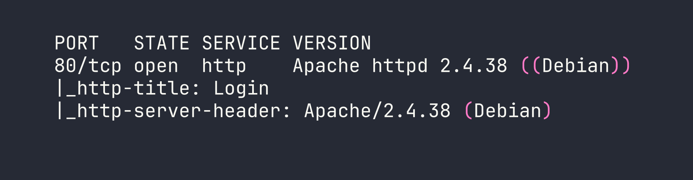
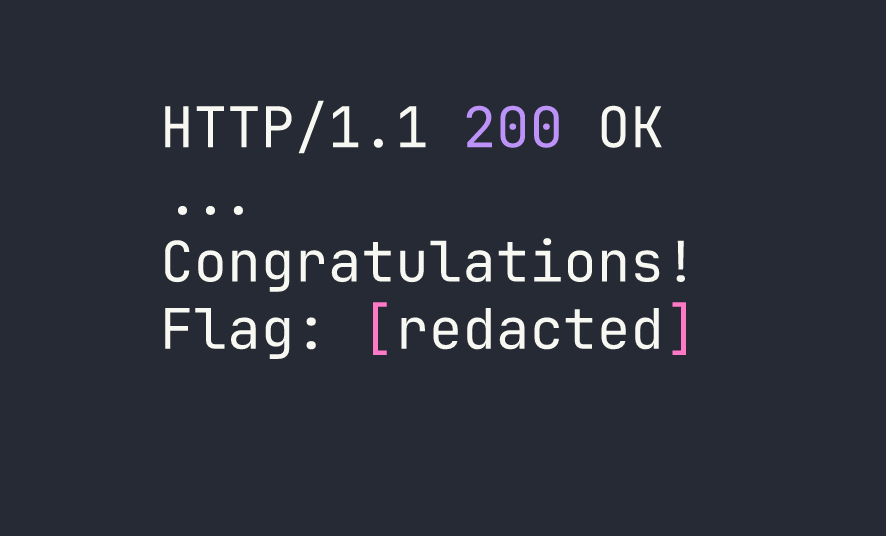

# Appointment

A deceptively simple box that proves sometimes the oldest tricks in the book are the most effective. Appointment is a single-page web challenge centered entirely on a PHP login form vulnerable to SQL injection authentication bypass — no rabbit holes, no pivoting, just clean exploitation of a classic vulnerability.

## Overview

Appointment runs a bare-bones Apache web server with a PHP login form as its only attack surface. The goal is straightforward: bypass authentication using SQL injection to retrieve the flag. It's a great box for internalizing *why* SQL injection works, not just *how* to use it.

## Reconnaissance

With only one port open, reconnaissance is quick. I kicked off an Nmap service scan to confirm what we're working with:



One port, one service — Apache 2.4.38 on Debian, serving a page titled "Login." That's the entire external attack surface.

Navigating to `http://<TARGET>/` in the browser confirms it: a standard HTML login form. Before reaching for any enumeration tools, I want to understand exactly what I'm dealing with. A quick check confirms `index.php` returns HTTP 200, telling us the backend is PHP. The form POSTs `username` and `password` fields back to itself — no redirects, no JavaScript magic, just a simple server-side login handler.

At this point, I made a deliberate choice *not* to spin up Gobuster or Feroxbuster. There's a tendency in CTF play to reflexively start directory brute-forcing, but when the entire challenge presents you with a login form, the highest-value next step is to probe that form directly. Wider enumeration can wait; injection testing comes first.

## Foothold

### Why SQL Injection?

When a web application authenticates users, it typically constructs a database query behind the scenes that looks something like this:

```sql
SELECT * FROM users WHERE username='[input]' AND password='[input]';
```

If the application passes user-supplied input directly into this query without sanitization or parameterized queries, an attacker can *inject* SQL syntax that changes the structure of the query itself. That's the vulnerability — the database can't distinguish between the developer's intended SQL and the attacker's injected SQL.

### Testing the Login Form

The classic first payload for authentication bypass targets the username field. I entered the following:

```
Username: admin'-- -
Password: anything
```

Let's break down why this payload works. The single quote `'` after `admin` closes the string literal that the application opened around our input. The `-- -` is a MySQL/MariaDB comment sequence — everything after it is ignored by the database engine. The trailing space and dash combination (`-- -` rather than just `--`) ensures the comment is parsed correctly across MySQL versions.

So the backend query transforms from:

```sql
SELECT * FROM users WHERE username='admin'-- -' AND password='...'
```

The password check is now commented out entirely. The query the database actually executes is:

```sql
SELECT * FROM users WHERE username='admin'
```

As long as a user named `admin` exists in the database — which is a reasonable assumption for any default installation — this query returns a valid row, the application sees a successful authentication, and we're in.

### Getting the Flag



The payload worked on the first attempt. No rate limiting, no account lockout, no secondary factor — the form accepted the injected credentials and returned the flag.

I did briefly consider trying the more aggressive `' OR 1=1-- -` payload (which returns *all* rows rather than targeting a specific user), but `admin'-- -` is the cleaner choice. The `OR 1=1` variant can behave unpredictably if the application only expects one row back and throws an error on multiple results. Targeting a known username is more surgical.

## Lessons Learned

**Test login forms for SQL injection before reaching for enumeration tools.** When you're presented with a single attack surface, exhaust your options against that surface first. Kicking off a directory brute-force while ignoring an injectable login form is working backwards.

**Understand the payload, don't just memorize it.** Knowing *why* `admin'-- -` works — string termination, comment injection, query truncation — lets you adapt when the simple payload fails. Maybe the application uses `"` as the string delimiter, or maybe you need `#` instead of `-- -`. Methodology beats memorization every time.

**The `-- -` comment syntax is your friend in MySQL/MariaDB.** The standard SQL comment is `--`, but MySQL requires a space after the double dash. Using `-- -` (double dash, space, hyphen) is a reliable way to ensure the trailing space is preserved even when browsers or form handlers strip trailing whitespace.

**Parameterized queries / prepared statements make this entire class of attack impossible.** If the backend had used `PDO` or `mysqli_prepare()` in PHP, no amount of SQL injection would have worked — the database would treat our entire input as a literal string value, not as SQL syntax. The fix for SQL injection is never input sanitization alone; it's architectural.
