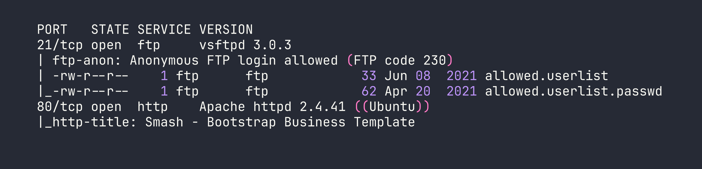
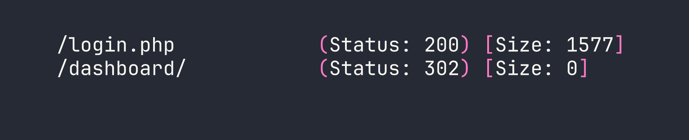
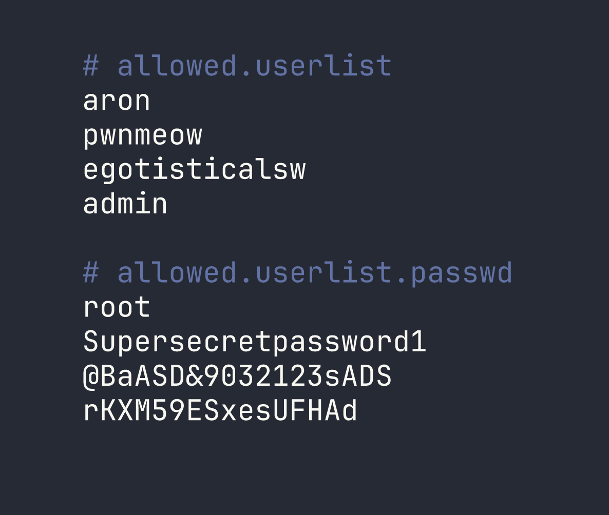
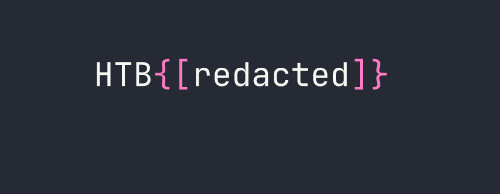

# HackTheBox — Crocodile

Crocodile is a Very Easy Linux box that demonstrates how a single misconfigured service can compromise an entire application. By chaining anonymous FTP access with a hidden PHP login page, we go from zero to dashboard without writing a single line of exploit code.

---

## Overview

The attack path here is refreshingly straightforward, but that's exactly what makes it a great learning exercise. Two services are exposed — FTP and HTTP — and neither is particularly hardened. The real skill being tested is *correlation*: recognizing that files sitting on an FTP server might contain exactly the credentials needed to authenticate to the web app running on the same host.

---

## Reconnaissance

### Port Scanning

I started with an Nmap service scan to get a clear picture of what's listening on the box.



Two ports, two services. What immediately jumps out is the Nmap FTP script output: **anonymous login is allowed**, and the directory listing reveals two suspiciously named files — `allowed.userlist` and `allowed.userlist.passwd`. The naming convention alone is a red flag. These aren't temp files or logs; someone put a credential store on a publicly accessible FTP server.

Port 80 is running Apache with what looks like a generic Bootstrap business template — nothing exciting on the surface, but definitely worth enumerating.

### Web Enumeration

Browsing to `http://<TARGET>` confirmed the Bootstrap template — a nice-looking but entirely static marketing page with no obvious login functionality linked anywhere. This is where directory brute-forcing becomes essential. Hidden functionality doesn't advertise itself.

I ran Gobuster with the `-x php` flag specifically to hunt for PHP files, since a login portal is far more likely to be a `.php` endpoint than a directory:

```bash
gobuster dir -u http://<TARGET> -w /usr/share/wordlists/dirb/common.txt -x php
```



Two interesting hits: `/login.php` is accessible directly, and `/dashboard/` redirects — almost certainly requiring authentication before it'll show anything useful. Now I have a target. The next step is finding valid credentials to feed into it.

---

## Foothold

### Harvesting Credentials via Anonymous FTP

With anonymous FTP access confirmed by Nmap, I connected to the server and grabbed both files without needing to supply a password:

```bash
ftp <TARGET>
```

At the username prompt, entering `anonymous` (with any password, or none at all) grants access. From there:

```bash
ftp> get allowed.userlist
ftp> get allowed.userlist.passwd
ftp> bye
```

Reading the files locally reveals the goods:



Four usernames, four passwords — and both files have the same line count. That's not a coincidence. When credential files are structured this way, the most logical interpretation is that they're paired line-by-line: `aron:root`, `pwnmeow:Supersecretpassword1`, and so on. The last pairing gives us `admin:rKXM59ESxesUFHAd`.

I could have written a quick script to try all 16 combinations, but given the small set and the obvious pairing structure, it made more sense to start with the most privileged-sounding account: `admin`.

### Logging In

Navigating to `http://<TARGET>/login.php` presents a standard username/password form. I entered the `admin` credentials:

- **Username:** `admin`
- **Password:** `rKXM59ESxesUFHAd`

One attempt. The page redirected immediately to `/dashboard/`, which displayed the flag.



No bruteforcing tools needed — just careful observation and logical deduction.

---

## Lessons Learned

**Anonymous FTP is always worth checking.** It's one of those services that gets enabled during initial setup and forgotten. Even if the FTP server doesn't have anything obviously named "passwords," it's worth browsing for configuration files, backups, or anything that looks out of place.

**Cross-service correlation is a core skill.** The FTP server and the web application are separate services, but they exist on the same host and are managed by the same (presumably overworked) administrator. Credentials, usernames, and configuration details found on one service frequently apply to another. Always think about how findings from one foothold can unlock a different attack surface.

**Directory brute-forcing with file extension flags matters.** Running Gobuster without `-x php` would have missed `/login.php` entirely if it wasn't indexed or linked from the main page. Always match your extension flags to the tech stack — Apache on Linux commonly serves PHP, so `-x php` is a natural addition. You can layer in others like `-x html,txt` depending on what you suspect.

**Matching line counts in credential files strongly imply line-by-line pairing.** This is a quick pattern recognition shortcut. When you pull two files named `users` and `passwords` and they have the same number of entries, treat them as paired before reaching for a brute-force tool. Start with the most privileged-looking account (here, `admin`) and work from there.
