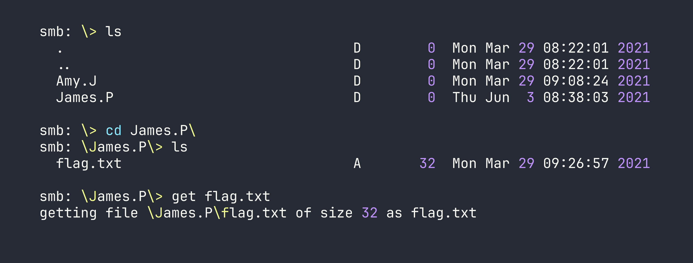

# HackTheBox — Dancing

Dancing is a beginner-friendly Windows box built around one of the most commonly misconfigured services in enterprise environments: SMB. If you've ever wondered how attackers pivot from "I can see the network" to "I have files," this box demonstrates exactly that with a non-default share left open to anonymous access.

---

## Overview

The target exposes several standard Windows services, but the interesting one is a custom SMB share called `WorkShares` that accepts null sessions — no username, no password required. From there, it's a matter of methodical enumeration to find what's been left exposed. There's no privilege escalation here; the flag is sitting in the share, waiting to be picked up.

---

## Reconnaissance

### Port Scanning

The first thing I always do is a service version scan with default scripts. This tells me what's listening, what versions are running, and sometimes hands me vulnerability hints directly from Nmap's script engine.

```bash
nmap -sC -sV -oA nmap/dancing $TARGET
```


A few things stand out immediately:

- **Port 445 (SMB):** This is the main event. SMB2/3 is running, and notably, message signing is *enabled but not required*. That last part matters for relay attacks, though we won't need to go that route today.
- **Port 5985 (WinRM):** Windows Remote Management is listening. This is a juicy target *if* we can land credentials — it would give us a proper PowerShell shell via tools like `evil-winrm`. I filed this away for later.
- **Ports 135/139 (RPC/NetBIOS):** Standard Windows plumbing. Not immediately actionable, but worth noting.

The WinRM port raised my hopes that this might involve credential reuse somewhere, but let's not get ahead of ourselves. SMB first.

### SMB Share Enumeration

With SMB confirmed, the next step is listing available shares. The `-N` flag tells `smbclient` to attempt a null session — no credentials at all. This is the digital equivalent of trying a door handle before assuming it's locked.

```bash
smbclient -L //$TARGET/ -N
```


This output is immediately interesting. The first three shares are Windows defaults:

- **ADMIN$** — Maps to `C:\Windows`. Requires administrator credentials.
- **C$** — The full C: drive. Also admin-only.
- **IPC$** — Used for inter-process communication and named pipes. Useful for RPC enumeration, but not a file store.

Then there's **WorkShares**. No comment, no obvious purpose — and critically, it's not a default Windows share. Non-default shares mean someone created it manually, which means there's a reason it exists. That reason is often "someone needed to share files" and sometimes "someone forgot to lock it down." Time to find out which one this is.

---

## Foothold

### Accessing the WorkShares Share

I tried connecting to `ADMIN$` and `C$` first with a null session, which — predictably — got me an `NT_STATUS_ACCESS_DENIED`. Good to verify, but no surprises there.

`WorkShares`, on the other hand, opened right up:

```bash
smbclient //$TARGET/WorkShares -N
```

I'm in. From here I treat the SMB session like an FTP client — `ls` to list files, `cd` to navigate directories, and `get` to download files. The key habit to build is **always checking subdirectories**. Flags and sensitive files rarely sit in the share root where you'd spot them immediately.

After browsing through a couple of subdirectories inside the share, I found `flag.txt` and pulled it down:

```bash
get <subfolder>/flag.txt
```




Flag retrieved. The box is solved.

---

## Privilege Escalation

Not applicable here. The flag was accessible directly through the misconfigured share — no lateral movement, no local exploit, no credential cracking required. This is a starting point machine, so the focus is on the enumeration workflow rather than a full attack chain.

That said, the presence of WinRM on port 5985 is worth mentioning as a "what if" for a more complex scenario. If those subdirectories had contained a password file or SSH key instead of (or in addition to) the flag, WinRM could have been the next step to get a full interactive shell.

---

## Lessons Learned

**Non-default SMB shares deserve immediate attention.** When you see `ADMIN$`, `C$`, and `IPC$`, those are expected — background noise. An unfamiliar share name like `WorkShares` is a signal that a human made a decision, and human decisions in IT environments are frequently where misconfigurations live.

**Always attempt null sessions before reaching for credentials.** It costs nothing to try `-N` with `smbclient`. A surprising number of shares — especially in internal networks and lab environments — are left open to anonymous access because someone needed a quick file transfer and never revisited the permissions.

**Enumerate subdirectories, not just the share root.** The flag in this box wasn't sitting at `\flag.txt` — it was nested under a user directory. In real assessments, interesting files (credentials, configs, backups) are rarely in the most obvious location. Build the habit of recursively exploring shares with `ls` and `cd`, or automate it with tools like `smbmap -R` for larger shares.

**WinRM is worth bookmarking.** Port 5985 is easy to overlook if you're focused on SMB, but it's a direct path to a remote shell if you ever acquire credentials for a user with WinRM access. In engagements with Active Directory environments, it's almost always worth checking whether any harvested credentials work against WinRM.
