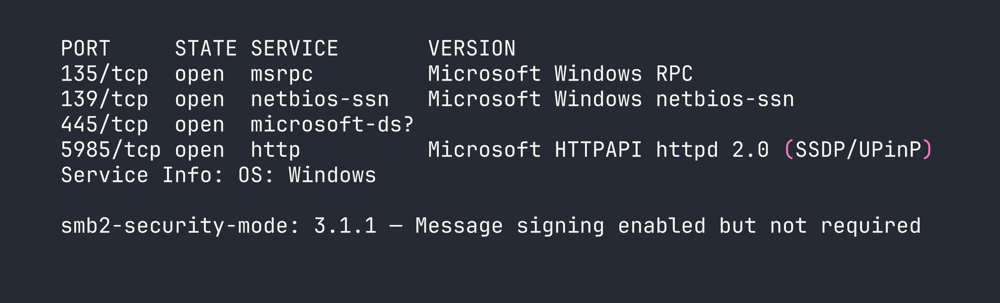
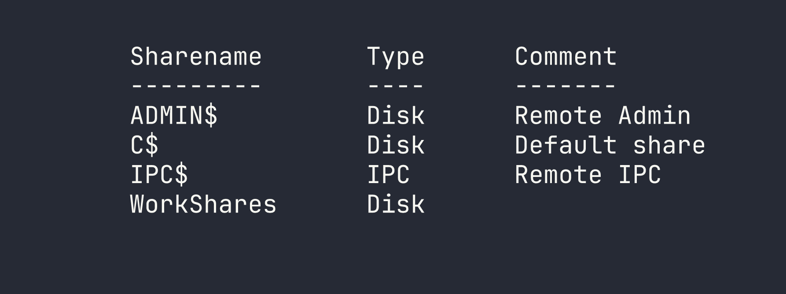

# Dancing — Anonymous SMB Access on a Windows Target

Dancing is a beginner-friendly Windows box that demonstrates one of the most common misconfigurations found in real-world environments: an SMB share left open to anonymous access. The entire engagement comes down to solid enumeration and knowing which shares are worth poking at.

---

## Reconnaissance

### Port Scanning

I started with a standard service scan to get a picture of what's running on the target. The `-sC` flag runs default scripts and `-sV` attempts version detection — together they give a solid baseline without being too noisy.

```bash
nmap -sC -sV -oA nmap/dancing $TARGET
```



The results paint a clear picture: this is a Windows machine with a standard RPC/NetBIOS/SMB stack. A few things jumped out immediately:

- **Port 445 (SMB):** SMB2/3 is open, and critically, message signing is *enabled but not required*. This means signing is optional, which has relay attack implications in other scenarios — but for now, the bigger question is whether any shares are accessible without credentials.
- **Port 5985 (WinRM):** Windows Remote Management is listening. If we end up with valid credentials anywhere, this could be a path to a proper shell.
- **Ports 135/139:** Standard Windows RPC and NetBIOS, expected on any Windows host.

SMB is the obvious first target here.

### SMB Share Enumeration

Before trying to authenticate, I checked whether the target would respond to a null session — that is, listing shares without providing any credentials. The `-N` flag suppresses the password prompt and attempts anonymous access.

```bash
smbclient -L //$TARGET/ -N
```



Four shares came back. Three of them are immediately recognizable as Windows defaults:

- **`ADMIN$`** — maps to `C:\Windows`, restricted to administrators
- **`C$`** — the root of the C drive, also admin-only
- **`IPC$`** — used for inter-process communication; sometimes useful for further enumeration but not a file share

Then there's `WorkShares`. It has no comment, it's non-default, and it's the kind of share that gets created by a sysadmin or developer for convenience and then quietly forgotten about. That's the one worth investigating.

---

## Foothold

### Accessing the WorkShares Share

I connected to `WorkShares` using another null session. If it was misconfigured to allow anonymous access, `smbclient` would drop me into an interactive prompt.

```bash
smbclient //$TARGET/WorkShares -N
```

It worked — no credentials required. I was in. From there, I dropped into an exploration mindset: list the top-level contents, then recurse into any subdirectories. Flags and sensitive files are rarely sitting in the share root; they're usually a level or two deeper.

After listing the share contents and navigating into a subdirectory, I found `flag.txt`. I pulled it down with `get`:

```bash
get <subfolder>/flag.txt
```

That was it. Flag retrieved without ever needing a password.

---

## Privilege Escalation

Not applicable here — the flag was obtained directly through anonymous read access to the SMB share. There's no user account to pivot from and no further escalation path to pursue on this box.

---

## Lessons Learned

**Non-default SMB shares are always worth investigating.** `ADMIN$`, `C$`, and `IPC$` are noise — you know what they are and you know they're locked down. Any share that doesn't fit that pattern deserves attention. `WorkShares` had no comment and no obvious justification, which is exactly the kind of anomaly that pays off.

**Null session enumeration is a foundational check.** Before throwing credentials at anything, always try anonymous access. The `-N` flag in `smbclient` costs nothing, and in misconfigured environments — which are more common than they should be — it can hand you access immediately. Tools like `enum4linux` or `crackmapexec` can automate broader null session enumeration if you want to cast a wider net.

**Enumerate subdirectories — don't stop at the share root.** It's tempting to glance at the top level, see nothing obvious, and move on. Sensitive files are frequently buried one or two directories deep, either intentionally (a weak attempt at obscurity) or because that's just where they naturally live in a project or admin workflow.

**WinRM on 5985 is a foothold multiplier.** On this box it didn't come into play, but its presence is worth noting. In environments where you find credentials through SMB access — configuration files, scripts, password files — WinRM gives you a direct path to an interactive shell via `evil-winrm`. Always keep an eye on what remote management services are exposed alongside file shares.
