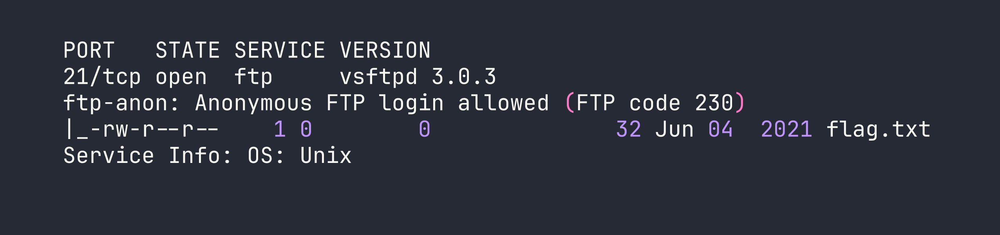
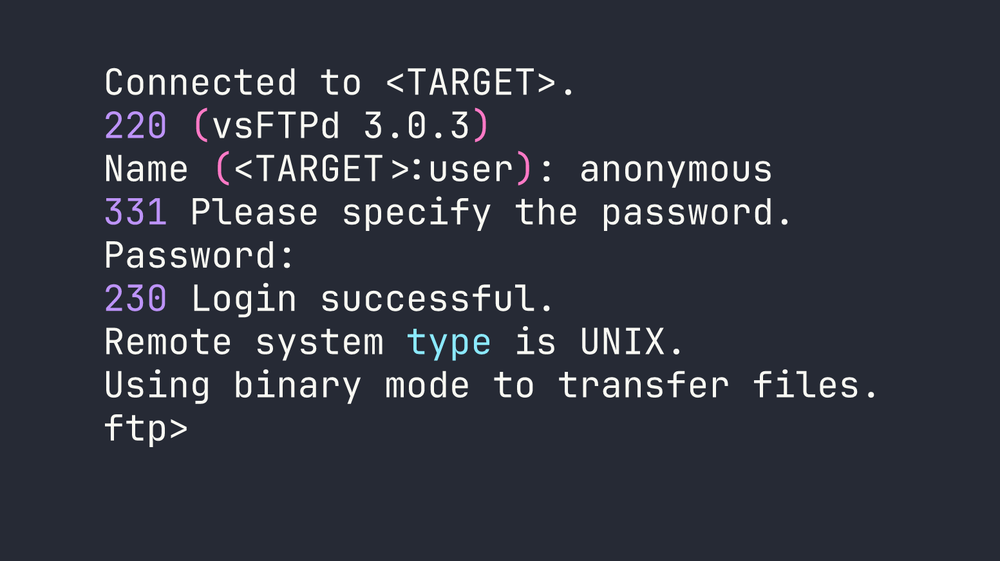
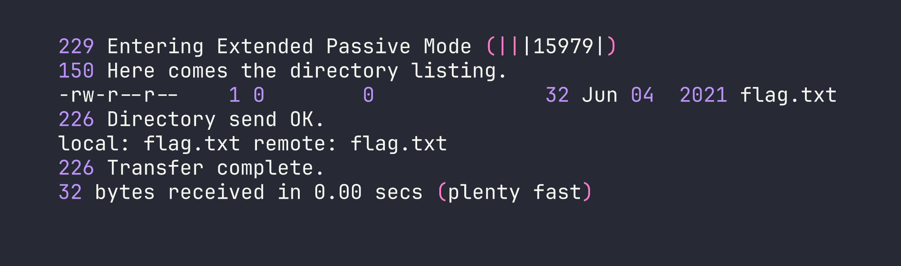

# HackTheBox — Fawn

Fawn is a beginner-friendly HackTheBox machine that cuts straight to one of the most prevalent real-world misconfigurations: an FTP server with anonymous login enabled and sensitive files left in plain sight. No exploitation, no privilege escalation — just recognizing a dangerous default and knowing what to do with it.

---

## Overview

The box runs a single exposed service — vsftpd 3.0.3 on port 21. Anonymous FTP access is enabled, the flag is sitting in the FTP root, and anyone who knows to try `anonymous` as a username walks right in. Simple as it sounds, this exact misconfiguration shows up in real enterprise environments more often than it should.

---

## Reconnaissance

### Port Scanning

I started with a standard nmap service scan to see what's listening. The `-sC` flag runs default scripts (useful for things like checking FTP anonymous login automatically), `-sV` grabs service versions, and `-oA` saves output in all formats for later reference.




The nmap output tells us everything we need in one pass. Two key findings jump out:

1. **Anonymous FTP login is allowed** — nmap's `ftp-anon` script confirmed this automatically, returning FTP code 230 (login successful).
2. **`flag.txt` is visible in the FTP root** — 32 bytes, world-readable permissions (`-rw-r--r--`), owned by root (`0 0`).

There's nothing else to enumerate here. One port, one service, one misconfiguration, one file. Let's grab it.

---

## Foothold

### Anonymous FTP Access

Anonymous FTP is a feature that allows users to log in without a real account — typically using `anonymous` as the username and either no password or an email address as the password. It was originally designed for public file distribution (think software mirrors in the 90s), but it's genuinely dangerous when enabled on a server hosting anything sensitive.

Connecting is as simple as firing up the built-in `ftp` client:

```bash
ftp <TARGET>
```

When prompted for a username, I entered `anonymous`. The server accepted it with no password required.




Once connected, I ran a quick `ls` to confirm the directory listing nmap already showed us, then pulled the flag down with `get`:

```bash
ftp> ls
ftp> get flag.txt
ftp> bye
```




The flag downloads to the local working directory. That's it — no exploitation, no lateral movement, no privilege escalation needed. The misconfiguration handed us everything.

```bash
cat flag.txt
```

Flag: `[redacted]`

---

## Privilege Escalation

Not applicable. The flag was accessible directly through anonymous FTP without any need for escalation. This is actually a useful reminder that "privilege escalation" isn't always the path — sometimes the damage is done entirely at the network access level before authentication ever becomes a factor.

---

## Lessons Learned

**Never leave anonymous FTP enabled in production.** The vsftpd configuration directive responsible for this is `anonymous_enable=YES` — and critically, it's the *default* in many distributions. That means the burden is on administrators to explicitly disable it. If you're auditing a system, always check `/etc/vsftpd.conf` and verify this is set to `NO`.

```bash
# What you want to see in /etc/vsftpd.conf
anonymous_enable=NO
```

**Nmap's default scripts catch this automatically.** The `-sC` flag runs the `ftp-anon` script, which attempts an anonymous login and reports back. This is why running `-sC` by default on your initial scan is good practice — you get service-level intelligence without any extra effort.

**Sensitive files in FTP roots are a double failure.** Even if you were willing to accept anonymous read access for *some* files, the absence of any access controls on what gets placed in that directory is a separate policy failure. Defense in depth means you shouldn't rely on "nobody would put something sensitive there."

**This misconfiguration exists in the real world.** It's tempting to dismiss Fawn as a toy CTF challenge, but anonymous FTP with sensitive data exposed shows up in real penetration tests, bug bounties, and breach investigations. The underlying habit — check anonymous access early, check what's actually *in* accessible shares — applies directly to SMB null sessions, unauthenticated Redis instances, open S3 buckets, and a dozen other analogous misconfigurations across different protocols.
