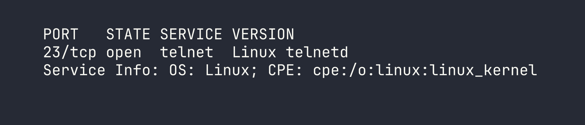
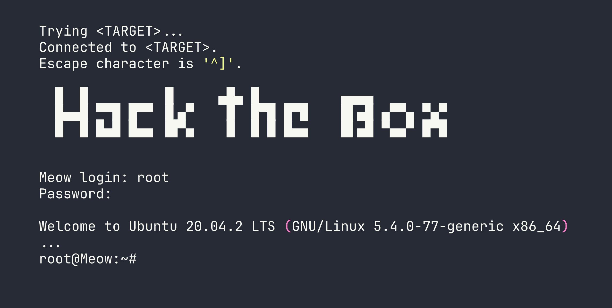

# Meow — HackTheBox Writeup

Meow is a beginner-friendly Linux box that demonstrates one of the most critical (and unfortunately still common) misconfigurations in the wild: a root account with no password exposed over Telnet. There's no exploitation or privilege escalation required here — just knowing where to look and what to try.

---

## Overview

The attack path is about as short as it gets. A single open port running Telnet, a root account with a blank password, and we're done. While it may seem almost trivially simple, this box hammers home an important point: the most devastating vulnerabilities are often misconfigurations, not complex exploits.

---

## Reconnaissance

As always, we start with an Nmap scan to understand what's running on the target. I use `-sV` to grab service version information, which often gives us crucial context about what we're dealing with.

```bash
nmap -sV <TARGET>
```



Only one port open: **TCP 23**, running Telnet. This immediately raises a red flag. Telnet is a protocol from a different era — it transmits everything, including credentials, in plaintext. Modern hardened systems simply don't expose it. Seeing it open on a public-facing machine is a strong signal that we're dealing with either legacy infrastructure or a severely misconfigured host.

With only one service to investigate, the path forward is clear.

---

## Foothold

Since Telnet is the only attack surface, we connect directly to it. Before trying any wordlists or brute-force tools, it's always worth testing the most obvious credentials manually — default usernames, blank passwords, and common combos like `admin/admin` or `root/root`.

```bash
telnet <TARGET>
```

The connection prompt asks for a login. I try `root` as the username and simply press Enter at the password prompt — no password at all.



That's it. We're dropped directly into a root shell. No exploit, no password cracking — the account simply had no authentication configured.

From here, grabbing the flag is trivial:

```bash
cat /root/flag.txt
```


---

## Privilege Escalation

Not applicable. We landed as `root` directly via Telnet, so there's no escalation path to walk through. Full system access was granted from the initial connection.

---

## Lessons Learned

This box is intentionally simple, but the lessons it illustrates are anything but trivial. These exact misconfigurations appear in real-world penetration tests and breach reports with surprising regularity.

**1. Always test for blank and default credentials first.**
Before reaching for a wordlist or an exploit, manually test the obvious. Blank passwords, `admin/admin`, `root/root`, and vendor defaults take seconds to try and occasionally hand you complete access. Automation is great, but don't skip the basics.

**2. Telnet should never be exposed on a production system.**
Telnet sends all data — including usernames and passwords — as unencrypted plaintext. Anyone on the network path can intercept credentials with a passive capture. SSH exists precisely to replace Telnet, and has for decades. If you find Telnet open during an assessment, flag it immediately regardless of whether authentication is working correctly.

**3. Root login with no password is a critical misconfiguration.**
This is arguably the most severe finding possible: unauthenticated remote access as the highest-privilege user on the system. In a real environment, this would be a P0/Critical finding with immediate remediation required. It can arise from rushed provisioning, forgotten test configurations, or simply a lack of hardening standards — all of which are preventable.

The takeaway: the simplest checks are often the most rewarding. A thorough methodology always starts at the bottom of the complexity ladder before climbing higher.
