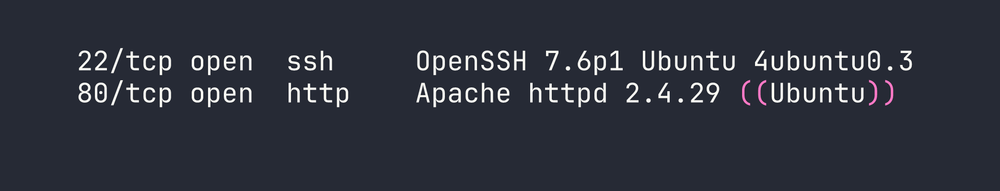
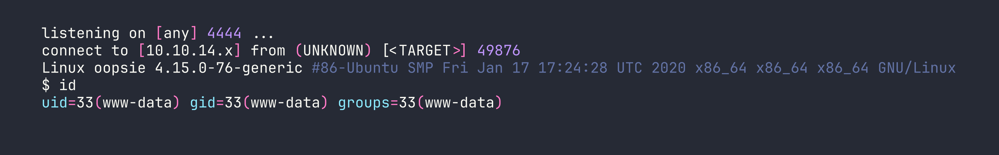
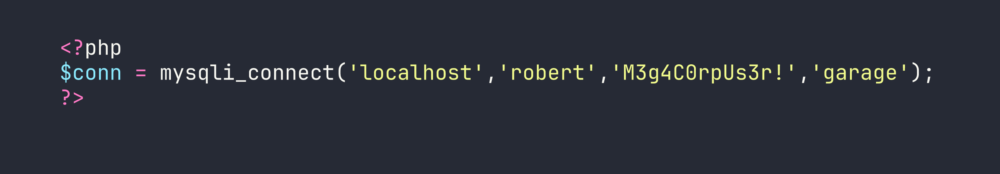
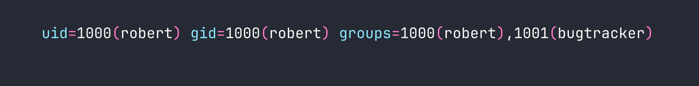
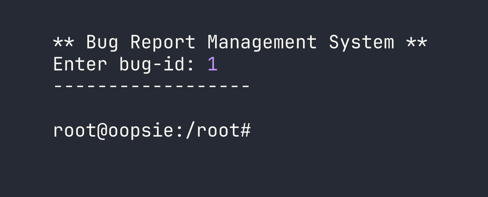

# Oopsie

Oopsie is a beginner-friendly Linux box that chains together several classic web application vulnerabilities — broken access control, an insecure file upload, and a SUID PATH hijacking — into a satisfying end-to-end compromise. What makes it particularly interesting is that it rewards players who remember their history: credentials from a previous box in the Starting Point series come back to bite the target here.

---

## Reconnaissance

### Port Scanning

I started with a default nmap scan to get the lay of the land:

```bash
nmap -sC -sV $TARGET
```



Two services. SSH on 22 is the typical Ubuntu stack — without credentials it's a dead end at this stage, so the web server on port 80 is where the action is.

### Web Enumeration

Hitting the site in a browser revealed a corporate-looking page for a company called MegaCorp. Nothing immediately obvious on the surface, so I started looking at the page source. Buried in the HTML was a reference that pointed me toward `/cdn-cgi/login/` — a login panel that isn't linked anywhere obvious in the navigation.

The source also handed me an email address: `admin@megacorp.com`. That's a useful username to pocket.

Before trying anything clever, I tried the guest login option the page offered. It worked, and it dropped me into the application with a limited session. Poking around in the browser dev tools, I noticed the session was tracked by two cookies: `role` and `user`. The `role` cookie was set to `guest` and `user` was set to a numeric ID.

This is a red flag. Client-side cookies controlling authorization is fundamentally broken — the server has to trust whatever value the client sends, which means we control our own privilege level.

I also spotted that the account detail pages used an `id` parameter in the URL to look up user profiles. Classic IDOR territory. I iterated through values until I found the admin account profile, which revealed the admin's Access ID: **34322**.

---

## Foothold

### Logging In with Reused Credentials

If you've worked through the Starting Point series before Oopsie, you may have already met `MEGACORP_4dm1n!!` — that was the admin password from Archetype. Credential reuse across an organization's systems is depressingly common in real engagements, so it's always worth trying known passwords against new targets before reaching for bigger tools.

Logging in as `admin` / `MEGACORP_4dm1n!!` worked immediately.

### Exploiting Broken Access Control

I was in, but my session cookie still reflected a limited role. I flipped that:

- `role` → `admin`
- `user` → `34322`

After refreshing, the application now showed me the Uploads page — functionality that wasn't accessible before. The server was trusting the role value I sent in the cookie without validating it server-side. That's the entire vulnerability: authorization logic living in a place the user can modify.

### Uploading a PHP Reverse Shell

The Uploads page accepted file uploads without any meaningful restriction on file type. I grabbed the standard PHP reverse shell from `/usr/share/webshells/php/php-reverse-shell.php`, updated the IP and port to point back at my machine, and uploaded it.

Before triggering the shell, I set up a listener:

```bash
nc -lvnp 4444
```

Then I navigated to `/uploads/shell.php` in the browser. The page hung — always a good sign — and my listener caught the connection:



We're in as `www-data`. Time to stabilize the shell before doing anything else:

```bash
python3 -c 'import pty; pty.spawn("/bin/bash")'
# Ctrl+Z to background
stty raw -echo; fg
export TERM=xterm
```

This gives us a proper interactive shell with tab completion and the ability to use `su` — which we'll need shortly.

---

## Privilege Escalation

### Finding Database Credentials

As `www-data`, one of the first things worth doing is poking around the web application's source files. Configuration files often contain hardcoded credentials, and developers have a habit of reusing those credentials for system accounts too.

```bash
cat /var/www/html/cdn-cgi/login/db.php
```



A username and password for the database — but more usefully, a username that might also be a system account.

### Lateral Movement to Robert

```bash
su robert
# Password: M3g4C0rpUs3r!
```

It worked. Password reuse strikes again. We can now grab the user flag from `/home/robert/user.txt`.

### Enumerating Robert's Groups

With a new user context, I checked what groups Robert belonged to:

```bash
id
```



The `bugtracker` group is non-standard — anything custom like this is worth investigating. I looked for files owned by or accessible to that group:

```bash
find / -group bugtracker 2>/dev/null
```

This returned `/usr/bin/bugtracker`. Checking its permissions:

```bash
ls -la /usr/bin/bugtracker
```

```
-rwsr-xr-- 1 root bugtracker 8792 Jan 25  2020 /usr/bin/bugtracker
```

The `s` in the owner execute position means this is a **SUID binary** owned by root. When Robert runs it, it executes with root privileges. This is the escalation path — now I just needed to understand what it does.

### Analyzing the Binary

Rather than running it blind, I used `strings` to peek at what commands the binary calls internally:

```bash
strings /usr/bin/bugtracker
```

Among the output, one line stood out:

```
cat /root/reports/
```

The binary calls `cat` to display bug reports from a root-owned directory. Critically, it calls `cat` **without an absolute path** — just the bare command name. That means it relies on whatever `cat` is first found in the `$PATH` environment variable.

This is a textbook PATH hijacking vulnerability.

### PATH Hijacking to Root

The attack is straightforward: create a malicious `cat` executable in a directory we control, then prepend that directory to `$PATH` so the SUID binary picks up our version instead of the real one.

```bash
echo '/bin/bash' > /tmp/cat
chmod +x /tmp/cat
export PATH=/tmp:$PATH
/usr/bin/bugtracker
```

When prompted for a bug ID, I entered any value. The binary tried to call `cat` on the corresponding report file — but it called *our* `cat` instead, which just spawned `/bin/bash`. Since the binary is SUID root, that bash process inherited root privileges:



Root shell. We can grab the root flag from `/root/root.txt`.

---

## Lessons Learned

**Credential reuse is your friend on engagements.** The admin password from Archetype worked here without modification. Always try credentials you've already found against new services and systems — it's low effort and pays off more often than you'd expect.

**Client-side authorization is not authorization.** Storing the user's role in a cookie and trusting it server-side is the same as having no access control at all. Authorization decisions must be made and enforced on the server, validated against a session stored server-side.

**Config files are goldmines.** `db.php`, `config.php`, `.env` — these files routinely contain credentials, and those credentials routinely get reused. When you have filesystem access, always grep the web root for connection strings and passwords.

**SUID + relative command paths = PATH hijack.** Whenever you find a SUID binary, run `strings` on it and look for commands called without full paths. If you find one, check whether the binary's owner group (or world execute permission) allows you to run it, then drop a malicious version of that command earlier in your `$PATH`.

**`find / -group <groupname>`** is a quick way to surface files associated with non-standard groups. Unusual group memberships often exist for a reason — follow them.

**Shell stabilization matters.** The PTY upgrade technique (spawn a pty with Python, background with Ctrl+Z, `stty raw -echo`, foreground) gives you a fully interactive shell that supports `su`, job control, and autocomplete. Get comfortable making this reflex after every initial shell catch.
