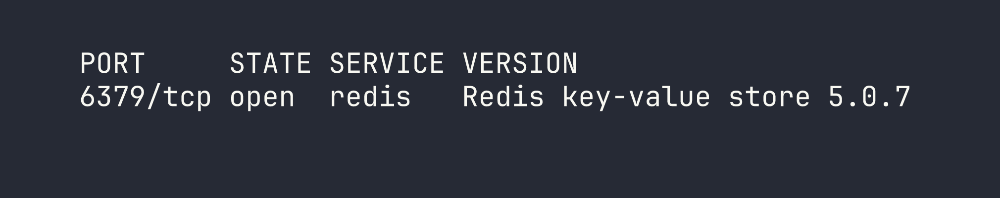
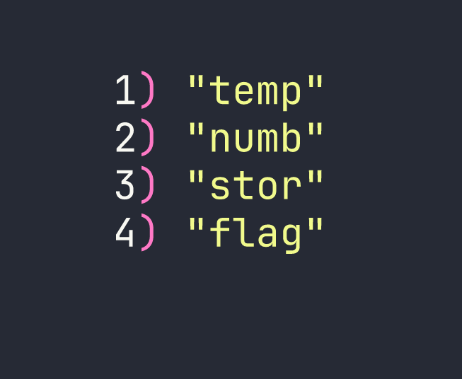
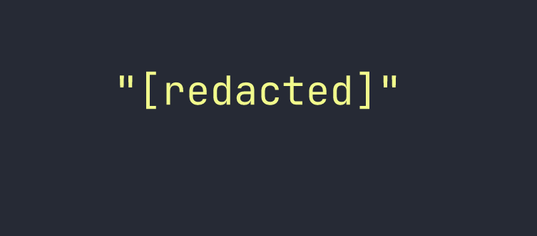

# Redeemer

Redeemer is a beginner-friendly HackTheBox machine that demonstrates one of the most common real-world misconfigurations you'll encounter: an exposed Redis instance with no authentication. There's no exploitation involved here — just enumeration, awareness that interesting services live outside the default nmap port range, and knowing a handful of Redis commands.

---

## Overview

The box runs a single exposed service — Redis 5.0.7 on port 6379 — configured with no password. The flag is stored directly as a key in the database. The entire challenge boils down to: find the service, connect to it, dump the keys.

Simple as that sounds, it teaches a genuinely important lesson about thorough port scanning and the dangers of default Redis deployments.

---

## Reconnaissance

### Full Port Scan

The first thing I always do is a full port scan rather than relying on nmap's default top-1000 ports. Port 6379 (Redis) sits outside that default range, so if I'd run a vanilla `nmap $TARGET` and moved on, I would have found nothing. This is exactly the kind of box that reinforces the habit.

I use `--min-rate 5000` to push packets through quickly on a full 65535-port sweep:

```bash
nmap -p- --min-rate 5000 $TARGET
```

Once that surfaces port 6379, I follow up with a targeted service/version scan:

```bash
nmap -p 6379 -sC -sV $TARGET
```



Redis 5.0.7. One open port, one interesting service. Time to understand what we're dealing with.

### What Is Redis?

Redis (Remote Dictionary Server) is an in-memory key-value store, commonly used for caching, session management, and message queuing. It's incredibly fast and widely deployed — which also means it's widely misconfigured. By default, Redis binds to all interfaces and requires **no authentication**. In a properly hardened environment it should either be bound to localhost, firewalled, or protected with a `requirepass` directive in `redis.conf`. On this box, none of that is in place.

---

## Foothold

### Connecting to Redis

The `redis-cli` tool is the standard client for interacting with Redis. Connecting is as simple as pointing it at the target host:

```bash
redis-cli -h $TARGET
```

No password prompt. We're in immediately.

### Enumerating the Instance

The first thing I run on any Redis instance is `INFO` — it returns a detailed breakdown of the server's configuration, memory usage, connected clients, and more. This is useful for confirming the version and understanding the environment:

```bash
127.0.0.1:6379> INFO
```

The output confirms Redis 5.0.7 and shows the server is running as the default configuration with no authentication required. Nothing surprising here, but it's good practice to gather this before diving into the data.

### Dumping the Keys

With unauthenticated access confirmed, I use `KEYS *` to list every key stored in the database:

```bash
127.0.0.1:6379> KEYS *
```



Four keys. The `flag` key is an obvious target. Retrieving the value of any key is done with `GET`:

```bash
127.0.0.1:6379> GET flag
```



That's the flag. Root-level access — or in this case, database-level access — achieved without a single exploit.

---

## Privilege Escalation

Not applicable. The flag was stored directly as a plaintext value in the Redis database. There's no operating system to escalate on — the entire challenge lives within the database layer.

In a real engagement, unauthenticated Redis access is often far more dangerous than retrieving a single value. Depending on the server configuration, it's sometimes possible to write SSH public keys to disk via Redis's `CONFIG SET dir` and `CONFIG SET dbfilename` commands, effectively achieving remote code execution. That's out of scope here, but worth keeping in mind as a follow-on technique when you encounter Redis in a real pentest.

---

## Lessons Learned

**Always scan all 65535 ports.** Nmap's default scan covers roughly the top 1000 most common ports. Redis on 6379 isn't in that list. A lazy scan on this box returns nothing — a full `-p-` scan reveals everything. Make full port scans part of your standard workflow, and use `--min-rate 5000` to keep them from taking forever.

**Redis has no authentication by default.** This is a documented, known-default behavior that routinely appears in real-world penetration tests and bug bounty programs. Any Redis instance exposed to a network without `requirepass` configured is a sitting duck. If you're deploying Redis, bind it to localhost or use a firewall rule — and always set a strong password.

**`KEYS *` and `GET` are your two-tool Redis enumeration kit.** For a misconfigured instance, that's often all you need. In production Redis instances with large datasets, `KEYS *` can be destructive (it blocks the server while scanning), but for CTF purposes and small instances it's perfectly fine.

**Dead ends to note:** I initially ran a default nmap scan out of habit and got zero results — a good reminder of why the `-p-` flag matters. There's no web interface, no SSH, nothing else to pivot through. The entire attack surface is a single unauthenticated service, and the lesson is recognizing it quickly.
