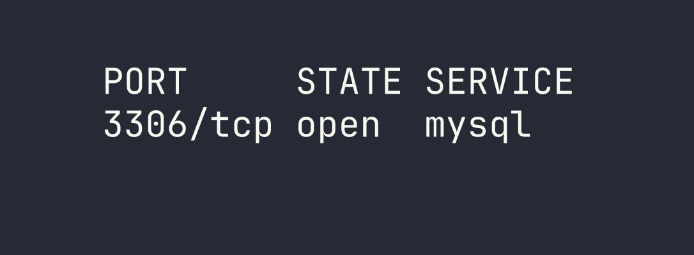
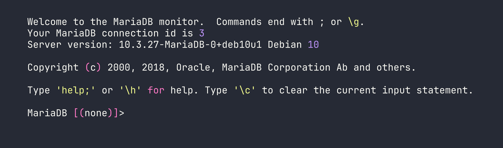
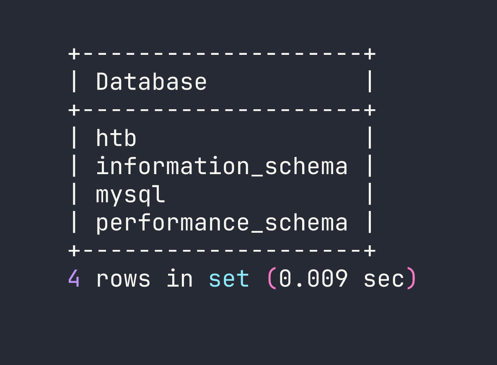
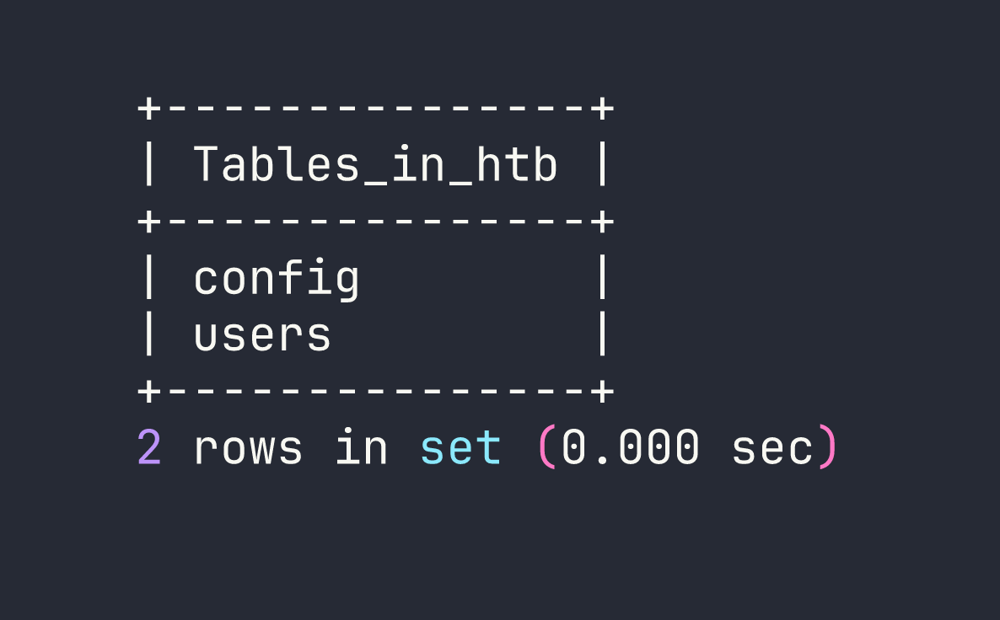

# HackTheBox — Sequel

Sequel is a dead-simple but instructive HackTheBox machine that highlights one of the most dangerous real-world misconfigurations: a MySQL/MariaDB instance exposed to the network with no root password. If you've done the Redeemer box and noticed a pattern with unauthenticated service access, this one will feel familiar — just swap Redis for a relational database.

---

## Overview

The attack path here is about as linear as it gets: find an open database port, connect without credentials, and enumerate your way to the flag. No exploitation, no fancy tooling — just a reminder that misconfiguration can be more dangerous than any CVE.

---

## Reconnaissance

I started with a basic Nmap scan against the target to see what we're working with.



That's it — a single open port. MySQL (or more precisely, MariaDB) on port 3306, exposed directly to the network. No web server, no SSH, nothing else to poke at. The entire attack surface is this one service.

The immediate question when you see a database port exposed like this is: does it require authentication? In a hardened environment, the answer should always be yes, and the service should ideally be bound to localhost only. The fact that 3306 is reachable externally is already a red flag.

---

## Foothold

### Connecting Without a Password

My first instinct was to try connecting as `root` with no password — a shockingly common misconfiguration, especially in development environments or cases where a database was stood up quickly and never locked down.

```bash
mariadb -h $TARGET -u root --skip-ssl
```

The `--skip-ssl` flag is worth calling out here. Without it, I hit a TLS/SSL mismatch error — the client and server couldn't agree on a protocol version. Rather than wrestling with SSL configuration, `--skip-ssl` tells the MariaDB client to skip the encrypted connection entirely and connect in plaintext. On a CTF target this is fine; in a real engagement, this is actually useful to know because it means credentials (if any existed) would also traverse the network in cleartext.



We're in. No password prompt, no error — just a root shell on the database server.

### Enumerating Databases

With access established, the methodology is straightforward: enumerate everything. Start with the databases, then drill down into tables, then pull data. I ran `SHOW DATABASES;` to see what's available.

```sql
SHOW DATABASES;
```



The `information_schema`, `mysql`, and `performance_schema` databases are standard MariaDB system databases. The interesting one is `htb` — clearly a non-default database that was set up for this machine.

### Exploring the HTB Database

I switched into the `htb` database and listed its tables:

```sql
USE htb;
SHOW TABLES;
```



Two tables: `config` and `users`. Both worth looking at. The `config` table is often where application secrets, API keys, or in this case flags get stored. I queried it first:

```sql
SELECT * FROM config;
```

The flag was sitting right there in the config table, no further steps required.

I also checked the `users` table out of curiosity — good habit to enumerate everything even after you've found what you came for, since in a real engagement you'd want the full picture of what data is exposed.

---

## Lessons Learned

**Unauthenticated database access is a critical finding.** MySQL and MariaDB instances with no root password are more common than they should be, particularly in environments where a developer spun up a local database and it somehow ended up internet-facing. Always try passwordless authentication as your first step against any database service.

**`--skip-ssl` is a useful client-side workaround.** When you hit TLS negotiation errors connecting to MariaDB, `--skip-ssl` bypasses the issue entirely. The flip side is that any credentials transmitted would be in cleartext — relevant if you're assessing the real-world risk of the misconfiguration.

**Exposed database ports are a pattern worth recognizing.** This box is intentionally similar to Redeemer, which featured unauthenticated Redis access. The lesson is the same: network-exposed data stores with no authentication are a critical misconfiguration. Redis, MySQL, MongoDB, Elasticsearch — this pattern appears constantly in the wild.

**Always enumerate fully.** Even after finding the flag in `config`, I checked `users`. In a real penetration test, every table in every database could contain credentials, PII, or sensitive configuration data. Don't stop at the first interesting result.
