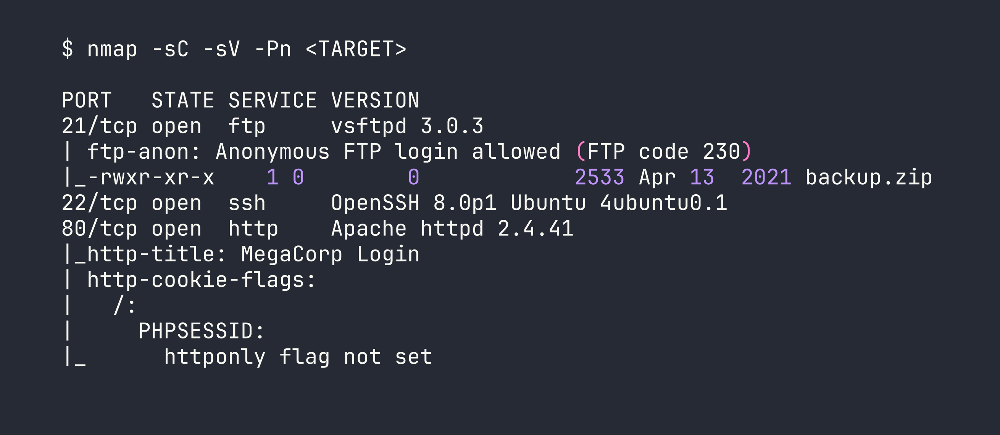
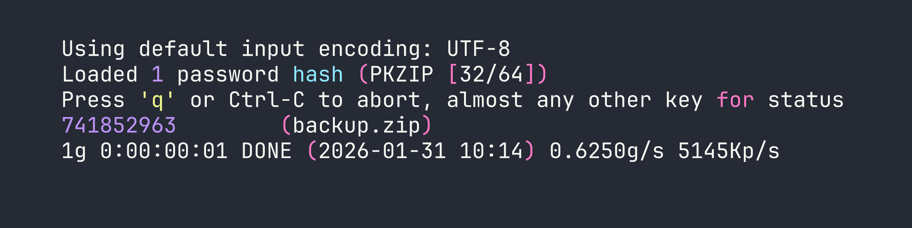
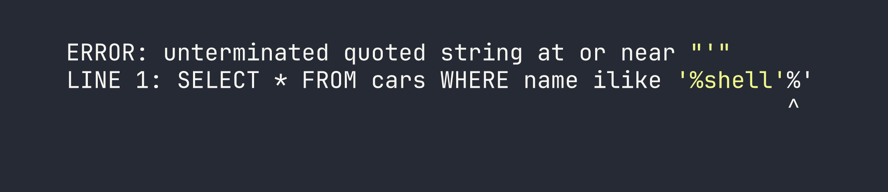
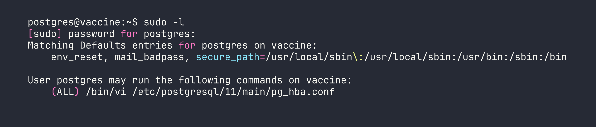
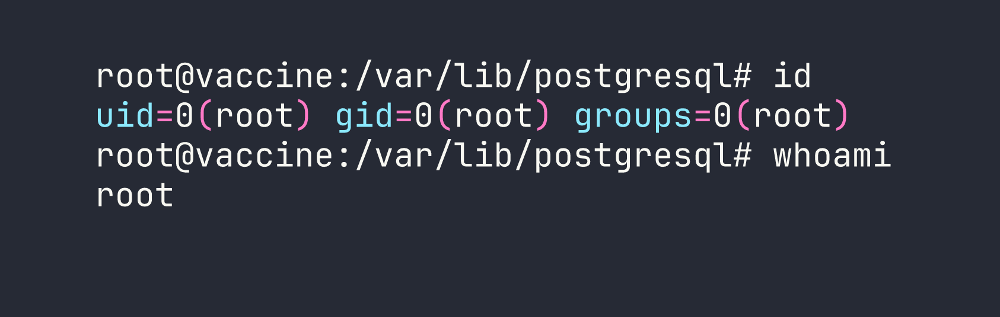

# HackTheBox — Vaccine

Vaccine is a Very Easy Linux box that rewards methodical enumeration at every layer: an anonymous FTP share hands you a password-protected zip, cracking it surfaces hardcoded credentials, and those credentials open a web app riddled with PostgreSQL SQL injection. From there, a classic `sudo` misconfiguration with `vi` hands you root in seconds. It's a tightly constructed chain where each stage feeds the next — a great box for internalizing how credential reuse and layered misconfigurations compound into a full compromise.

---

## Reconnaissance

### Port Scan

I started with a default script and version scan across all TCP ports. With a box called Vaccine, I expected something web-based, but it's always worth letting `nmap` tell you the full picture first.




Three ports: FTP with anonymous login enabled, SSH, and a PHP-backed web app. The juicy detail is right there in the nmap output — anonymous FTP is allowed, and there's already a file sitting on the server waiting to be grabbed.

### FTP — Pulling the Backup

Anonymous FTP is a gift during recon. I logged in without credentials and grabbed the only file present.

```bash
ftp <TARGET>
# Username: anonymous, Password: (blank)
ftp> get backup.zip
```

### Cracking the Zip

The zip was password-protected, which might feel like a dead end — but password-protected zips are notoriously weak against dictionary attacks. `zip2john` extracts a crackable hash from the archive metadata, and `john` does the rest.

```bash
zip2john backup.zip > backup.hash
john backup.hash --wordlist=/usr/share/wordlists/rockyou.txt
```




Password `741852963` — a purely numeric sequence that rockyou finds almost instantly. The archive contained `index.php` and `style.css`, the source code for the web application running on port 80.

### Hardcoded Credentials in Source

Reviewing `index.php`, the login logic was immediately suspicious:

```php
if(isset($_POST['username']) && isset($_POST['password'])) {
    if($_POST['username'] === 'admin' && md5($_POST['password']) === '2cb42f8734ea607eefed3b70af13bbd3') {
        $_SESSION['login'] = "true";
        header("Location: dashboard.php");
    }
}
```

The password is stored as an MD5 hash. MD5 is not a password hashing function — it's a fast digest algorithm with no salting, which means any entry in a precomputed rainbow table will crack it instantly. A quick lookup (or `hashcat` with mode `-m 0`) reveals: `2cb42f8734ea607eefed3b70af13bbd3` → `qwerty789`.

Credentials: **admin / qwerty789**. Logging into the web app on port 80 redirects to `dashboard.php`.

---

## Foothold

### SQL Injection on dashboard.php

The dashboard presented a car search interface with a URL parameter: `dashboard.php?search=`. The first thing I do with any search field is probe for injection. Sending a single quote caused the application to throw a verbose error:

```
search=shell'
```




The database is PostgreSQL (the `ilike` operator is a PostgreSQL-specific case-insensitive LIKE), and the full query is exposed. This is a textbook error-based SQL injection — the application is directly interpolating our input into the query without sanitisation.

I handed it off to `sqlmap` to confirm and exploit. The `--cookie` flag is needed since the dashboard is behind authentication.

```bash
sqlmap -u 'http://<TARGET>/dashboard.php?search=a' \
  --cookie="PHPSESSID=<your_session_id>" \
  --os-shell
```

sqlmap confirmed stacked queries and UNION-based injection, then leveraged PostgreSQL's `COPY TO/FROM PROGRAM` feature to achieve OS command execution. `--os-shell` drops you into an interactive pseudo-shell running as the `postgres` OS user.

### Recovering Database Credentials

With command execution established, I read the `dashboard.php` source directly from the server:

```bash
os-shell> cat /var/www/html/dashboard.php
```

Buried in the PHP is the database connection string:

```php
$conn = pg_connect("host=localhost port=5432 dbname=carsdb user=postgres password=P@s5w0rd!");
```

There it is — the `postgres` database user's password, `P@s5w0rd!`, stored in plaintext. This is an extremely common pattern: developers hardcode database credentials in application source files and the same password gets reused for the OS-level account. Let's test that assumption.

```bash
ssh postgres@<TARGET>
# Password: P@s5w0rd!
```

It works. We have a proper SSH session as `postgres` and can grab the user flag.

---

## Privilege Escalation

### Enumerating sudo Permissions

The first thing I check after landing a shell is `sudo -l` — what can this user run as root without a password (or with their known password)?




The intent here was to allow the `postgres` user to edit the PostgreSQL host-based authentication config file as root — a reasonable-seeming permission. The problem is that `vi` (and most text editors) can spawn a shell from within the editor itself. This is documented exhaustively on [GTFOBins](https://gtfobins.github.io/gtfobins/vi/).

### Shell Escape via vi

The exploit is trivial: open the file with the allowed `sudo` command, then use vi's built-in command execution to spawn a shell. The shell inherits the `sudo` context — meaning it runs as root.

```bash
sudo /bin/vi /etc/postgresql/11/main/pg_hba.conf
```

Once inside vi, drop into command mode and execute:

```
:!/bin/bash
```




Full root access. The root flag is at `/root/root.txt`.

---

## Lessons Learned

**Anonymous FTP is a recon goldmine.** Always authenticate as `anonymous` during enumeration — you'd be surprised how often it's enabled on production-adjacent boxes and real systems.

**Password-protected zips offer almost no security against dictionary attacks.** `zip2john` + rockyou will crack the vast majority of zip passwords encountered in the wild. If you need to protect an archive, use a long, random passphrase — not a PIN or dictionary word.

**MD5 is not a password hash.** It's fast, unsalted, and fully reversible via rainbow tables. Any application storing passwords as raw MD5 digests should be considered compromised by default. Proper password storage uses bcrypt, scrypt, or Argon2.

**PostgreSQL's `ilike` in a URL parameter is a strong SQLi indicator.** The moment you see a case-insensitive search exposed in a query string, probe it aggressively. PostgreSQL stacked queries + `COPY TO/FROM PROGRAM` is a reliable path to OS command execution once injection is confirmed.

**`sqlmap --os-shell` is powerful but noisy.** It works by writing a backdoor script to the web root and communicating through it. In a real engagement, understand what artifacts it leaves behind — this technique would light up any decent WAF or SIEM.

**Database connection strings in PHP files almost always contain reused credentials.** When you find a `pg_connect()`, `mysqli_connect()`, or similar call, note the password and try it everywhere: SSH, sudo, other services. Developer credential reuse is epidemic.

**Any `sudo` entry allowing a text editor is an instant root.** `vi`, `vim`, `nano`, `less`, `more`, `awk`, `python` — if a user can `sudo` any of these, check GTFOBins and assume privilege escalation is trivial. The principle of least privilege means granting write access to a specific file, not unrestricted shell access through an editor.
